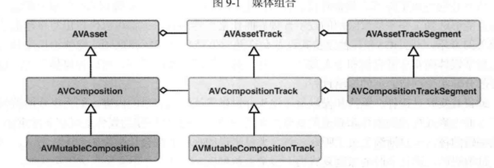
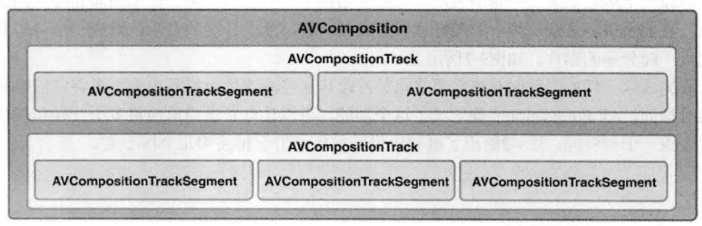

## 组合媒体

-----

一个组合就是将多个媒体资源整合成一个自定义的临时排列，最后生成一个独立的媒体资源

相关类结构体：




`AVComposition`中的轨道都是`AVAssetTrack`的子类`AVCompositionTrack`。一个轨道`AVCompositionTrack`本身是由一个或者多个媒体片段组成，每个媒体片段是一个`AVCompositionTrackSegment`。`AVCompostion`、`AVCompostionTrack`、`AVCompostionTrackSegment`的关系如下：




#### 时间的介绍

----------

###### CMTime:

```objective-c
typedef int64_t CMTimeValue;
typedef int32_t CMTimeScale
typedef int64_t CMTimeEpoch

typedef CF_OPTIONS( uint32_t, CMTimeFlags ) {
	kCMTimeFlags_Valid = 1UL<<0,
	kCMTimeFlags_HasBeenRounded = 1UL<<1,
	kCMTimeFlags_PositiveInfinity = 1UL<<2,
	kCMTimeFlags_NegativeInfinity = 1UL<<3,
	kCMTimeFlags_Indefinite = 1UL<<4,
	kCMTimeFlags_ImpliedValueFlagsMask = kCMTimeFlags_PositiveInfinity | kCMTimeFlags_NegativeInfinity | kCMTimeFlags_Indefinite
}

typedef struct
{
	CMTimeValue	value;		/*! @field value The value of the CMTime. value/timescale = seconds. */
	CMTimeScale	timescale;	/*! @field timescale The timescale of the CMTime. value/timescale = seconds.  */
	CMTimeFlags	flags;		/*! @field flags The flags, eg. kCMTimeFlags_Valid, kCMTimeFlags_PositiveInfinity, etc. */
	CMTimeEpoch	epoch;		/*! @field epoch Differentiates between equal timestamps that are actually different because
												 of looping, multi-item sequencing, etc.  
												 Will be used during comparison: greater epochs happen after lesser ones. 
												 Additions/subtraction is only possible within a single epoch,
												 however, since epoch length may be unknown/variable. */
} CMTime;
```

###### CMTimeRange:

```objective-c
typedef struct
{
	CMTime			start;		/*! @field start The start time of the time range. */
	CMTime			duration;	/*! @field duration The duration of the time range. */
} CMTimeRange

// 创建方法
CMTimeRangeMake
CMTimeRangeFromTimeToTime
```


#### 基础方法

--------

