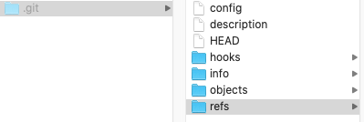
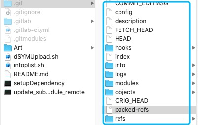
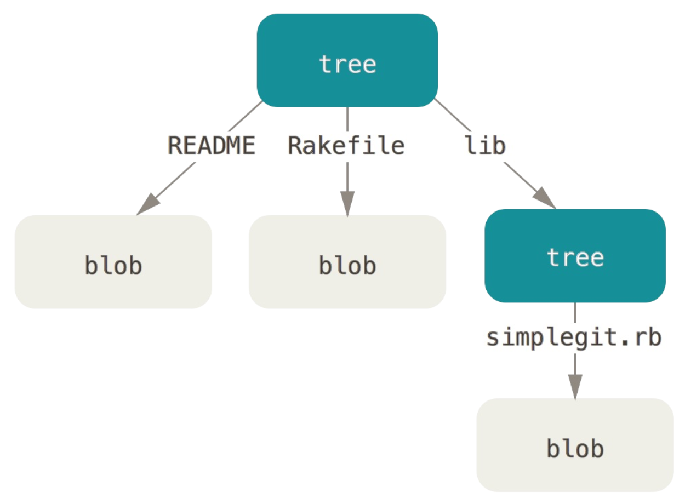
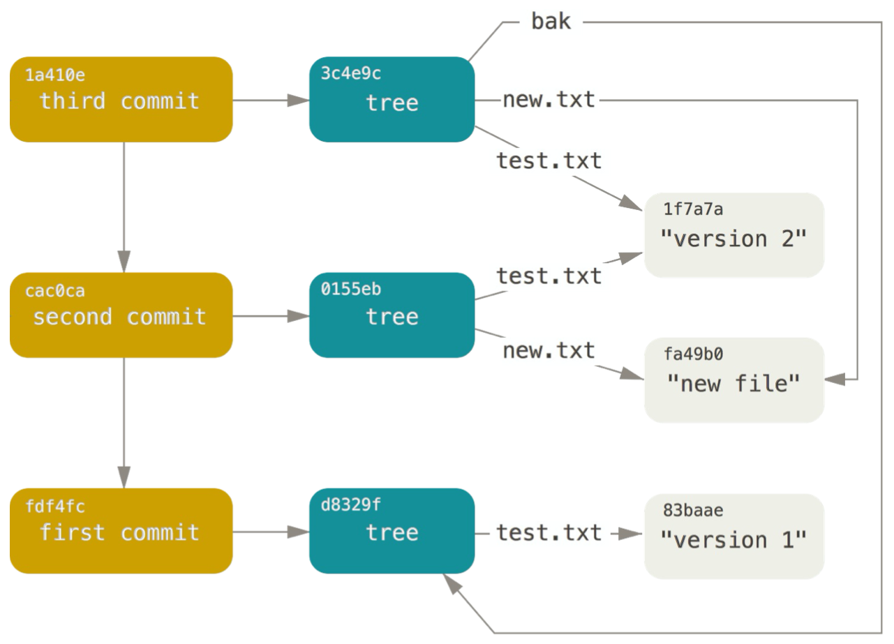
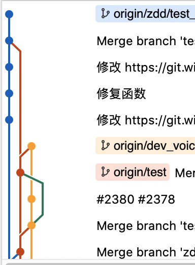
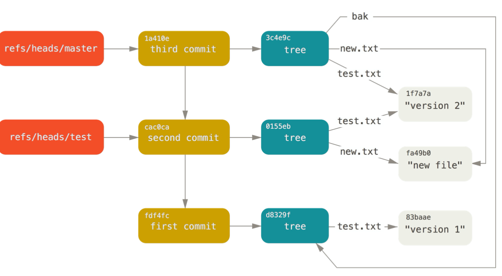

## Git原理

Git是一个<font color=red>免费&开源</font>的分布式版本控制系统-DVCS(distributed version control system)，旨在快速、高效的处理从小型到大型项目的所有内容

在成为一个VCS之前，Git首先是一个文件系统，并且这个文件系统是<font color=red>内容寻址(content-address)</font>文件系统。在1.5之前，Git的命令晦涩难懂，主要因为：<font color=green>1.5之前是按文件系统的思维去做版本控制的事</font>，1.5之前才慢慢的逐渐形成目前的使用方式，成为一个易用、高效的版本控制系统

Git文件系统是一个简化的Unix文件系统，简单来说是一个键值对数据库，这个数据库的特点是<font color=red>文件信息和内容是分开存储的</font>。


#### Git目录

------

我们执行`git init dir`之后会生成一个干净的git环境，目录如下：



使用一段时间之后，我们发现是下面这样：



对我们来说，下面几个比较重要的：

- objects：本地数据库，commit之后的数据都存在在这个目录
- refs：本地引用记录。packed-refs记录了所有的引用关系，是refs压缩后的结果
- index：暂存区
- HEAD：当前的HEAD，里面可能是分支，tag，但是最终都是指向一个commit对象

其他内容：

- modules：使用git submodule后生成的目录
- logs:
- Hooks：钩子(待续。。。)
- FETCH_HEAD：
- Description：Web专利
- config：git配置，这个是本地配置，还有一个全局配置，配置用户邮箱，用户名等等

#### Git对象

-------

想要弄清楚，Git是怎么做数据存储的，首先需要了解Git对象，Git对象类型主要包括以下几种：

- Blob object：数据对象，真正存储数据内容的对象
- Tree object：树对象，主要是为了解决Blob object的文件名保存及索引问题
- commit object：提交对象，主要用于解决快照的重用和回溯问题
- tag object：待续


###### Git对象的存储

Blob object的存储：

- 将头部信息和内容信息A拼接，生成内容B

  ```
  header = "对象类型(blob/tree/commit/tag) #{content.length}\0"
  ```

- 对内容B做SHA-1，得到40个字节的哈希字符串C

- 压缩这条新内容

- 新内容入库

  ```
  我们知道所有的git内容都存储在.git/objects目录下。入库操作步骤如下：
  1.获取字符串C的前两位字符D，并检查.git/obejcts目录下，有没有文件夹名称为D的文件夹，没有的话创建
  2.将字符串C去掉前两位D，剩余的38位作为文件名，然后将压缩后的内容存在这个文件内
  ```

上面描述了blob object的存储过程，其他对象也是以这种方式存储的。不同点有：

- tree和commit的头部信息是”tree“和"commit"，不是blob
- blob object的内容可以使任何类型，但是tree object以及commit object的内容却有各自固定的格式


###### Blob Object

通过上面我们知道了，Blob对象存储后，生成了一个SHA-1的哈希字符串，我们可以利用这个哈希字符串获取到原来的内容

```
$ git cat-file -p d670460b4b4aece5915caf5c68d12f560a9fe3e4
-p 表示自动判断文件类型
```

###### Tree Object

Blob对象存储了文件数据，Tree对象用来解决文件名保存，也就是将N个文件组织在一起的问题。我们知道git文件系统是一个简化版的Unix系统，Tree Object对应了Unix中的目录项，而Blob对象则是目录项下面的内容

一个Tree Object包含了X个Tree Object和X个Blob Object，结构如下：



顶层的Tree Object，就是项目的一个快照。记录的是，当前Tree object下，项目的真实情况。我们可以使用`git write-tree`将当前index(暂存区)的内容写入一个Tree Object

```
$ git write-tree
d8329fc1cc938780ffdd9f94e0d364e0ea74f579
$ git cat-file -t d8329fc1cc938780ffdd9f94e0d364e0ea74f579
tree
```


###### Commit Object

一个顶层的树对象对应了项目某个时间点的一个快照，不同的时间点有N多个项目快照，这么多的不同时间点的快照，是谁保存的这些快照？，为什么保存这些快照？什么时刻保存的这些快照？Git是如何管理的呢？没错，就是Commit Object对象。

我们可以使用`git commit-tree`命令创建一个commit object，为此，我们需要为commit object指定一个tree object，还需要为当前commit-tree对象指定一个father commit object。项目的第一个commit是没有father commit object的，以后的 father commit object对象，都是根据HEAD文件获取到的

```
echo 'first commit' | git commit-tree d8329f fdf4fc3344e67ab068f836878b6c4951e3b15f3d
$ git cat-file -p fdf4fc3
   tree d8329fc1cc938780ffdd9f94e0d364e0ea74f579
   author Scott Chacon <schacon@gmail.com> 1243040974 -0700
   committer Scott Chacon <schacon@gmail.com> 1243040974 -0700
   
   first commit
```

如果我们中间经过了几次commit，会得到以下关系图：



###### Tag Object（待续）


#### Git分支

-------



我们看到的分支是一个逐渐演进的线条。其实分支的本质是：一个指向一系列提交之首的指针和引用，如下所示：



那么问题来了，Git是怎么记录分支和引用的对应关系。.git/refs记录了当当前本地存在的分支和commit对象的对应关系。但是refs这个东西完全是本地的，Git会在commit的时候压缩refs中的文件，生成一个packed-refs，压缩文件，提交到远端。这也是git存储方面的一个优化。


#### Git tag

-----

tag其实也是Git对象的一种。tag object指向的是一个提交对象，tag对象包含两种：

- 轻量标签：仅仅是一个引用，记录在refs目录下

  ```
  git update-ref refs/tags/v1.0 cac0cab538b970a37ea1e769cbbde608743bc96d
  ```

- 附注标签：是一个独立的对象。附注标签会创建一个标签对象，并记录一个引用来指向该标签对象，而不是指向提交对象

  ```
  git tag -a v1.1 1a410efbd13591db07496601ebc7a059dd55cfe9 -m 'test tag'
  ```

  

#### Git的存储优化:

-----

- ref packet

- objects packet
- 提交压缩


#### Git的隐忧

-------

- SHA-1的问题 - google 两张不同的pdf文件，SHA-1的值是一直的