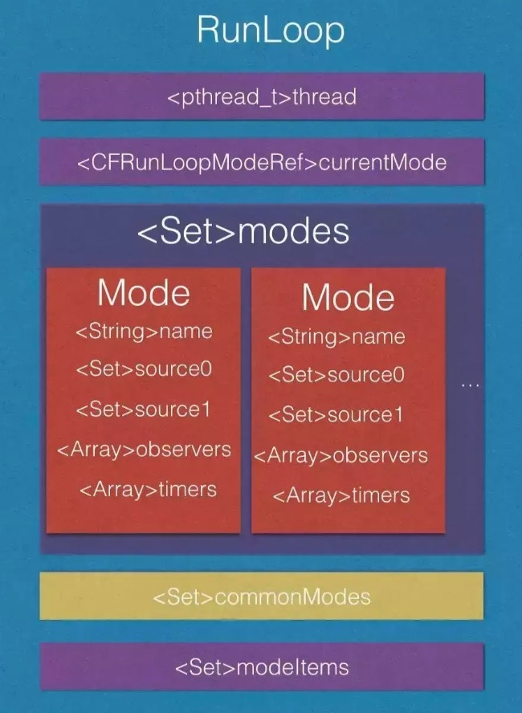

## Runloop


#### 为什么需要Runloop

-----

RunLoop被称为“运行循环”，其实就是一个“event loop”，伪代码如下：

```
while(var) {
		doTask()
		wait...
		wakeUp()
}
```

一般while循环会导致cpu进入忙等待状态，而RunLoop是一种闲等待。当没有事件时，RunLoop可以让线程进入休眠状态，有事件发生时，RunLoop会唤醒线程继续工作。简单来说，RunLoop主要有以下作用：

- 保持程序的持续运行，循环避免线程销毁
- 处理App的各种事件
- 节省CPU资源，提高程序运行性能


#### RunLoop和线程的关系

------

###### 线程

```
有的线程执行的任务是一条直线(A->B)。而另一些是一个圆(A->B->...->A)，直到以某种方式将他终止。圆形任务模型的线程是怎么实现的呢？没错，就是RunLoop
```

###### 线程和RunLoop的关系

```
RunLoop为了线程而生，没有线程，就没有RunLoop。所以，RunLoop并没有方法可以创建他，只能在线程内通过函数获取(note:主线程例外的RunLoop可以在其他线程获取)。
RunLoop和线程是一一对应的，Cocoa和CoreFundation框架都提供了RunLoop对象方便配置和管理线程的RunLoop
```

###### 主线程的RunLoop默认是启动的，非主线程默认是不启动的

```
int main(int argc, char * argv[]) {
    NSString * appDelegateClassName;
    @autoreleasepool {
        // Setup code that might create autoreleased objects goes here.
        appDelegateClassName = NSStringFromClass([AppDelegate class]);
    }
    return UIApplicationMain(argc, argv, nil, appDelegateClassName);
}

上面的代码是xcode默认创建一个项目的main.m的函数，UIApplicationMain这个方法会为main thread开启一个runloop对象

其他线程默认并不开启RunLoop，执行完任务就退出了，如果不希望退出，需要开启RunLoop，下面代码是AFNetworking的代码片段，用于“线程保活”

+ (void)networkRequestThreadEntryPoint:(id)__unused object {
    @autoreleasepool {
        [[NSThread currentThread] setName:@"AFNetworking"];
        NSRunLoop *runLoop = [NSRunLoop currentRunLoop];
        [runLoop addPort:[NSMachPort port] forMode:NSDefaultRunLoopMode];
        [runLoop run];
    }
}
 
+ (NSThread *)networkRequestThread {
    static NSThread *_networkRequestThread = nil;
    static dispatch_once_t oncePredicate;
    dispatch_once(&oncePredicate, ^{
        _networkRequestThread = [[NSThread alloc] initWithTarget:self selector:@selector(networkRequestThreadEntryPoint:) object:nil];
        [_networkRequestThread start];
    });
    return _networkRequestThread;
}
```

###### RunLoop的线程安全问题

```
Cocoa中的NSRunLoop类并不是线程安全的，我们无法在一个线程去操作另外一个线程的RunLoop对象。但是CoreFundataion中的CFRunLoopRef是线程安全的。Cocoa中的NSRunLoop可以通过实例方法getCFRunLoop来获取
```

苹果不允许直接创建RunLoop，只能获取。获取的过程中，如果当前线程不存在RunLoop，会自动创建一个，并关联到当前线程，线程和RunLoop的对应关系存储在一个全局字典`static CFMutableDictionaryRef __CFRunLoops = NULL;`

```
static CFMutableDictionaryRef __CFRunLoops = NULL;
static CFSpinLock_t loopsLock = CFSpinLockInit;

// should only be called by Foundation
// t==0 is a synonym for "main thread" that always works
CF_EXPORT CFRunLoopRef _CFRunLoopGet0(pthread_t t) {
    if (pthread_equal(t, kNilPthreadT)) {
	t = _CFMainPThread;
    }
    __CFSpinLock(&loopsLock);
    if (!__CFRunLoops) {
        __CFSpinUnlock(&loopsLock);
	CFMutableDictionaryRef dict = CFDictionaryCreateMutable(kCFAllocatorSystemDefault, 0, NULL, &kCFTypeDictionaryValueCallBacks);
	CFRunLoopRef mainLoop = __CFRunLoopCreate(_CFMainPThread);
	CFDictionarySetValue(dict, pthreadPointer(_CFMainPThread), mainLoop);
	if (!OSAtomicCompareAndSwapPtrBarrier(NULL, dict, (void * volatile *)&__CFRunLoops)) {
	    CFRelease(dict);
	}
	CFRelease(mainLoop);
        __CFSpinLock(&loopsLock);
    }
    CFRunLoopRef loop = (CFRunLoopRef)CFDictionaryGetValue(__CFRunLoops, pthreadPointer(t));
    if (!loop) {
        __CFSpinUnlock(&loopsLock);
	CFRunLoopRef newLoop = __CFRunLoopCreate(t);
        __CFSpinLock(&loopsLock);
	loop = (CFRunLoopRef)CFDictionaryGetValue(__CFRunLoops, pthreadPointer(t));
	if (!loop) {
	    CFDictionarySetValue(__CFRunLoops, pthreadPointer(t), newLoop);
	    loop = newLoop;
	}
	CFRelease(newLoop);
    }
    if (pthread_equal(t, pthread_self())) {
        _CFSetTSD(__CFTSDKeyRunLoop, (void *)loop, NULL);
        if (0 == _CFGetTSD(__CFTSDKeyRunLoopCntr)) {
            _CFSetTSD(__CFTSDKeyRunLoopCntr, (void *)(PTHREAD_DESTRUCTOR_ITERATIONS-1), (void (*)(void *))__CFFinalizeRunLoop);
        }
    }
    __CFSpinUnlock(&loopsLock);
    return loop;
}

CFRunLoopRef CFRunLoopGetMain(void) {
    CHECK_FOR_FORK();
    static CFRunLoopRef __main = NULL; // no retain needed
    if (!__main) __main = _CFRunLoopGet0(_CFMainPThread); // no CAS needed
    return __main;
}

CFRunLoopRef CFRunLoopGetCurrent(void) {
    CHECK_FOR_FORK();
    CFRunLoopRef rl = (CFRunLoopRef)_CFGetTSD(__CFTSDKeyRunLoop);
    if (rl) return rl;
    return _CFRunLoopGet0(pthread_self());
}

```


#### RunLoop中的mode

----

先看一下RunLoop，RunLoopMode的数据结构

```
struct __CFRunLoop {
    CFRuntimeBase _base;
    pthread_mutex_t _lock;			/* locked for accessing mode list */
    __CFPort _wakeUpPort;			// used for CFRunLoopWakeUp 
    Boolean _ignoreWakeUps;
    volatile uint32_t *_stopped;
    pthread_t _pthread;
    uint32_t _winthread;
    CFMutableSetRef _commonModes;
    CFMutableSetRef _commonModeItems;
    CFRunLoopModeRef _currentMode;
    CFMutableSetRef _modes;
    struct _block_item *_blocks_head;
    struct _block_item *_blocks_tail;
    CFTypeRef _counterpart;
};

struct __CFRunLoopMode {
    CFRuntimeBase _base;
    pthread_mutex_t _lock;	/* must have the run loop locked before locking this */
    CFStringRef _name;
    Boolean _stopped;
    char _padding[3];
    CFMutableSetRef _sources0;
    CFMutableSetRef _sources1;
    CFMutableArrayRef _observers;
    CFMutableArrayRef _timers;
    CFMutableDictionaryRef _portToV1SourceMap;
    __CFPortSet _portSet;
    CFIndex _observerMask;
#if DEPLOYMENT_TARGET_MACOSX || DEPLOYMENT_TARGET_EMBEDDED
    mach_port_t _timerPort;
#endif
#if DEPLOYMENT_TARGET_WINDOWS
    HANDLE _timerPort;
    DWORD _msgQMask;
    void (*_msgPump)(void);
#endif
};

struct __CFRunLoopSource {
    CFRuntimeBase _base;
    uint32_t _bits;
    pthread_mutex_t _lock;
    CFIndex _order;			/* immutable */
    CFMutableBagRef _runLoops;
    union {
	CFRunLoopSourceContext version0;	/* immutable, except invalidation */
        CFRunLoopSourceContext1 version1;	/* immutable, except invalidation */
    } _context;
};

struct __CFRunLoopTimer {
    CFRuntimeBase _base;
    uint16_t _bits;
    pthread_mutex_t _lock;
    CFRunLoopRef _runLoop;
    CFMutableSetRef _rlModes;
    CFAbsoluteTime _nextFireDate;
    CFTimeInterval _interval;		/* immutable */
    int64_t _fireTSR;			/* TSR units */
    CFIndex _order;			/* immutable */
    CFRunLoopTimerCallBack _callout;	/* immutable */
    CFRunLoopTimerContext _context;	/* immutable, except invalidation */
};

struct __CFRunLoopObserver {
    CFRuntimeBase _base;
    pthread_mutex_t _lock;
    CFRunLoopRef _runLoop;
    CFIndex _rlCount;
    CFOptionFlags _activities;		/* immutable */
    CFIndex _order;			/* immutable */
    CFRunLoopObserverCallBack _callout;	/* immutable */
    CFRunLoopObserverContext _context;	/* immutable, except invalidation */
};

```


RunLoop是一个结构体对象，绑定了一个线程，包含当前正在运行的Mode，N个Mode，N个CommonMode



从代码和图中可以看出：

- runloop和线程一一对应
- runloop包含多个mode，mode包含多个modeitem(source，timers, observers)
- runloop每次只能运行在一个mode下：
  - 切换mode必须先停止mode，然后设置mode，重新run
  - runloop通过切换mode来筛选要处理的事件，让其互不影响
  - 这是iOS运行流畅的关键

__CFRunLoopMode负责管理所有的事件，而runloop负责管理mode：

- 一个mode包括N个source0，N个source1，N个observers，N个timers。
- mode是可以定制的，至少包含一个mode item，同一个mode item可以被多个mode持有
- 一个mode可以将自己标记为"common"属性，标记为common属性的mode-A，会自动将runloop中commonModeitems同步到mode-A的items中去


一个RunLoop包含多个Mode，每个Mode又包含多个Source/Timer/Observer。同一时刻，RunLoop只能运行其中一个Mode。如何需要切换Mode，只能退出loop，指定mode后重新进入。

###### Input Source

###### Timer

###### Observer


#### RunLoop的工作流程

-----


#### RunLoop中的事件源

-----


#### RunLoop中比较重要的几个概念

------

- CFRunLoopRef

- CFRunLoopModeRef

- CFRunLoopSourceRef

- CFRunLoopTimerRef

- CFRunLoopObserversRef

  ######__CFRunLoopMode

  ```
  // RunLoopMode 结构体
  // mode 负责管理在该 mode 下运行着的各种事件
  struct __CFRunLoopMode {
      CFRuntimeBase _base;
      pthread_mutex_t _lock;  /* must have the run loop locked before locking this */
      CFStringRef _name;      //mode 名称
      Boolean _stopped;       //是否停止
      char _padding[3];
      // mode 内的几种事件类型
      CFMutableSetRef _sources0;
      CFMutableSetRef _sources1;
      CFMutableArrayRef _observers;
      CFMutableArrayRef _timers;
      CFMutableDictionaryRef _portToV1SourceMap;
      __CFPortSet _portSet;   //保证所有需要监听的 port 都在这个 set 里面
      CFIndex _observerMask;
  #if USE_DISPATCH_SOURCE_FOR_TIMERS
      dispatch_source_t _timerSource;
      dispatch_queue_t _queue;
      Boolean _timerFired; // set to true by the source when a timer has fired
      Boolean _dispatchTimerArmed;
  #endif
  #if USE_MK_TIMER_TOO
      mach_port_t _timerPort;
      Boolean _mkTimerArmed;
  #endif
  #if DEPLOYMENT_TARGET_WINDOWS
      DWORD _msgQMask;
      void (*_msgPump)(void);
  #endif
      uint64_t _timerSoftDeadline; /* TSR */
      uint64_t _timerHardDeadline; /* TSR */
  };
  ```

  


#### RunLoop & RunLoop mode & source/observer/timer的关系


