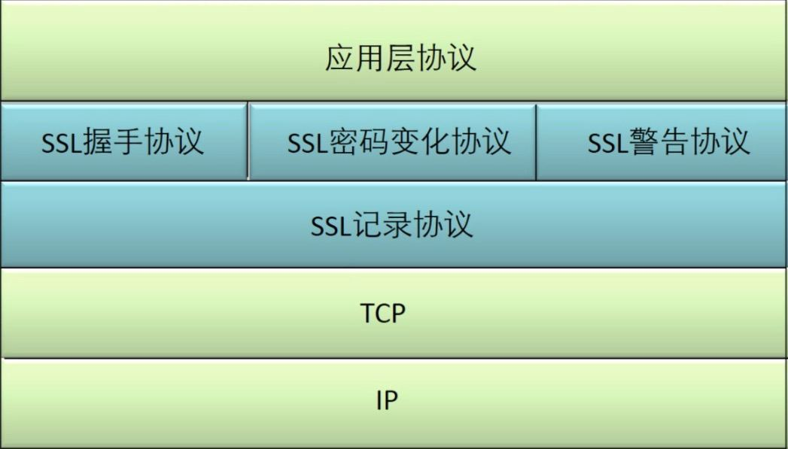

## SSL/TLS

SSL是Netscape公司开发的，用于保障WWW通信的安全。主要任务是提供数据的私密性、完整性和身份验证。1990年SSLV1，1994年V2，1995年V3，TLS是IETF于1999年颁布，是在V3的基础上做的调整

SSL/TLS位于TCP/IP层和应用层之间，他有两个子协议层构成：



- SSL记录协议层

  ```SSL
  SSSL记录协议层的作用是为高层协议提供基本的安全服务。SSL记录协议针对HTTP协议进行了特别的设计，使得超文本的传输协议HTTP能够在SSL运行。纪录封装各种高层协议，具体实施压缩解压缩、加密解密、计算和校验MAC等与安全有关的操作
  ```

- SSL握手协议层

  ```dd
  SSL握手协议层包括SSL握手协议（SSL HandShake Protocol）、SSL密码参数修改协议（SSL Change Cipher Spec Protocol）和SSL告警协议（SSL Alert Protocol）。握手层的这些协议用于SSL管理信息的交换，允许应用协议传送数据之间相互验证，协商加密算法和生成密钥等。SSL握手协议的作用是协调客户和服务的状态，是双方能够达到状态的同步
  ```


其中最重要的是记录协议和握手协议

- SSL记录协议

  ```fd
  它建立在可靠的传输（如TCP）之上，为高层协议提供数据封装、压缩、加密等基本功能。
  ```

- SSL握手协议

  ```sd
  它建立在SSL记录协议之上，用于在实际的数据传输开始之前，通讯双方进行身份认证、协商加密算法、交换加密密钥等
  ```

  

#### SSL连接建立第一阶段:SSL握手

-----

- 客户端发送Client Hello报文，报文包含以下信息:
  - SSL版本
  - 随机数 RN1 (用于后面生成对称机密秘钥)
  - 安全策略或者叫做加密套件-CipherSuites(主要是客户端所支持的加密方法)
  - 会话ID,如果是第一次连接,那么为空
- server回应ServerHello，主要包含以下信息:
  - 指定SSL版本
  - 随机数 RN2 (用于后面生成对称加密秘钥)
  - 指定的加密套件
  - 会话ID


#### SSL连接建立的第二阶段

----

服务器启动SSL握手第2阶段，是本阶段所有消息的唯一发送方，客户机是所有消息的唯一接收方。该阶段分为4步：

- 证书：服务器将数字证书和到根CA整个链发给客户端，使客户端能用服务器证书中的服务器公钥认证服务器。
- 服务器密钥交换（可选）：这里视密钥交换算法而定
- 证书请求：服务端可能会要求客户自身进行验证。
- 服务器握手完成：第二阶段的结束，第三阶段开始的信号


#### SSL连接建立第三阶段

----

客户机启动SSL握手第3阶段，是本阶段所有消息的唯一发送方，服务器是所有消息的唯一接收方。该阶段分为3步：

- 证书（可选）：为了对服务器证明自身，客户要发送一个证书信息，这是可选的，在IIS中可以配置强制客户端证书认证。
- 客户机密钥交换（Pre-master-secret）：这里客户端将预备主密钥发送给服务端，注意这里会使用服务端的公钥进行加密。
- 证书验证（可选），对预备秘密和随机数进行签名，证明拥有（a）证书的公钥。


#### SSL建立第四阶段

-----

客户机启动SSL握手第4阶段，使服务器结束。该阶段分为4步，前2个消息来自客户机，后2个消息来自服务器。

- 建立起一个安全的连接，客户端发送一个Change Cipher Spec消息，并且把协商得到的CipherSuite拷贝到当前连接的状态之中。
- 然后，客户端用新的算法、密钥参数发送一个Finished消息，这条消息可以检查密钥交换和认证过程是否已经成功。其中包括一个校验值，对客户端整个握手过程的消息进行校验。
- 服务器同样发送Change Cipher Spec消息和Finished消息。握手过程完成，客户端和服务器可以交换应用层数据进行通信。


#### 相关文章

-----

- http://www.ruanyifeng.com/blog/2014/02/ssl_tls.html
- [https://cshihong.github.io/2019/05/09/SSL%E5%8D%8F%E8%AE%AE%E8%AF%A6%E8%A7%A3/](https://cshihong.github.io/2019/05/09/SSL协议详解/)

