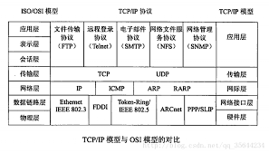
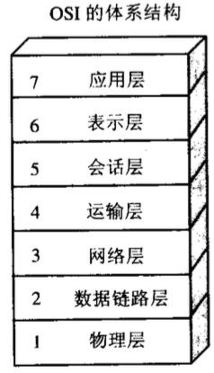
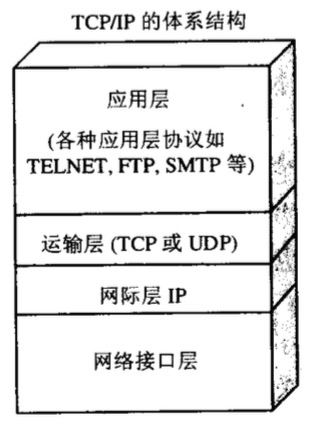
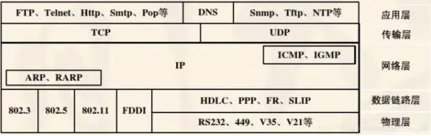
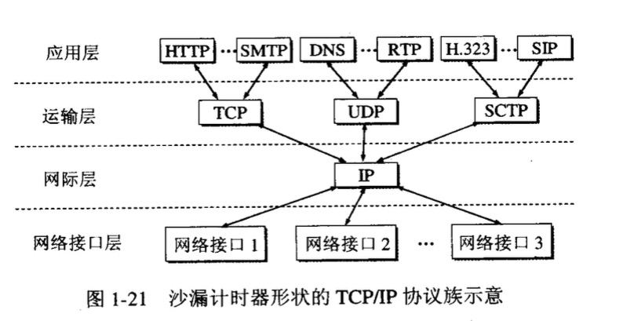

## TCP/IP四层模型和OSI七层模型

-------

最早出现的是`TCP/IP`四层协议模型，后面才有了`OSI`七层模型。

`OSI`七层模型是在`TCP/IP`四层协议模型流行起来后，`OSI`在其基础上，重新制定的标准。标准归标准，现在使用的仍是`TCP/IP`四层协议模型




#### OSI七层协议模型

------



- 应用层

  ```markdown
  网络服务与最终用户的一个接口。
  协议有：HTTP FTP TFTP SMTP SNMP DNS TELNET HTTPS POP3 DHCP
  ```

- 表示层

  ```markdown
  数据的表示、安全、压缩。（在五层模型里面已经合并到了应用层）
  格式有，JPEG、ASCll、EBCDIC、加密格式等
  ```

- 会话层

  ```markdown
  建立、管理、终止会话。（在五层模型里面已经合并到了应用层）
  对应主机进程，指本地主机与远程主机正在进行的会话
  ```

- 传输层

  ```markdown
  定义传输数据的协议端口号，以及流控和差错校验。
  协议有：TCP UDP，数据包一旦离开网卡即进入网络传输层
  ```

- 网络层

  ```markdown
  进行逻辑地址寻址，实现不同网络之间的路径选择。
  协议有：ICMP IGMP IP（IPV4 IPV6）
  ```

- 数据链路层

  ```markdown
  建立逻辑连接、进行硬件地址寻址、差错校验 [3]  等功能。（由底层网络定义协议）
  将比特组合成字节进而组合成帧，用MAC地址访问介质，错误发现但不能纠正。
  ```

- 物理层

  ```markdown
  建立、维护、断开物理连接。（由底层网络定义协议）
  ```

  

#### TCP/IP协议模型

------







