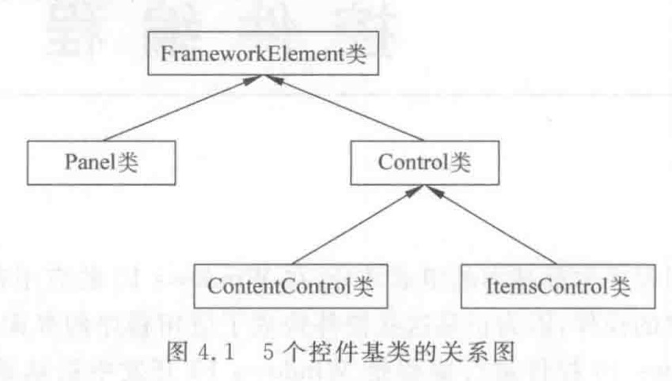

##Windows控件编程之控件分类

Windows 10的系统控件有几十个，这些控件共同组成了复杂的页面，对于系统的控件会按照控件的功能来进行。系统控件的基类有FrameWorkElement、Panel、Control、ContentControl、ItemsControl,所有的系统控件都派生自这5个基类，这5个基类之间也是派生关系，他们的关系如下：

- FrameworkElement类派生自UIElement类，UIElement类是Windows 10 具有可视化外观并可以处理基本输入的大多数对象的基类，封装了键盘事件、触摸事件等一些基础的UI控件，但是UIElement类并不公开公共构造函数，所以Windows 10中的UIElement类的作用就是为了作为FrameworkElement类的基类对UI的基础操作进行封装。
- Panel类
- Control类
- ContentControl类
- ItemsControl类

Windows 10的系统控件按照这5个控件的基类来划分为下面5个类别：

- 面板控件：派生自Panel类，有Canvas、Grid、StackPanel、RelativePanel，这些控件常用于界面的布局
- 内容控件：派生自ContentControl类，提供了Content属性，常用于定制控件的内容，包含Button、RadioButton、HyperlinkButton、CheckBox和ScrollViewer控件
- 列表控件：派生自ItemsControl类，用于数据集合
- 普通控件：派生自control类
- 其他控件：直接派生自FrameworkElement类，包含TextBlock，Border，Image，MediaElement和PopUp

