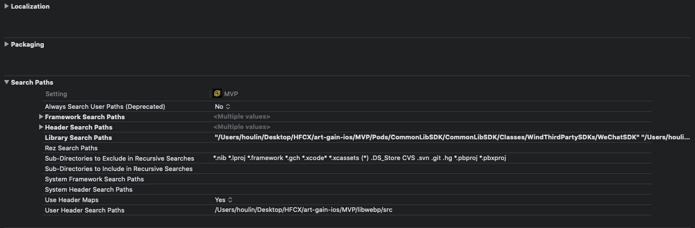
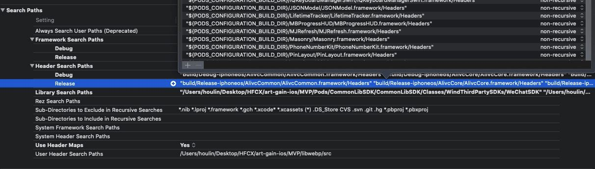
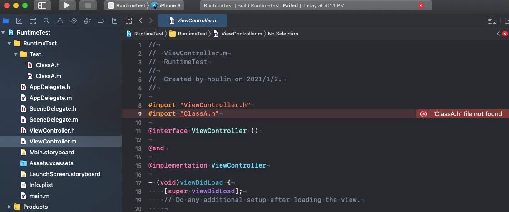
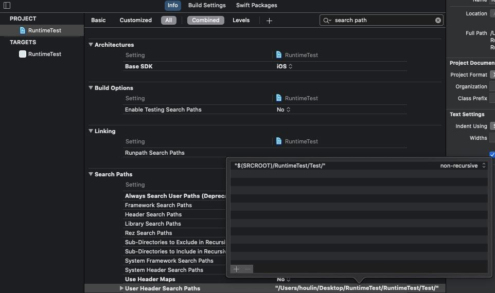

## Search Paths

---------

查询路径



在介绍这几个路径之前，我们首先要搞明白`import ""`和`import <>`（或者是`include ""`和`include <>`）的区别：

- `import`和`include`的区别

  ```markdown
  当我们在代码中对同一个文件进行两次#include的时候会报错：因为#include相当于拷贝头文件中的内容，所以会报重复定义的错误。
  例如: 有a.h、b.h、c.h三个头文件,  b.h引用包含a.h,   c.h中同时引用包含a.h和b.h。如果使用#include来包含头文件，不做重复引用处理情况下，那么在c.h中相当于包含了两次a.h。这样
  
  在编译时就会引起不必要的错误，这时就需要引入头文件保护符才能避免c.h中重复引用包含两次a.h。
  
  如果使用#import来包含头文件，那么不需要做任何事情，在c.h中就只会包含一次a.h，而不会引起任何错误。不管你对一个文件同时包含了多少次，使用#import确定只会包含一次。所以它可以解决重复导入的问题，它会做一次判断，如果已经导入一次就不导入了。
  ```

- `<>`和`""`的区别

  ```markdown
  `<>`是对`系统自带的头文件`的引用，编译器会在`系统目录空间`下查找该文件
  `""`是对`用户自定的文件`的引用，引用时，编译器首先在`用户目录空间`下查找，然后去安装目录中查找，最后在系统文件目录中查找
  ```

  

###### 什么是`系统路径`，什么又是`用户自定义路径`?

- 系统路径

  

- 用户路径


###### `import ""`和`import <>`的搜索顺序

- `import ""`搜索顺序

  ```markdown
  1.USER_HEADERMAP(如果启用，则会在映射表中查，直接跳过`header search path`的配置，如果没有查到，或者没有启用，直接往下走)
  2.USER_HEADER_SEARCH_PATHS
  3.HEADER_SEARCH_PATHS
  ```

- `import <>`搜索顺序

  ```markdown
  1.系统路径
  2.USER_HEADER_SEARCH_PATHS(ALWAYS_SEARCH_USER_PATHS 为 YES,则会搜索该路径，该变量默认是NO，并且已经被标记为Deprecated)
  3.HEADER_SEARCH_PATHS
  ```

  

#### Always Search User Paths(Deprecated)

------

`If enabled, both #include <header.h>-style and #include “header.h”-style directives search the paths in User Header Search Paths (USER_HEADER_SEARCH_PATHS) before Header Search Paths (HEADER_SEARCH_PATHS). As a consequence, user headers, such as your own String.h header, have precedence over system headers when using #include <header.h>. This is done using the -iquote flag for the paths provided in User Header Search Paths. If disabled and your compiler fully supports separate user paths, user headers are only accessible with #include “header.h”-style preprocessor directives.For backwards compatibility reasons, this setting is enabled by default. Disabling it is strongly recommended.`

是否搜索用户路径，已经被删除。目前存在的话，只是为了向后兼容。如果这个选项设置为了`YES`,无论是`<>`还是`""`的方式引用，都会先搜索`User Header Search Paths`。正常情况下，`<>`引用方式是不会去搜索`User Header Search Paths`。这也就是为什么，`pod`这个工具，会将`Framework/headers`这些路径，都填充到`Header Search Paths`，并且在引用的时候，我们无论我们使用`<>`还是`""`的方式，都可以引用到文件。如果，`pod`将所有的`Framework/headers`路径填充到`User Header Search Paths`下，同时`ALWAYS_SEARCH_USER_PATHS`为`no`的情况下，通过`<>`这中方式，是无法引用到`Pod`生成的`Framework/Headers`中的头文件的


#### Framework Search Paths

-------

`This is a list of paths to folders containing frameworks to besearched by the compiler for both included or imported header fileswhen compiling C, Objective-C, C++, or Objective-C++, and by thelinker for frameworks used by the product.`

本地引用的`Framework`所在的目录路径。当我们项目中，本地引用`Framework的时候`，这里会自动生成对`Framework`的引用路径


#### Header Search Paths

------

`This is a list of paths to folders to be searched by the compilerfor included or imported header files when compiling C,Objective-C, C++, or Objective-C++ source files`

`系统目录空间`路径，狭义上，我们认为`Xcode`工程中，`系统库(比如AVFoudation.framework)`所在的路径是`系统目录空间`，但是他其实是一个相对的概念，其实就是相对于`User Header Search Paths(用户目录空间路径)`。

比如，`pod`自动填充到`Xcode工程`配置中的路径其实都是本地路径:




#### Library Search Paths

-----

`This is a list of paths to folders to be searched by the linker forstatic and dynamic libraries used by the product.`

本地引用的静态库`.a`，动态库(`.dyld`、`.tdb`)所在的目录路径。自动生成


#### Rez Search Paths

------

`This is a list of paths to search for files included by CarbonResource Manager resources and compiled with the Rez tool.`

<font color='red'>未知作用，知道的请留言给我，谢谢</font>


#### System Framework Search Paths

------

<font color='red'>未知作用，知道的请留言给我，谢谢</font>


#### System Header Search Paths

-----

<font color='red'>未知作用，知道的请留言给我，谢谢</font>


#### Sub-Directories to Exclude in Recursive Searches

------

指定哪些类型的子目录在递归查找时忽略

<font color='red'>未知作用，知道的请留言给我，谢谢</font>

#### Sub-Directories to include in Recursive Searches

------

指定哪些类型的子目录在递归查找时包含

<font color='red'>未知作用，知道的请留言给我，谢谢</font>


#### User Header Maps

-----

`Enable the use of Header Maps, which provide the compiler with a mapping from textual header names to their locations, bypassing the normal compiler header search path mechanisms. This allows source code to include headers from various locations in the file system without needing to update the header search path build settings.`

开启这个开关后，在本地会根据当前目录生成一份文件名和相对路径的映射，依靠这个映射，我们可以直接import工程里的文件，不需要依靠header search path。



如果将`User Header Maps`这个开关关掉，当`ViewController`和`ClassA`不在同一个真正存在的文件夹(非虚拟文件夹)中时，就会编译失败


#### User Header Search Path

-----

`用户工作空间路径`

如果，我们将`User Header Maps`关掉，但是又想编译通过，那么需要将`ClassA`所在路径添加到`User Header Search Path`中，这个时候就可以编译通过



#### #### 其他相关问题

--------

- `Header Search Paths`和`User Header Search Paths`的区别:

  ```markdown
  首先`Header Search Paths`是`系统目录空间`,而`User Header Search Paths`是`用户目录空间`
  
  ```

  


#### 相关文章


