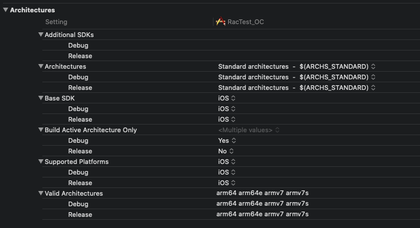

## BuildSetting - Architectures



| CPU指令集 | 对应设备                                                     |
| --------- | ------------------------------------------------------------ |
| armv7     | iPhone 3GS，iPhone4，iPhone 4s，iPad，iPad2，iPad3(The New iPad)，iPad mini，iPod Touch 3G，iPod Touch4 |
| armv7s    | iPhone5， iPhone5C，iPad4，iPod5                             |
| arm64     | iPhone5s，iPhone6、7、8，iPhone6、7、8 Plus，iPhone X，iPad Air，iPad mini2(iPad mini with Retina Display)， |
| x86_64    | 模拟器64位处理器测试(Xcode 9目前IPhone类型编译出来的都是x86_64) |
| i386      | 模拟器32位处理器测试                                         |
| arm64e    | iPhone XS\XR\XS Max                                          |
| armv6     | iPhone, iPhone 3G, iPod 1G/2G                                |


#### 各个Item解析

----

**Architectures:**

```swift

```

**Build Active Architecture Only:**

```python

```

**Valid Architectures


#### 常见错误

---


#### 相关文章

---

- https://www.cnblogs.com/lulushen/p/8135269.html