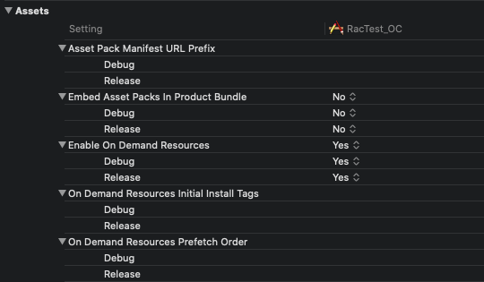

## BuildSetting - Assets




#### 各个Item解析

-----

**Asset Pack Manifest URL Prefix:**

```swift

```

**Embed Asset Packs In Product Bundle:**

```swift

```

**Enable On Demand Resources:**

```swift
ios9引入了一个新功能，On-Demand Resources，它是app thinning 的一部分。这个机能简单的说，就是在下载app的时候，app中包含的不重要资源不下载，等到需要时，在由系统向苹果的server发送请求，下载这些资源包。

官方连接如下：

https://developer.apple.com/library/ios/documentation/FileManagement/Conceptual/On_Demand_Resources_Guide/index.html#//apple_ref/doc/uid/TP40015083-CH2-SW1

这个系统集成的下载功能和我们常用下载功能是有区别的:

1.On-Demand Resources中的涉及的资源是在app打包时就确定了的，不进行版本更新就无法更新这些资源。

2.由于下载的Server是app store替我们实现的，我们就不需要服务器了。

通过以上这两点就可以看出，如果我们的app中的某些资源很大，而且是固定的内容，就该使用On-Demand Resources功能，简化开发，提高用户体验。

详细的使用说明，见iOS_9_by_Tutorials中的 App Thinning 章节。
```

**On Demand Resources Initial Install Tags**

```swift

```

**On Demand Resources Prefetch Order:**

```swift

```


#### 常见错误

---


#### 相关文章

---

- https://www.jianshu.com/p/87079de32e01