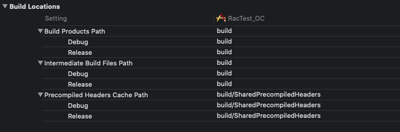

## BuildSetting - Assets




#### 各个Item解析

-----

**Build Products Path:**

```swift
产品文件和编译中间文件的根目录，产品文件和编译时的临时文件都放在这个子目录中
```

**Intermediate Build Files Path:**

```swift
编译时，临时文件的存放位置。编译中间文件格式为product name+.build，如：Myproduct.build
```

**Precompiled Headers Cache Path:**

```swift
存放预编译头文件的位置，通过这个配置，Targets可以互相共享预编译头文件。也就是pch头文件
```


#### 常见错误

---


#### 相关文章

---

- 

