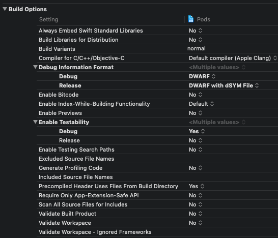

## BuildSetting - Build Options




#### 各个Item解析

-----

**Always Embed Swift Standard Libraries:**

```swift

```

**Build Libraries for Distribution:**

```swift

```

**Build Variants:**

```swift

```

**Compiler for C/C++/Objective-C:**

```swift

```

**Debug Information Format:**

```swift

```

**Enable BitCode:**

```swift

```

**Enable Index - While - Building Functionality:**

```swift

```

**Enable Previews:**

```swift

```

**Enable Testability:**

```swift

```

**Enable Testing Search Paths:**

```swift

```

**Excluded Source File Names:**

```swift

```

**Generate Profilling Code:**

```swift

```

**Included Source File Names:**

```swift

```

**Precompiled Header Uses Files From Build Directory:**

```swift

```

**Require Only App-Extension-Safe API:**

```swift

```

**Scan All Source Files for Includes:**

```swift

```

**Validate Built Product:**

```swift

```

**Validate Workspace:**

```swift

```

**Validate Workspace - Ignored Frameworks:**

```swift

```


#### 常见错误

---


#### 相关文章

---

- 

