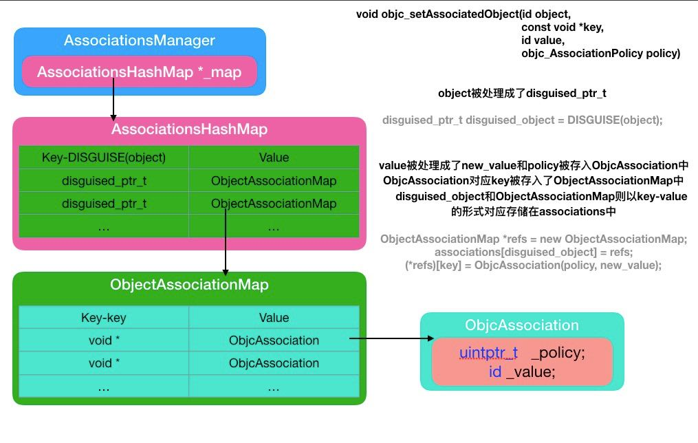

## OC-runtime关联对象的实现原理

-----

使用当中涉及到的三个方法：

```objective-c
//关联对象
void objc_setAssociatedObject(id object, const void *key, id value, objc_AssociationPolicy policy)
//获取关联的对象
id objc_getAssociatedObject(id object, const void *key)
//移除关联的对象
void objc_removeAssociatedObjects(id object)
```

runtime源码:

```objc
id
objc_getAssociatedObject(id object, const void *key)
{
    return _object_get_associative_reference(object, key);
}

static void
_base_objc_setAssociatedObject(id object, const void *key, id value, objc_AssociationPolicy policy)
{
  _object_set_associative_reference(object, key, value, policy);
}

static ChainedHookFunction<objc_hook_setAssociatedObject> SetAssocHook{_base_objc_setAssociatedObject};

void
objc_setHook_setAssociatedObject(objc_hook_setAssociatedObject _Nonnull newValue,
                                 objc_hook_setAssociatedObject _Nullable * _Nonnull outOldValue) {
    SetAssocHook.set(newValue, outOldValue);
}

void
objc_setAssociatedObject(id object, const void *key, id value, objc_AssociationPolicy policy)
{
    SetAssocHook.get()(object, key, value, policy);
}


void objc_removeAssociatedObjects(id object) 
{
    if (object && object->hasAssociatedObjects()) {
        _object_remove_assocations(object);
    }
}
```


可以看出：

- `objc_setAssociatedObject`实际调用的是`_object_set_associative_reference`
- `objc_getAssociatedObject`实际调用的是`_object_get_associative_reference`
- `objc_removeAssociatedObjects`实际调用的是`_object_remove_assocations`

下面就这几个方法进行解析


#### _object_set_associative_reference

-------


#### _object_get_associative_reference

--------


#### _object_remove_associations

------


通过上面的三个方法，我们知道了下面几个类

- AssociationsManager
- AssociationsHashMap
- ObjctAssociationMap
- ObjctAssociation

关系图：

 


大致的数据结构是这样的：

```markdown
1.所有的类的关联属性都存储在一个`AssociationsManager`的实例中，这个实例包含了一个map:`ExplicitInitDenseMap<DisguisedPtr<objc_object>, ObjectAssociationMap>`。map的key是根据对象的地址生成一个DisguisedPtr，value是一个map
2.`ObjectAssociationMap`中存储了一个对象的所有的关联对象信息`DenseMap<const void *, ObjcAssociation> `
3.`ObjcAssociation`

```


