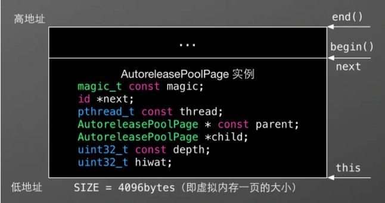
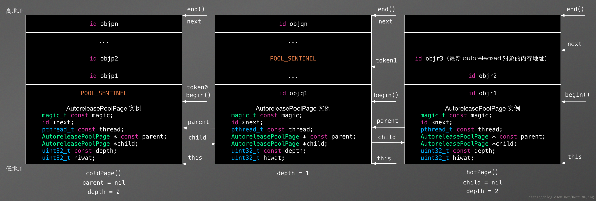

## 自动释放池 - AutoReleasePool

-------

本文主要涉及以下几个问题：

- 自动释放池的结构（关注AutoReleasePool嵌套）
- POOL_SENTINEL
- 自动释放池的操作
- 主线程的自动释放池
- 子线程的自动释放池
- 自动释放池和线程的关系：一一对应


#### 自动释放池的结构

------

自动释放池的结构是：栈 + 双向链表。每一个节点叫做`AutoreleasePoolPage`

```c++
struct AutoreleasePoolPageData {
  // 用来校验AutoReleasePoolPage是否完整
	magic_t const magic; 
  // 下一个空闲位置的指针
	__unsafe_unretained id *next; 
  // 当前所在的线程
	pthread_t const thread;
  // 父节点指针
	AutoreleasePoolPage * const parent;
  // 子节点指针
	AutoreleasePoolPage *child;
  // 链表的深度
	uint32_t const depth;
  // 数据容纳的一个上限
	uint32_t hiwat;
};

class AutoreleasePoolPage : private AutoreleasePoolPageData {
	...
#define POOL_SENTINEL nil
    id * begin() {
        return (id *) ((uint8_t *)this+sizeof(*this));
    }

    id * end() {
        return (id *) ((uint8_t *)this+SIZE);
    }
}
```

一个`AutoReleasePoolPage`的结构如下：



而多个`AutoReleasePoolPage`就形成了一个链表，这就是`AutoReleasePool`:



上面是一个嵌套的`AutoReleasePool`，也就是下面这样：

```objective-c
@autoreleasepool {
  NSObject * a = [NSObject new];
  @autoreleasepool {
    NSObject *b = [NSObject new];
    @autoreleasepool {
      NSObject *c = [NSObject new];
    }
  }
}
```

需要注意一下几个点：

- `next`指针指向的是当前的空闲位置
- 每个`page`的大小为4096的字节，也就是一页虚拟内存的大小


#### POOL-SENTINEL - 哨兵

--------

看`AutoreleasePoolPage`结构体，正常情况下，他就是一个`nil`。当每个自动释放池初始化调用`objc_autoreleasePoolPush`的时候，都会把一个`POOL_SENTINEL`push到当前自动释放池的栈顶，并且返回这个`POOL_SENTINEL`哨兵对象
当我们使用`@autoreloeasepool{}`是，会转换为以下代码：

```c++
int main(int argc, const char * argv[]) {
    {
        void * atautoreleasepoolobj = objc_autoreleasePoolPush();
        
        // do whatever you want
        
        objc_autoreleasePoolPop(atautoreleasepoolobj);
    }
    return 0;
}
```

当自动释放池执行的最后"}"的时候，自动释放池就会对当前自动释放池所有引用的对象执行`release`操作


#### 自动释放池的操作

---------


#### 主线程的自动释放池

---------

###### 主线程自动释放池的创建和销毁：

- App启动后，苹果会在主线程的`RunLoop`里，注册两个`Observer`，其回调都是`_wrapRunLoopWithAutoreleasePoolHandler()`
- 第一个`Observer`监听的`Entry(即将进入RunLoop)`，其回调内会调用`_objc_autoreleasePoolPush`方法，自动创建自动释放池。这个监听的`order`是`-2147483647`，表示优先级最高，保证释放池的创建在其他所有的回调之前
- 第二个`Observer`监听了两个事件：`BeforeWaiting(准备进入休眠)`和`exit(退出RunLoop)`。其中，在`BeforeWaiting`时，会调用`_objc_atuoreleasePoolPop()`和`_objc_autoreleasePoolPop()`释放旧的池，并创建新的池。在`exit`是，只会调用`_objc_autoreleasePoolPop()`来释放自动释放池。这个`Observer`的优先级是`2147483647`，优先级最低，保证其释放池放生在所有的其他回调之后
- 在主线程执行的代码，通常是写在诸如事件回调、Timer回调内的。这些回调会被 RunLoop 创建好的 AutoreleasePool 环绕着，所以不会出现内存泄漏，开发者也不必显示创建 Pool 了。

也就是说AutoreleasePool创建是在一个RunLoop事件开始之前(push)，AutoreleasePool释放是在一个RunLoop事件即将结束之前(pop)。 AutoreleasePool里的Autorelease对象的加入是在RunLoop事件中，AutoreleasePool里的Autorelease对象的释放是在AutoreleasePool释放时。


#### 子线程的自动释放池

----------

子线程默认情况下，`RunLoop`是关闭的，这种情况下，子线程的自动释放池难道不存在了吗？

不是的。如果子线程存在`RunLoop`开始的时候，创建自动释放池。否则，就要看编译器了，编译器自动在每个对象上添加`autorelease`的时候，创建自动释放池