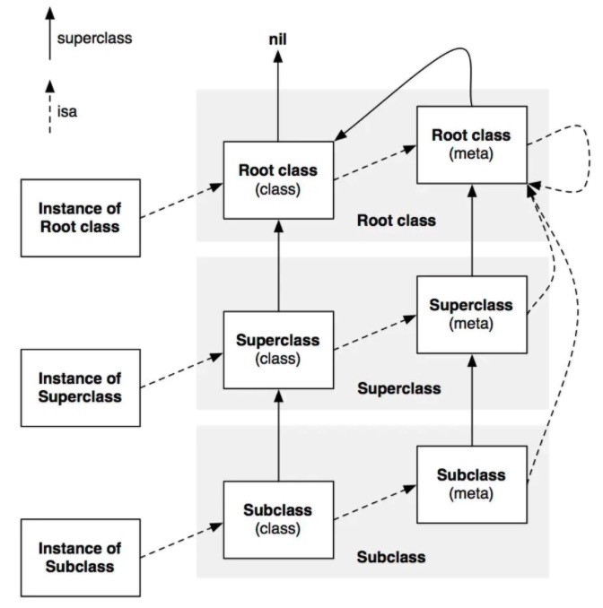

## 对象、类对象、元类对象结构体

本文主要研究对象、类对象、元类对象的结构体表示以及他们之间的关系

先说一下结论：

- 实例的isa指针指向类对象
- 类对象的isa指针指向元类对象
- 元类对象的isa指针指向根元类对象
- 根元类对象的isa指针是根类对象

看一下具体关系图：



我们拿个实例来说一下：

```objective-c
@interface A:NSObject {
    
}

@end

@interface B:A {
    
}

@end

@interface C:B {
    
}

@end
```

上面的代码，C继承自B，B继承自A，A继承自NSObject。我们来总结一下，下面几个对象(类也是对象)的关系：

- `C`对象、`C`对象的类对象是`C-Class`、C对象的元类对象是`C-metaClass`
- `B`对象、`B`对象的类对象是`B-Class`、`B`对象的元类对象是`B-metaClass`
- `A`对象、`A`对象的类对象是`A-Class`、`A`对象的元类对象`A-metaClass`，
- `NSObject`对象、`NSObject`对象的类对象是`NSObject-class`，NSObject对象的元类对象的关系

命令行下执行`xcrun -sdk iphonesimulator clang -rewrite-objc main.m -o main_cpp.cpp`，转成C++代码如下：

```c++
// A
typedef struct objc_object A;
typedef struct {} _objc_exc_A;

struct A_IMPL {
	struct NSObject_IMPL NSObject_IVARS;
};

// B
typedef struct objc_object B;
typedef struct {} _objc_exc_B;

struct B_IMPL {
	struct A_IMPL A_IVARS;
};

// C
typedef struct objc_object C;
typedef struct {} _objc_exc_C;

struct C_IMPL {
	struct B_IMPL B_IVARS;
};

// 对类A的初始化
static void OBJC_CLASS_SETUP_$_A(void ) {
	OBJC_METACLASS_$_A.isa = &OBJC_METACLASS_$_NSObject;
	OBJC_METACLASS_$_A.superclass = &OBJC_METACLASS_$_NSObject;
	OBJC_METACLASS_$_A.cache = &_objc_empty_cache;
	OBJC_CLASS_$_A.isa = &OBJC_METACLASS_$_A;
	OBJC_CLASS_$_A.superclass = &OBJC_CLASS_$_NSObject;
	OBJC_CLASS_$_A.cache = &_objc_empty_cache;
}

// 对类B的初始化
static void OBJC_CLASS_SETUP_$_B(void ) {
	OBJC_METACLASS_$_B.isa = &OBJC_METACLASS_$_NSObject;
	OBJC_METACLASS_$_B.superclass = &OBJC_METACLASS_$_A;
	OBJC_METACLASS_$_B.cache = &_objc_empty_cache;
	OBJC_CLASS_$_B.isa = &OBJC_METACLASS_$_B;
	OBJC_CLASS_$_B.superclass = &OBJC_CLASS_$_A;
	OBJC_CLASS_$_B.cache = &_objc_empty_cache;
}

// 对类C的初始化
static void OBJC_CLASS_SETUP_$_C(void ) {
	OBJC_METACLASS_$_C.isa = &OBJC_METACLASS_$_NSObject;
	OBJC_METACLASS_$_C.superclass = &OBJC_METACLASS_$_B;
	OBJC_METACLASS_$_C.cache = &_objc_empty_cache;
	OBJC_CLASS_$_C.isa = &OBJC_METACLASS_$_C;
	OBJC_CLASS_$_C.superclass = &OBJC_CLASS_$_B;
	OBJC_CLASS_$_C.cache = &_objc_empty_cache;
}

// 存储了当前类在编译期就已经确定的属性、方法以及遵循的协议
struct _class_ro_t {
	unsigned int flags;
	unsigned int instanceStart;
	unsigned int instanceSize;
	unsigned int reserved;
	const unsigned char *ivarLayout;
	const char *name;
	const struct _method_list_t *baseMethods;
	const struct _objc_protocol_list *baseProtocols;
	const struct _ivar_list_t *ivars;
	const unsigned char *weakIvarLayout;
	const struct _prop_list_t *properties;
};

struct _class_t {
	struct _class_t *isa;
	struct _class_t *superclass;
	void *cache;
	void *vtable;
	struct _class_ro_t *ro;
};
```

