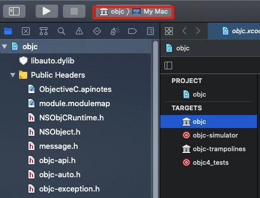
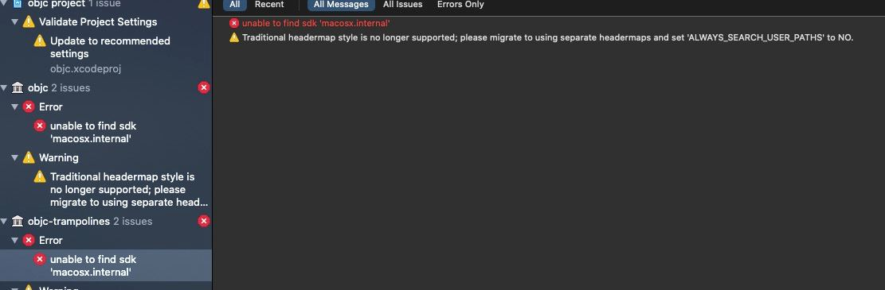

## 编译Runtime源码

-----

先来做一下准备工作

1. 需要先下载的几个源码：

- Runtime源码

  ```markdown
  链接：`https://opensource.apple.com/tarballs/objc4/`
  我这里下载的是`objec-781.tar.gz`
  ```

- dyld源码

  ```markdown
  链接：`https://opensource.apple.com/tarballs/dyld/`
  我这里下载的是`dyld-750.6.tar.gz`
  ```

- GCD源码

  ```markdown
  链接：`https://opensource.apple.com/tarballs/libdispatch/`
  我这里下载的是`libdispatch-1173.40.5.tar.gz`
  ```

- XNU内核源码

  ```markdown
  链接：`https://opensource.apple.com/tarballs/xnu/`
  我这里下载的是`xnu-6153.81.5.tar.gz`
  ```

- libplatform源码

  ```markdown
  链接：`https://opensource.apple.com/tarballs/libplatform/`
  我这里下载的是`libplatform-177.270.1.tar.gz`，目前也只有这一个版本
  ```

- pthread源码

  ```markdown
  链接：`https://opensource.apple.com/tarballs/libpthread/`
  我这里下载的是`libpthread-416.40.3.tar.gz`
  ```

  note:<font color=gray>上面所有的版本，都是写这篇文章的时候最新的库</font>

2. 新建目录`Runtime Compile`，将上面下载到的几个文件拖进该文件夹，然后解压
3. 进入`objc4-781`文件夹，打开`objc.xcodeproj`

下面进入正题：编译


#### 编译

--------

###### 1.选中target`objc`，然后`commond + b`:



###### 2.遇到两个报错和两个警告



原因：

```markdown
对于报错：当前Xcode并不包含`macosx.internal`这个平台的支持，猜测只有`Apple`内部`Xcode`版本才支持这个平台
对于警告：
```

解决办法：分别对报错的两个`target`的`build setting`做如下改动:


