## 编译Runtime源码

-----

先来做一下准备工作

1. 需要先下载的几个源码：

- Runtime源码

  ```markdown
  链接：`https://opensource.apple.com/tarballs/objc4/`
  我这里下载的是`objec-781.tar.gz`
  ```

- dyld源码

  ```markdown
  链接：`https://opensource.apple.com/tarballs/dyld/`
  我这里下载的是`dyld-750.6.tar.gz`
  ```

- GCD源码

  ```markdown
  链接：`https://opensource.apple.com/tarballs/libdispatch/`
  我这里下载的是`libdispatch-1173.40.5.tar.gz`
  ```

- XNU内核源码

  ```markdown
  链接：`https://opensource.apple.com/tarballs/xnu/`
  我这里下载的是`xnu-6153.81.5.tar.gz`
  ```

- libplatform源码

  ```markdown
  链接：`https://opensource.apple.com/tarballs/libplatform/`
  我这里下载的是`libplatform-177.270.1.tar.gz`，目前也只有这一个版本
  ```

- pthread源码

  ```markdown
  链接：`https://opensource.apple.com/tarballs/libpthread/`
  我这里下载的是`libpthread-416.40.3.tar.gz`
  ```

- libclosure源码

  ```markdown
  链接：`https://opensource.apple.com/tarballs/libclosure/`
  我这里下载的是`libclosure-74.tar.gz`
  ```

- libauto源码

  ```markdown
  链接：`https://opensource.apple.com/tarballs/libauto/`
  我这里下载的是`libauto-141.1.tar.gz`
  ```

- Libc源码

  ```markdown
  链接：`https://opensource.apple.com/tarballs/Libc/`
  我这里下载的是`Libc-1353.41.1.tar.gz`
  ```

  

  

  note:<font color=gray>上面所有的版本，都是写这篇文章的时候最新的库</font>

2. 新建目录`Runtime Compile`，将上面下载到的几个文件拖进该文件夹，然后解压
3. 进入`objc4-781`文件夹，打开`objc.xcodeproj`

下面进入正题：编译


#### 编译

--------

###### 1.选中target`objc`，然后`commond + b`:


###### 2.遇到两个报错和两个警告


原因：

```markdown
对于报错：当前Xcode并不包含`macosx.internal`这个平台的支持，猜测只有`Apple`内部`Xcode`版本才支持这个平台
对于警告：
```

解决办法：分别对报错的两个`target`的`build setting`做如下改动:

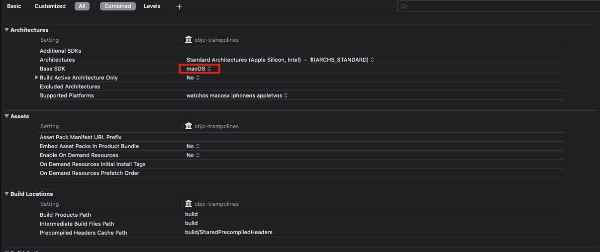

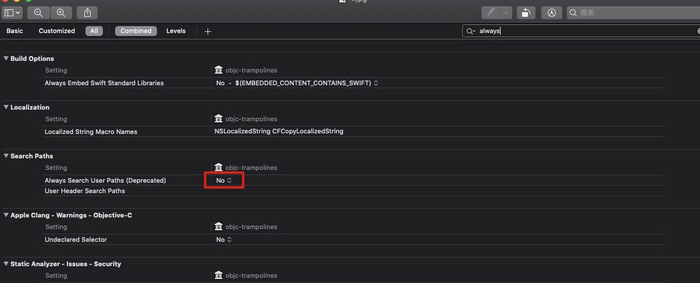


###### 2.修改完后，执行`commond + b`，报错如下：

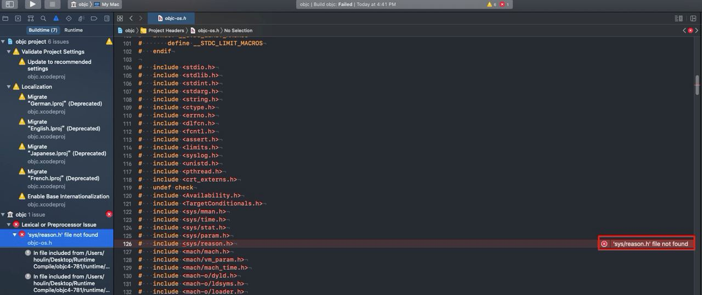

`Commond + shift + o`搜索一下这个文件，发现并不存在，也就是头文件不存在，那么我们需要在工程下，新建一个`CommonHeaders`文件夹，将后面编译所有缺失的头文件，放入这个文件夹。

将`CommonHeaders`的路径，添加到`Header Search Paths`中

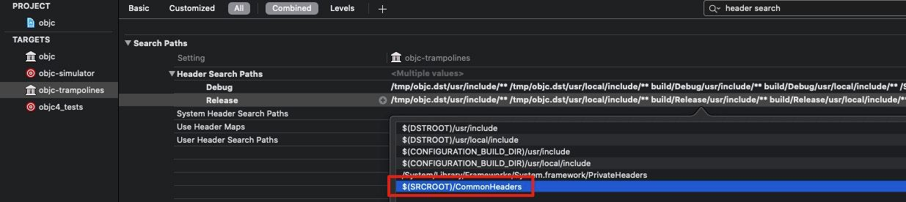

那么缺失的`头文件`去哪里找呢，这些缺失的头文件，都能在我们准备阶段下载的几个源码文件中找到的到

`reason.h`这个文件，其实是在`xnu`内核源码中:

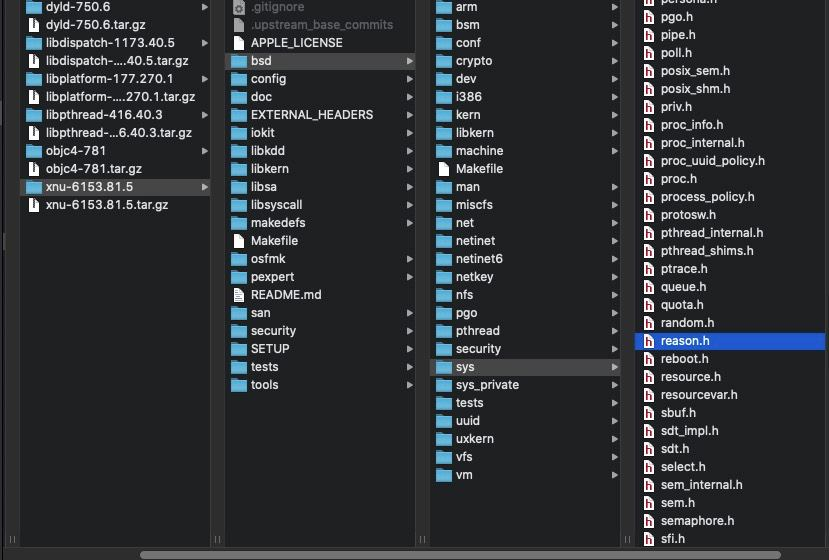

将`reason.h`文件导入到项目中:

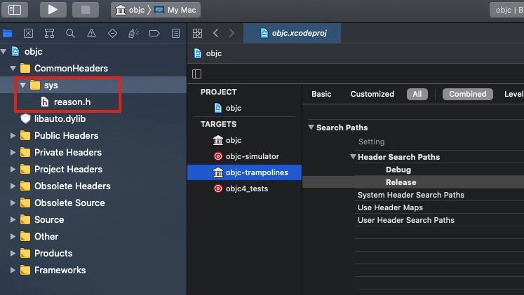

除了缺少`reason.h`头文件之外，还缺少下面文件:

```markdown
`mach-o/dyld_priv.h`
`os/lock_private.h`
`os/base_private.h`
`pthread/tsd_private.h`
`System/machine/cpu_capabilities.h`
`os/tsd.h`
`pthread/spinlock_private.h`
`System/pthread_machdep.h`，这个文件并没有在上面下载的库中找到，具体原因，见后面解释
`CrashReporterClient.h`，在`libc`中，具体方案见下面详解
`objc-shared-cache.h`
`_simple.h`，使用`libplatform`中的
`Block_private.h`，使用`libclosure`中的
`kern/restartable.h`
```


#### `System/pthread_machdep.h`并没有在上面的库中找到

-----

原因是，在`libc-997`之后的版本，`libc-997`之中的`pthread`文件夹被移走了，所以我们需要将`libc`的库版本，降低到`Libc-825.40.1.tar.gz`

更新库后，导入`pthread_machdep.h`文件中，下面几个方法报错：

```markdown
pthread_lock_t
_pthread_has_direct_tsd
_pthread_getspecific_direct
_pthread_setspecific_direct
```

需要将上面的三个方法注释掉


#### <CrashReporterClient.h> file not found

----

这个文件在`libc`库中，添加完之后，还需要添加`宏定义`

"TARGETS->objc->Build Settings",搜索"preprocessor",在Preprocessor Macros中添加 LIBC_NO_LIBCRASHREPORTERCLIENT，DEBUG和RELEASE都添加。


#### objc-runtime-new.mm 编译错误

---------

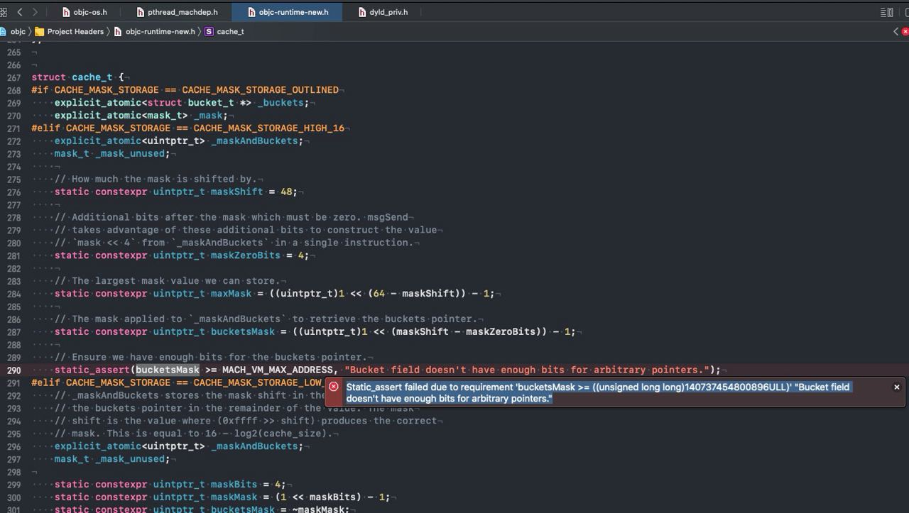

直接注释掉


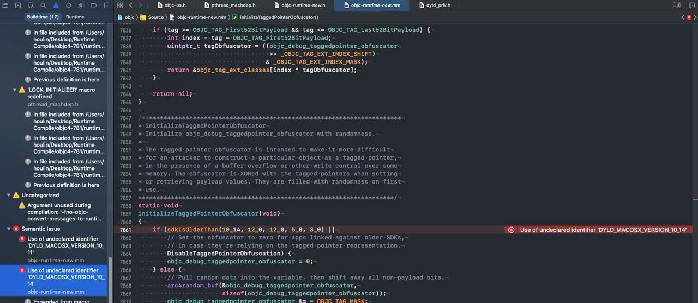

在`dyld_priv.h`文件中，添加下面的宏

```
#define DYLD_MACOSX_VERSION_10_11 0x000A0B00
#define DYLD_MACOSX_VERSION_10_12 0x000A0C00
#define DYLD_MACOSX_VERSION_10_13 0x000A0D00
#define DYLD_MACOSX_VERSION_10_14 0x000A0E00
```


#### objc-os.h报错

-----

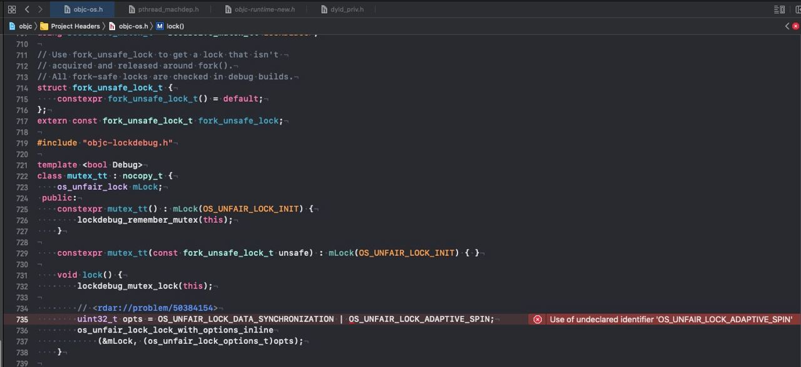

直接注释掉


#### bridgeos(3.0)报错

------

直接删除`bridgeos(3.0)`，不要忘记删除前面的`.`


#### objc-errors.mm报错

------

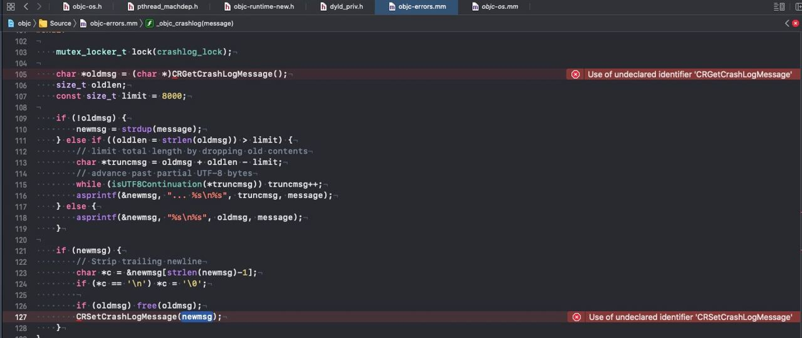

解决办法：添加宏定义`LIBC_NO_LIBCRASHREPORTERCLIENT`

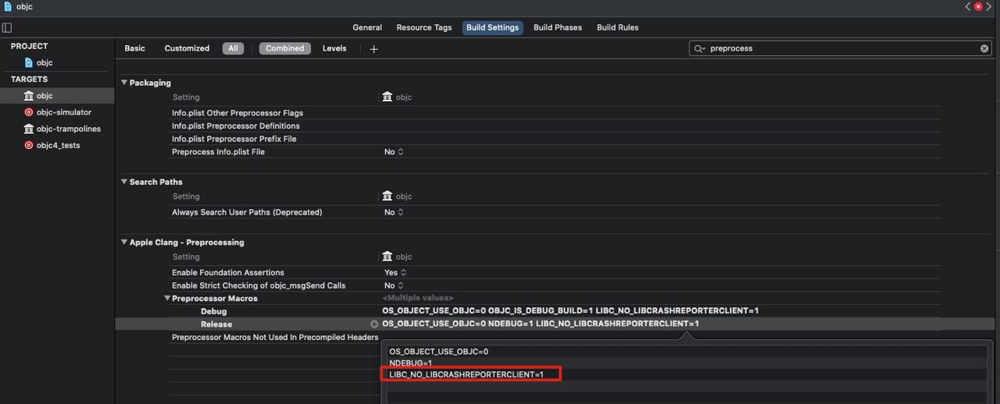


#### 链接报错:libobjc.order报错

-----

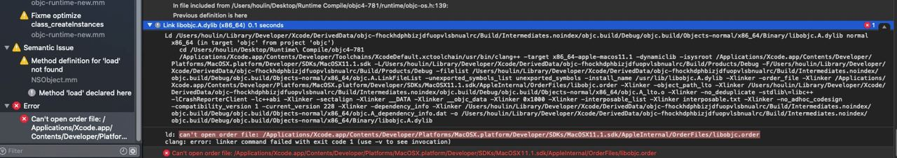

解决办法：在工程的 `Order File` 中添加搜索路径 `$(SRCROOT)/libobjc.order`

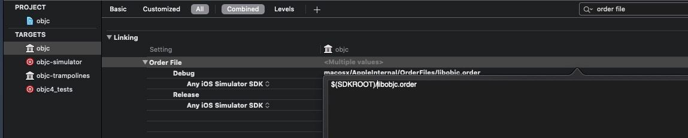


解决办法："TARGETS->objc->Build Settings->Linking->Other Linker Flags"中删除lCrashReporterClient，DEBUG和RELEASE都删除，如下图：

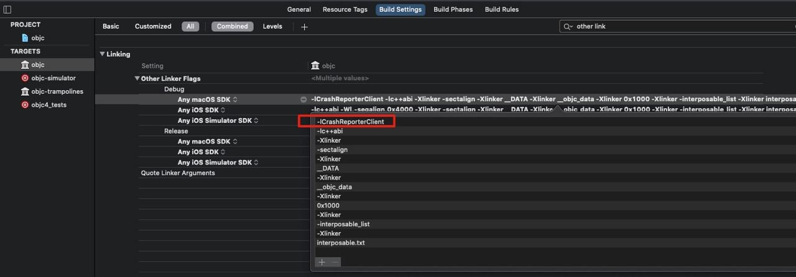


#### macOS.internal报错

-----

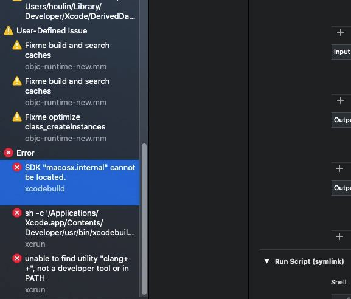

解决办法，去掉`build phase`中的`run script`脚本中的`macosx.internal`，改为`macosx`

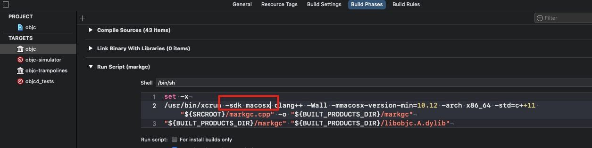


到此未知，编译成功，接下来我们调试


#### 调试`Runtime`

--------

在我们编译通过的工程下，新建一个`Target`，选择`macOS`->


