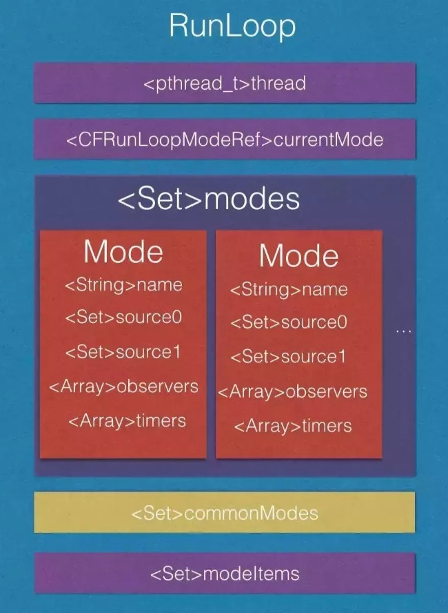

## Runloop

-----------------


#### 为什么需要Runloop

-----

RunLoop被称为“运行循环”，其实就是一个“event loop”，伪代码如下：

```
while(var) {
		doTask()
		wait...
		wakeUp()
}
```

一般while循环会导致cpu进入忙等待状态，而RunLoop是一种闲等待。当没有事件时，RunLoop可以让线程进入休眠状态，有事件发生时，RunLoop会唤醒线程继续工作。简单来说，RunLoop主要有以下作用：

- 保持程序的持续运行，循环避免线程销毁
- 处理App的各种事件
- 节省CPU资源，提高程序运行性能

实现Runloop的关键点在于：如何管理事件/消息，如何让线程在没有处理消息时休眠以避免资源占用、在有消息到来时立刻被唤醒。


#### RunLoop和线程的关系

------

###### 线程

```markdown
有的线程执行的任务是一条直线(A->B)。而另一些是一个圆(A->B->...->A)，直到以某种方式将他终止。圆形任务模型的线程是怎么实现的呢？没错，就是RunLoop
```


###### 线程和RunLoop的关系

```
RunLoop为了线程而生，没有线程，就没有RunLoop。所以，RunLoop并没有方法可以创建他，只能在线程内通过函数获取(note:主线程例外的RunLoop可以在其他线程获取)。
RunLoop和线程是一一对应的，Cocoa和CoreFundation框架都提供了RunLoop对象方便配置和管理线程的RunLoop
```


###### 主线程的RunLoop默认是启动的，非主线程默认是不启动的

```
int main(int argc, char * argv[]) {
    NSString * appDelegateClassName;
    @autoreleasepool {
        // Setup code that might create autoreleased objects goes here.
        appDelegateClassName = NSStringFromClass([AppDelegate class]);
    }
    return UIApplicationMain(argc, argv, nil, appDelegateClassName);
}

上面的代码是xcode默认创建一个项目的main.m的函数，UIApplicationMain这个方法会为main thread开启一个runloop对象

其他线程默认并不开启RunLoop，执行完任务就退出了，如果不希望退出，需要开启RunLoop，下面代码是AFNetworking的代码片段，用于“线程保活”

+ (void)networkRequestThreadEntryPoint:(id)__unused object {
    @autoreleasepool {
        [[NSThread currentThread] setName:@"AFNetworking"];
        NSRunLoop *runLoop = [NSRunLoop currentRunLoop];
        [runLoop addPort:[NSMachPort port] forMode:NSDefaultRunLoopMode];
        [runLoop run];
    }
}
 
+ (NSThread *)networkRequestThread {
    static NSThread *_networkRequestThread = nil;
    static dispatch_once_t oncePredicate;
    dispatch_once(&oncePredicate, ^{
        _networkRequestThread = [[NSThread alloc] initWithTarget:self selector:@selector(networkRequestThreadEntryPoint:) object:nil];
        [_networkRequestThread start];
    });
    return _networkRequestThread;
}
```


###### RunLoop的线程安全问题

```
Cocoa中的NSRunLoop类并不是线程安全的，我们无法在一个线程去操作另外一个线程的RunLoop对象。但是CoreFundataion中的CFRunLoopRef是线程安全的。Cocoa中的NSRunLoop可以通过实例方法getCFRunLoop来获取
```


苹果不允许直接创建RunLoop，只能获取。获取的过程中，如果当前线程不存在RunLoop，会自动创建一个，并关联到当前线程，线程和RunLoop的对应关系存储在一个全局字典`static CFMutableDictionaryRef __CFRunLoops = NULL;`

```
static CFMutableDictionaryRef __CFRunLoops = NULL;
static CFSpinLock_t loopsLock = CFSpinLockInit;

// should only be called by Foundation
// t==0 is a synonym for "main thread" that always works
CF_EXPORT CFRunLoopRef _CFRunLoopGet0(pthread_t t) {
    if (pthread_equal(t, kNilPthreadT)) {
	t = _CFMainPThread;
    }
    __CFSpinLock(&loopsLock);
    if (!__CFRunLoops) {
        __CFSpinUnlock(&loopsLock);
	CFMutableDictionaryRef dict = CFDictionaryCreateMutable(kCFAllocatorSystemDefault, 0, NULL, &kCFTypeDictionaryValueCallBacks);
	CFRunLoopRef mainLoop = __CFRunLoopCreate(_CFMainPThread);
	CFDictionarySetValue(dict, pthreadPointer(_CFMainPThread), mainLoop);
	if (!OSAtomicCompareAndSwapPtrBarrier(NULL, dict, (void * volatile *)&__CFRunLoops)) {
	    CFRelease(dict);
	}
	CFRelease(mainLoop);
        __CFSpinLock(&loopsLock);
    }
    CFRunLoopRef loop = (CFRunLoopRef)CFDictionaryGetValue(__CFRunLoops, pthreadPointer(t));
    if (!loop) {
        __CFSpinUnlock(&loopsLock);
	CFRunLoopRef newLoop = __CFRunLoopCreate(t);
        __CFSpinLock(&loopsLock);
	loop = (CFRunLoopRef)CFDictionaryGetValue(__CFRunLoops, pthreadPointer(t));
	if (!loop) {
	    CFDictionarySetValue(__CFRunLoops, pthreadPointer(t), newLoop);
	    loop = newLoop;
	}
	CFRelease(newLoop);
    }
    if (pthread_equal(t, pthread_self())) {
        _CFSetTSD(__CFTSDKeyRunLoop, (void *)loop, NULL);
        if (0 == _CFGetTSD(__CFTSDKeyRunLoopCntr)) {
            _CFSetTSD(__CFTSDKeyRunLoopCntr, (void *)(PTHREAD_DESTRUCTOR_ITERATIONS-1), (void (*)(void *))__CFFinalizeRunLoop);
        }
    }
    __CFSpinUnlock(&loopsLock);
    return loop;
}

CFRunLoopRef CFRunLoopGetMain(void) {
    CHECK_FOR_FORK();
    static CFRunLoopRef __main = NULL; // no retain needed
    if (!__main) __main = _CFRunLoopGet0(_CFMainPThread); // no CAS needed
    return __main;
}

CFRunLoopRef CFRunLoopGetCurrent(void) {
    CHECK_FOR_FORK();
    CFRunLoopRef rl = (CFRunLoopRef)_CFGetTSD(__CFTSDKeyRunLoop);
    if (rl) return rl;
    return _CFRunLoopGet0(pthread_self());
}

```


#### RunLoop中的mode

----

先看一下RunLoop，RunLoopMode的数据结构

```
struct __CFRunLoop {
    CFRuntimeBase _base;
    pthread_mutex_t _lock;			/* locked for accessing mode list */
    __CFPort _wakeUpPort;			// used for CFRunLoopWakeUp 
    Boolean _ignoreWakeUps;
    volatile uint32_t *_stopped;
    pthread_t _pthread;
    uint32_t _winthread;
    CFMutableSetRef _commonModes;
    CFMutableSetRef _commonModeItems;
    CFRunLoopModeRef _currentMode;
    CFMutableSetRef _modes;
    struct _block_item *_blocks_head;
    struct _block_item *_blocks_tail;
    CFTypeRef _counterpart;
};

struct __CFRunLoopMode {
    CFRuntimeBase _base;
    pthread_mutex_t _lock;	/* must have the run loop locked before locking this */
    CFStringRef _name;
    Boolean _stopped;
    char _padding[3];
    CFMutableSetRef _sources0;
    CFMutableSetRef _sources1;
    CFMutableArrayRef _observers;
    CFMutableArrayRef _timers;
    CFMutableDictionaryRef _portToV1SourceMap;
    __CFPortSet _portSet;
    CFIndex _observerMask;
#if DEPLOYMENT_TARGET_MACOSX || DEPLOYMENT_TARGET_EMBEDDED
    mach_port_t _timerPort;
#endif
#if DEPLOYMENT_TARGET_WINDOWS
    HANDLE _timerPort;
    DWORD _msgQMask;
    void (*_msgPump)(void);
#endif
};

struct __CFRunLoopSource {
    CFRuntimeBase _base;
    uint32_t _bits;
    pthread_mutex_t _lock;
    CFIndex _order;			/* immutable */
    CFMutableBagRef _runLoops;
    union {
	CFRunLoopSourceContext version0;	/* immutable, except invalidation */
        CFRunLoopSourceContext1 version1;	/* immutable, except invalidation */
    } _context;
};

struct __CFRunLoopTimer {
    CFRuntimeBase _base;
    uint16_t _bits;
    pthread_mutex_t _lock;
    CFRunLoopRef _runLoop;
    CFMutableSetRef _rlModes;
    CFAbsoluteTime _nextFireDate;
    CFTimeInterval _interval;		/* immutable */
    int64_t _fireTSR;			/* TSR units */
    CFIndex _order;			/* immutable */
    CFRunLoopTimerCallBack _callout;	/* immutable */
    CFRunLoopTimerContext _context;	/* immutable, except invalidation */
};

struct __CFRunLoopObserver {
    CFRuntimeBase _base;
    pthread_mutex_t _lock;
    CFRunLoopRef _runLoop;
    CFIndex _rlCount;
    CFOptionFlags _activities;		/* immutable */
    CFIndex _order;			/* immutable */
    CFRunLoopObserverCallBack _callout;	/* immutable */
    CFRunLoopObserverContext _context;	/* immutable, except invalidation */
};

```


RunLoop是一个结构体对象，绑定了一个线程，包含当前正在运行的Mode，N个Mode，N个CommonMode



从代码和图中可以看出：

- runloop和线程一一对应
- runloop包含多个mode，mode包含多个modeitem(source，timers, observers)
- runloop每次只能运行在一个mode下：
  - 切换mode必须先停止mode，然后设置mode，重新run
  - runloop通过切换mode来筛选要处理的事件，让其互不影响
  - 这是iOS运行流畅的关键

__CFRunLoopMode负责管理所有的事件，而runloop负责管理mode：

- 一个mode包括N个source0，N个source1，N个observers，N个timers。
- mode是可以定制的，至少包含一个mode item，同一个mode item可以被多个mode持有
- 一个mode可以将自己标记为"common"属性，标记为common属性的mode-A，会自动将runloop中commonModeitems同步到mode-A的items中去

苹果公开的mode有两个：kCFRunLoopDefaultMode和UITrackingRunLoopMode。除此之外，还提供了一个操作common标记的字符串kCFRunLoopCommonModes (NSRunLoopCommonModes)，你可以用这个字符串来操作common items，或者标记一个mode为common


#### RunLoop的工作流程

-----


源码如下：

```
static int32_t __CFRunLoopRun(CFRunLoopRef rl, CFRunLoopModeRef rlm, CFTimeInterval seconds, Boolean stopAfterHandle, CFRunLoopModeRef previousMode) {
    int64_t startTSR = (int64_t)mach_absolute_time();

    if (__CFRunLoopIsStopped(rl)) {
        __CFRunLoopUnsetStopped(rl);
	return kCFRunLoopRunStopped;
    } else if (rlm->_stopped) {
	rlm->_stopped = false;
	return kCFRunLoopRunStopped;
    }

    mach_port_name_t dispatchPort = MACH_PORT_NULL;
    Boolean libdispatchQSafe = pthread_main_np() && ((HANDLE_DISPATCH_ON_BASE_INVOCATION_ONLY && NULL == previousMode) || (!HANDLE_DISPATCH_ON_BASE_INVOCATION_ONLY && 0 == _CFGetTSD(__CFTSDKeyIsInGCDMainQ)));
    if (libdispatchQSafe && (CFRunLoopGetMain() == rl) && CFSetContainsValue(rl->_commonModes, rlm->_name)) dispatchPort = _dispatch_get_main_queue_port_4CF();

    dispatch_source_t timeout_timer = NULL;
    struct __timeout_context *timeout_context = (struct __timeout_context *)malloc(sizeof(*timeout_context));
    if (seconds <= 0.0) { // instant timeout
        seconds = 0.0;
        timeout_context->termTSR = 0LL;
    } else if (seconds <= TIMER_INTERVAL_LIMIT) {
	dispatch_queue_t queue = dispatch_get_global_queue(DISPATCH_QUEUE_PRIORITY_HIGH, DISPATCH_QUEUE_OVERCOMMIT);
	timeout_timer = dispatch_source_create(DISPATCH_SOURCE_TYPE_TIMER, 0, 0, queue);
        dispatch_retain(timeout_timer);
	timeout_context->ds = timeout_timer;
	timeout_context->rl = (CFRunLoopRef)CFRetain(rl);
	timeout_context->termTSR = startTSR + __CFTimeIntervalToTSR(seconds);
	dispatch_set_context(timeout_timer, timeout_context); // source gets ownership of context
	dispatch_source_set_event_handler_f(timeout_timer, __CFRunLoopTimeout);
        dispatch_source_set_cancel_handler_f(timeout_timer, __CFRunLoopTimeoutCancel);
        uint64_t nanos = (uint64_t)(seconds * 1000 * 1000 + 1) * 1000;
	dispatch_source_set_timer(timeout_timer, dispatch_time(DISPATCH_TIME_NOW, nanos), DISPATCH_TIME_FOREVER, 0);
	dispatch_resume(timeout_timer);
    } else { // infinite timeout
        seconds = 9999999999.0;
        timeout_context->termTSR = INT64_MAX;
    }

    Boolean didDispatchPortLastTime = true;
    int32_t retVal = 0;
    do {
        uint8_t msg_buffer[3 * 1024];
#if DEPLOYMENT_TARGET_MACOSX || DEPLOYMENT_TARGET_EMBEDDED
        mach_msg_header_t *msg = NULL;
#elif DEPLOYMENT_TARGET_WINDOWS
        HANDLE livePort = NULL;
        Boolean windowsMessageReceived = false;
#endif
	__CFPortSet waitSet = rlm->_portSet;

	rl->_ignoreWakeUps = false;

        if (rlm->_observerMask & kCFRunLoopBeforeTimers) __CFRunLoopDoObservers(rl, rlm, kCFRunLoopBeforeTimers);
        if (rlm->_observerMask & kCFRunLoopBeforeSources) __CFRunLoopDoObservers(rl, rlm, kCFRunLoopBeforeSources);

	__CFRunLoopDoBlocks(rl, rlm);

        Boolean sourceHandledThisLoop = __CFRunLoopDoSources0(rl, rlm, stopAfterHandle);
        if (sourceHandledThisLoop) {
            __CFRunLoopDoBlocks(rl, rlm);
	}

        Boolean poll = sourceHandledThisLoop || (0LL == timeout_context->termTSR);

        if (MACH_PORT_NULL != dispatchPort && !didDispatchPortLastTime) {
#if DEPLOYMENT_TARGET_MACOSX || DEPLOYMENT_TARGET_EMBEDDED
            msg = (mach_msg_header_t *)msg_buffer;
            if (__CFRunLoopServiceMachPort(dispatchPort, &msg, sizeof(msg_buffer), 0)) {
                goto handle_msg;
            }
#elif DEPLOYMENT_TARGET_WINDOWS
            if (__CFRunLoopWaitForMultipleObjects(NULL, &dispatchPort, 0, 0, &livePort, NULL)) {
                goto handle_msg;
            }
#endif
        }

        didDispatchPortLastTime = false;

	if (!poll && (rlm->_observerMask & kCFRunLoopBeforeWaiting)) __CFRunLoopDoObservers(rl, rlm, kCFRunLoopBeforeWaiting);
	__CFRunLoopSetSleeping(rl);
	// do not do any user callouts after this point (after notifying of sleeping)

        // Must push the local-to-this-activation ports in on every loop
        // iteration, as this mode could be run re-entrantly and we don't
        // want these ports to get serviced.

        __CFPortSetInsert(dispatchPort, waitSet);

	__CFRunLoopModeUnlock(rlm);
	__CFRunLoopUnlock(rl);

#if DEPLOYMENT_TARGET_MACOSX || DEPLOYMENT_TARGET_EMBEDDED
        if (kCFUseCollectableAllocator) {
            objc_clear_stack(0);
            memset(msg_buffer, 0, sizeof(msg_buffer));
        }
        msg = (mach_msg_header_t *)msg_buffer;
        __CFRunLoopServiceMachPort(waitSet, &msg, sizeof(msg_buffer), poll ? 0 : TIMEOUT_INFINITY);
#elif DEPLOYMENT_TARGET_WINDOWS
        // Here, use the app-supplied message queue mask. They will set this if they are interested in having this run loop receive windows messages.
        // Note: don't pass 0 for polling, or this thread will never yield the CPU.
        __CFRunLoopWaitForMultipleObjects(waitSet, NULL, poll ? 0 : TIMEOUT_INFINITY, rlm->_msgQMask, &livePort, &windowsMessageReceived);
#endif
        
        __CFRunLoopLock(rl);
        __CFRunLoopModeLock(rlm);

        // Must remove the local-to-this-activation ports in on every loop
        // iteration, as this mode could be run re-entrantly and we don't
        // want these ports to get serviced. Also, we don't want them left
        // in there if this function returns.

        __CFPortSetRemove(dispatchPort, waitSet);

	rl->_ignoreWakeUps = true;

        // user callouts now OK again
	__CFRunLoopUnsetSleeping(rl);
	if (!poll && (rlm->_observerMask & kCFRunLoopAfterWaiting)) __CFRunLoopDoObservers(rl, rlm, kCFRunLoopAfterWaiting);

        handle_msg:;
	rl->_ignoreWakeUps = true;

#if DEPLOYMENT_TARGET_MACOSX || DEPLOYMENT_TARGET_EMBEDDED
        mach_port_t livePort = msg ? msg->msgh_local_port : MACH_PORT_NULL;
#endif
#if DEPLOYMENT_TARGET_WINDOWS
        if (windowsMessageReceived) {
            // These Win32 APIs cause a callout, so make sure we're unlocked first and relocked after
            __CFRunLoopModeUnlock(rlm);
	    __CFRunLoopUnlock(rl);

            if (rlm->_msgPump) {
                rlm->_msgPump();
            } else {
                MSG msg;
                if (PeekMessage(&msg, NULL, 0, 0, PM_REMOVE | PM_NOYIELD)) {
                    TranslateMessage(&msg);
                    DispatchMessage(&msg);
                }
            }
            
            __CFRunLoopLock(rl);
	    __CFRunLoopModeLock(rlm);
 	    sourceHandledThisLoop = true;
        } else
#endif
        if (MACH_PORT_NULL == livePort) {
            // handle nothing
        } else if (livePort == rl->_wakeUpPort) {
            // do nothing on Mac OS
#if DEPLOYMENT_TARGET_WINDOWS
            // Always reset the wake up port, or risk spinning forever
            ResetEvent(rl->_wakeUpPort);
#endif
        } else if (livePort == rlm->_timerPort) {
#if DEPLOYMENT_TARGET_WINDOWS
            // We use a manual reset timer to ensure that we don't miss timers firing because the run loop did the wakeUpPort this time
            // The only way to reset a timer is to reset the timer using SetWaitableTimer. We don't want it to fire again though, so we set the timeout to a large negative value. The timer may be reset again inside the timer handling code.
            LARGE_INTEGER dueTime;
            dueTime.QuadPart = LONG_MIN;
            SetWaitableTimer(rlm->_timerPort, &dueTime, 0, NULL, NULL, FALSE);
#endif
	    __CFRunLoopDoTimers(rl, rlm, mach_absolute_time());
        } else if (livePort == dispatchPort) {
	    __CFRunLoopModeUnlock(rlm);
	    __CFRunLoopUnlock(rl);
            _CFSetTSD(__CFTSDKeyIsInGCDMainQ, (void *)6, NULL);
#if DEPLOYMENT_TARGET_MACOSX || DEPLOYMENT_TARGET_EMBEDDED
 	    _dispatch_main_queue_callback_4CF(msg);
#elif DEPLOYMENT_TARGET_WINDOWS
            _dispatch_main_queue_callback_4CF();
#endif
            _CFSetTSD(__CFTSDKeyIsInGCDMainQ, (void *)0, NULL);
	    __CFRunLoopLock(rl);
	    __CFRunLoopModeLock(rlm);
 	    sourceHandledThisLoop = true;
            didDispatchPortLastTime = true;
        } else {
            // Despite the name, this works for windows handles as well
            CFRunLoopSourceRef rls = __CFRunLoopModeFindSourceForMachPort(rl, rlm, livePort);
            if (rls) {
#if DEPLOYMENT_TARGET_MACOSX || DEPLOYMENT_TARGET_EMBEDDED
		mach_msg_header_t *reply = NULL;
		sourceHandledThisLoop = __CFRunLoopDoSource1(rl, rlm, rls, msg, msg->msgh_size, &reply) || sourceHandledThisLoop;
		if (NULL != reply) {
		    (void)mach_msg(reply, MACH_SEND_MSG, reply->msgh_size, 0, MACH_PORT_NULL, 0, MACH_PORT_NULL);
		    CFAllocatorDeallocate(kCFAllocatorSystemDefault, reply);
		}
#elif DEPLOYMENT_TARGET_WINDOWS
                sourceHandledThisLoop = __CFRunLoopDoSource1(rl, rlm, rls) || sourceHandledThisLoop;
#endif
	    }
        } 
#if DEPLOYMENT_TARGET_MACOSX || DEPLOYMENT_TARGET_EMBEDDED
        if (msg && msg != (mach_msg_header_t *)msg_buffer) free(msg);
#endif
        
	__CFRunLoopDoBlocks(rl, rlm);

	if (sourceHandledThisLoop && stopAfterHandle) {
	    retVal = kCFRunLoopRunHandledSource;
        } else if (timeout_context->termTSR < (int64_t)mach_absolute_time()) {
            retVal = kCFRunLoopRunTimedOut;
	} else if (__CFRunLoopIsStopped(rl)) {
            __CFRunLoopUnsetStopped(rl);
	    retVal = kCFRunLoopRunStopped;
	} else if (rlm->_stopped) {
	    rlm->_stopped = false;
	    retVal = kCFRunLoopRunStopped;
	} else if (__CFRunLoopModeIsEmpty(rl, rlm, previousMode)) {
	    retVal = kCFRunLoopRunFinished;
	}
    } while (0 == retVal);

    if (timeout_timer) {
        dispatch_source_cancel(timeout_timer);
        dispatch_release(timeout_timer);
    } else {
        free(timeout_context);
    }

    return retVal;
}
```


#### RunLoop底层机制

-----

###### OSX/iOS系统框架


###### Darwin架构


- Mach是微内核(内环)，提供处理器调度、IPC等基础功能
- BSD是包在Mach外部的一个外环，提供了文件系统，进程管理、网络等功能
- IOKit层为设备驱动提供了一个面向对象的框架

###### Mach通讯

Mach 本身提供的 API 非常有限，而且苹果也不鼓励使用 Mach 的 API，但是这些API非常基础，如果没有这些API的话，其他任何工作都无法实施。在 Mach 中，所有的东西都是通过自己的对象实现的，进程、线程和虚拟内存都被称为”对象”。和其他架构不同， Mach 的对象间不能直接调用，只能通过消息传递的方式实现对象间的通信。”消息”是 Mach 中最基础的概念，消息在两个端口 (port) 之间传递，这就是 Mach 的 IPC (进程间通信) 的核心。

Mach 的消息定义是在 <mach/message.h> 头文件的，很简单：

```
typedef struct {
  mach_msg_header_t header;
  mach_msg_body_t body;
} mach_msg_base_t;
 
typedef struct {
  mach_msg_bits_t msgh_bits;
  mach_msg_size_t msgh_size;
  mach_port_t msgh_remote_port;
  mach_port_t msgh_local_port;
  mach_port_name_t msgh_voucher_port;
  mach_msg_id_t msgh_id;
} mach_msg_header_t;
```

一条 Mach 消息实际上就是一个二进制数据包 (BLOB)，其头部定义了当前端口 local_port 和目标端口 remote_port，
发送和接受消息是通过同一个 API 进行的，其 option 标记了消息传递的方向：

```
mach_msg_return_t mach_msg(
			mach_msg_header_t *msg,
			mach_msg_option_t option,
			mach_msg_size_t send_size,
			mach_msg_size_t rcv_size,
			mach_port_name_t rcv_name,
			mach_msg_timeout_t timeout,
			mach_port_name_t notify);
```

为了实现消息的发送和接收，mach_msg() 函数实际上是调用了一个 Mach 陷阱 (trap)，即函数mach_msg_trap()，陷阱这个概念在 Mach 中等同于系统调用。当你在用户态调用 mach_msg_trap() 时会触发陷阱机制，切换到内核态；内核态中内核实现的 mach_msg() 函数会完成实际的工作，如下图：

RunLoop 的核心就是一个 mach_msg() (见上面代码的第7步)，RunLoop 调用这个函数去接收消息，如果没有别人发送 port 消息过来，内核会将线程置于等待状态。例如你在模拟器里跑起一个 iOS 的 App，然后在 App 静止时点击暂停，你会看到主线程调用栈是停留在 mach_msg_trap() 这个地方。

关于mach_ports通信的文章：

https://nshipster.com/inter-process-communication/


#### RunLoop实现的功能

###### AutoRealsePool

- <a href="Runloop&AutoReleasePool">Runloop&AutoReleasePool</a>

###### 事件响应

苹果注册了一个 Source1 (基于 mach port 的) 用来接收系统事件，其回调函数为 __IOHIDEventSystemClientQueueCallback()。

当一个硬件事件(触摸/锁屏/摇晃等)发生后，首先由 IOKit.framework 生成一个 IOHIDEvent 事件并由 SpringBoard 接收。这个过程的详细情况可以参考[这里](http://iphonedevwiki.net/index.php/IOHIDFamily)。SpringBoard 只接收按键(锁屏/静音等)，触摸，加速，接近传感器等几种 Event，随后用 mach port 转发给需要的App进程。随后苹果注册的那个 Source1 就会触发回调，并调用 _UIApplicationHandleEventQueue() 进行应用内部的分发。

_UIApplicationHandleEventQueue() 会把 IOHIDEvent 处理并包装成 UIEvent 进行处理或分发，其中包括识别 UIGesture/处理屏幕旋转/发送给 UIWindow 等。通常事件比如 UIButton 点击、touchesBegin/Move/End/Cancel 事件都是在这个回调中完成的。

###### 手势识别

当上面的 _UIApplicationHandleEventQueue() 识别了一个手势时，其首先会调用 Cancel 将当前的 touchesBegin/Move/End 系列回调打断。随后系统将对应的 UIGestureRecognizer 标记为待处理。

苹果注册了一个 Observer 监测 BeforeWaiting (Loop即将进入休眠) 事件，这个Observer的回调函数是 _UIGestureRecognizerUpdateObserver()，其内部会获取所有刚被标记为待处理的 GestureRecognizer，并执行GestureRecognizer的回调。

当有 UIGestureRecognizer 的变化(创建/销毁/状态改变)时，这个回调都会进行相应处理。

###### 界面更新

当在操作 UI 时，比如改变了 Frame、更新了 UIView/CALayer 的层次时，或者手动调用了 UIView/CALayer 的 setNeedsLayout/setNeedsDisplay方法后，这个 UIView/CALayer 就被标记为待处理，并被提交到一个全局的容器去。

苹果注册了一个 Observer 监听 BeforeWaiting(即将进入休眠) 和 Exit (即将退出Loop) 事件，回调去执行一个很长的函数：
_ZN2CA11Transaction17observer_callbackEP19__CFRunLoopObservermPv()。这个函数里会遍历所有待处理的 UIView/CAlayer 以执行实际的绘制和调整，并更新 UI 界面。

这个函数内部的调用栈大概是这样的：

```
_ZN2CA11Transaction17observer_callbackEP19__CFRunLoopObservermPv()
    QuartzCore:CA::Transaction::observer_callback:
        CA::Transaction::commit();
            CA::Context::commit_transaction();
                CA::Layer::layout_and_display_if_needed();
                    CA::Layer::layout_if_needed();
                        [CALayer layoutSublayers];
                            [UIView layoutSubviews];
                    CA::Layer::display_if_needed();
                        [CALayer display];
                            [UIView drawRect];
```


###### 定时器

###### PerformSelector

当调用 NSObject 的 performSelecter:afterDelay: 后，实际上其内部会创建一个 Timer 并添加到当前线程的 RunLoop 中。所以如果当前线程没有 RunLoop，则这个方法会失效。

当调用 performSelector:onThread: 时，实际上其会创建一个 Timer 加到对应的线程去，同样的，如果对应线程没有 RunLoop 该方法也会失效。

###### 关于GCD

实际上 RunLoop 底层也会用到 GCD 的东西，~~比如 RunLoop 是用 dispatch_source_t 实现的 Timer~~（评论中有人提醒，NSTimer 是用了 XNU 内核的 mk_timer，我也仔细调试了一下，发现 NSTimer 确实是由 mk_timer 驱动，而非 GCD 驱动的）。但同时 GCD 提供的某些接口也用到了 RunLoop， 例如 dispatch_async()。

当调用 dispatch_async(dispatch_get_main_queue(), block) 时，libDispatch 会向主线程的 RunLoop 发送消息，RunLoop会被唤醒，并从消息中取得这个 block，并在回调 __CFRUNLOOP_IS_SERVICING_THE_MAIN_DISPATCH_QUEUE__() 里执行这个 block。但这个逻辑仅限于 dispatch 到主线程，dispatch 到其他线程仍然是由 libDispatch 处理的。

###### 关于网络请求

iOS 中，关于网络请求的接口自下至上有如下几层:

```
CFSocket
CFNetwork       ->ASIHttpRequest
NSURLConnection ->AFNetworking
NSURLSession    ->AFNetworking2, Alamofire
```

• CFSocket 是最底层的接口，只负责 socket 通信。
• CFNetwork 是基于 CFSocket 等接口的上层封装，ASIHttpRequest 工作于这一层。
• NSURLConnection 是基于 CFNetwork 的更高层的封装，提供面向对象的接口，AFNetworking 工作于这一层。
• NSURLSession 是 iOS7 中新增的接口，表面上是和 NSURLConnection 并列的，但底层仍然用到了 NSURLConnection 的部分功能 (比如 com.apple.NSURLConnectionLoader 线程)，AFNetworking2 和 Alamofire 工作于这一层。

下面主要介绍下 NSURLConnection 的工作过程。

通常使用 NSURLConnection 时，你会传入一个 Delegate，当调用了 [connection start] 后，这个 Delegate 就会不停收到事件回调。实际上，start 这个函数的内部会会获取 CurrentRunLoop，然后在其中的 DefaultMode 添加了4个 Source0 (即需要手动触发的Source)。CFMultiplexerSource 是负责各种 Delegate 回调的，CFHTTPCookieStorage 是处理各种 Cookie 的。

当开始网络传输时，我们可以看到 NSURLConnection 创建了两个新线程：com.apple.NSURLConnectionLoader 和 com.apple.CFSocket.private。其中 CFSocket 线程是处理底层 socket 连接的。NSURLConnectionLoader 这个线程内部会使用 RunLoop 来接收底层 socket 的事件，并通过之前添加的 Source0 通知到上层的 Delegate。


NSURLConnectionLoader 中的 RunLoop 通过一些基于 mach port 的 Source 接收来自底层 CFSocket 的通知。当收到通知后，其会在合适的时机向 CFMultiplexerSource 等 Source0 发送通知，同时唤醒 Delegate 线程的 RunLoop 来让其处理这些通知。CFMultiplexerSource 会在 Delegate 线程的 RunLoop 对 Delegate 执行实际的回调。


#### Runloop源码

-----

http://opensource.apple.com/tarballs/CF/ 

https://github.com/apple/swift-corelibs-foundation/