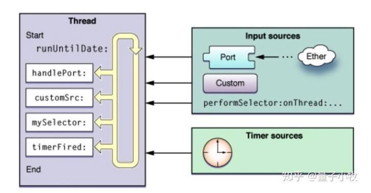

## RunLoop事件源类型

--------

我们知道`__CFRunLoopMode`的结构提如下：

```c++
struct __CFRunLoopMode {
    CFRuntimeBase _base;
    pthread_mutex_t _lock;	/* must have the run loop locked before locking this */
    CFStringRef _name;
    Boolean _stopped;
    char _padding[3];
    // 包含多个source 0
    CFMutableSetRef _sources0;
    // 包含多个source 1
    CFMutableSetRef _sources1;
    // 包含多个observers
    CFMutableArrayRef _observers;
    // 包含多个timers
    CFMutableArrayRef _timers;
    CFMutableDictionaryRef _portToV1SourceMap;
    __CFPortSet _portSet;
    CFIndex _observerMask;
#if USE_DISPATCH_SOURCE_FOR_TIMERS
    dispatch_source_t _timerSource;
    dispatch_queue_t _queue;
    Boolean _timerFired; // set to true by the source when a timer has fired
    Boolean _dispatchTimerArmed;
#endif
#if USE_MK_TIMER_TOO
    mach_port_t _timerPort;
    Boolean _mkTimerArmed;
#endif
#if DEPLOYMENT_TARGET_WINDOWS
    DWORD _msgQMask;
    void (*_msgPump)(void);
#endif
    uint64_t _timerSoftDeadline; /* TSR */
    uint64_t _timerHardDeadline; /* TSR */
};
```

其中包括四个事件源集合:

- _sources0
- _srouces1
- _observers
- _timers

那么这四种事件源，都包含了哪些事件呢？


## _source0

----------

```markdown
非基于`port`的事件，也就是这个消息不是来自于其他进程或者内核的消息
```

- 触摸事件

  ```markdown
  我们触摸屏幕,先摸到硬件(屏幕)，屏幕表面的事件会先包装成Event, Event先告诉source1（mach_port）,source1唤醒RunLoop, 然后将事件Event分发给source0,然后由source0来处理。
  ```

- `performSelector:onThread:`


## _source1

-------

```markdown
基于`mach_Port`的，来自系统内核、其他进程的事件。它可以主动唤醒休眠中的`RunLoop`
```

- 基于port的线程间通信
- 系统事件捕捉


## _timers

-------

- Timers

- NSTimers

- `performSelector:withObject:afterDelay`

  

## _observers

-----

- 用于监听`RunLoop`的状态
- `UI刷新`监听(BeforeWaiting)
- `Autorelease pool`(BeforeWaiting)

`RunLoop`可以观察的时间点有以下几个:

```objective-c
typedef CF_OPTIONS(CFOptionFlags, CFRunLoopActivity) 
{
    kCFRunLoopEntry         = (1UL << 0), // 即将进入Loop
    kCFRunLoopBeforeTimers  = (1UL << 1), // 即将处理 Timer
    kCFRunLoopBeforeSources = (1UL << 2), // 即将处理 Source
    kCFRunLoopBeforeWaiting = (1UL << 5), // 即将进入休眠
    kCFRunLoopAfterWaiting  = (1UL << 6), // 刚从休眠中唤醒
    kCFRunLoopExit          = (1UL << 7), // 即将退出Loop
};
```


#### RunLoop到底有几种事件源

-------



上面讲到过，`RunLoop`工作的过程中，会向外传递四种类型的消息：`source0`、`source1`、`timers`、`observers`。其实，对于低层而言，`RunLoop`的事件来源只有两种:

- Input sources
  - 基于端口的事件源
  - 自定义的数据源
- Timer sources

RunLoop从两种不同类型的Sources 接受事件（注意，这里是sources是事件源的意思，不要理解成source0或source1），Input Sources 传递异步事件，通常是来自另一线程或来自不同应用程序的消息。Timer Sources传递在特定的时间或者重复的间隔内发生的同步事件。这两种类型的源都使用特定于应用程序的处理程序来处理事件到达时的事件。

Input sources 异步地向线程传递事件。事件的来源取决于输入源的类型，通常是两种类型之一。基于端口的输入源监控应用程序的Mach端口。自定义输入源监视事件的自定义来源。就运行循环而言，输入源是基于端口的还是自定义的都不重要。系统通常实现两种类型的输入源，它们可以按原样使用。这两个来源之间唯一的区别是它们是如何发出信号的。基于端口的源代码由内核自动发出，并且自定义源必须手动从另一个线程发出信号。


