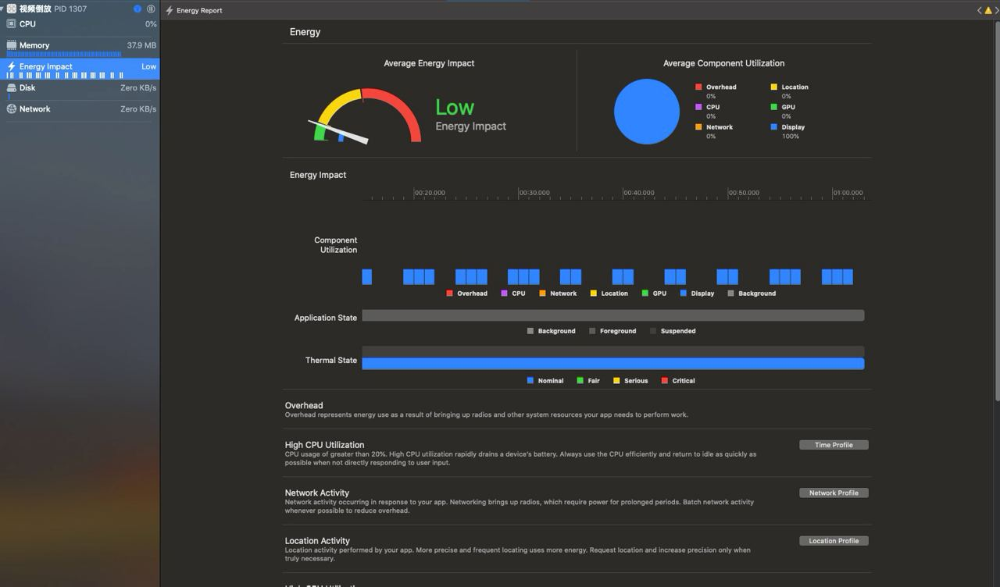

## 耗电量监控

-------

- 开发过程中的监控
- 上线后监控：手机设置，导出耗电量日志，结合xcode定位问题
- 上线后监控：三方库监控

#### 开发过程中监控

---------

`Xcode`连接真机`debug`

###### 影响电量的五个因素：

#### 上线后监控：手机设置，导出耗电量日志，结合xcode定位问题

-----------

#### 上线后监控：三方库监控

--------

https://github.com/aozhimin/iOS-Monitor-Platform

#### 耗电量大户

------

- 网络
- 定位
- CPU
- GPU
- 传感器和蓝牙

#### 相关文章

--------

https://www.jianshu.com/p/4555704f9696

https://www.jianshu.com/p/bd2c1ce5c02a

