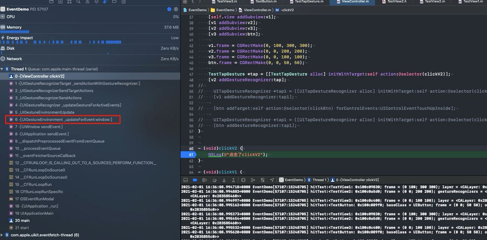
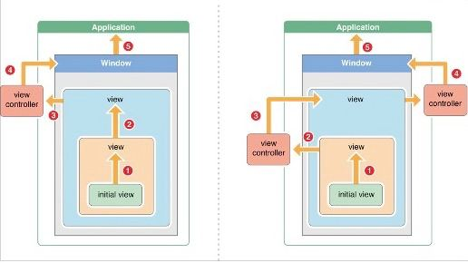

## 事件分发和响应者链条

-----------

首先看一下`事件的产生和传递`、`事件的相应`以及`RunLoop`的关系:

基本上，分为三个过程：

- 事件的产生和封装
- 事件从下往上传递
- 事件的响应(响应者链条)

#### 事件的产生和封装

-------

- 手指触摸屏幕，硬件产生一个事件，传递给`IOKit.framework`
- `IOKit.framework`将事件封装为`IOHIDEvent`对象，通过`IPC`发送给`SpringBoard`
- `SrpingBoard`将事件通过`IPC`发送给当前App的主线程
- `主RunLoop`触发`srouce1`类型的事件回调
- `source1`内部会触发`source0`事件回调
- `source0`内部，将`IOHIDEvent`对象转换为`UIEvent`，并发送给当前的`KeyWindow`

#### 事件从上往下传递

--------

这个过程是通过`hitTest: withEvent:`和`pointInside: withEvent:`方法，从下往上层层递归，去查找最适合相应事件的`View`

#### 事件的响应

--------

这个过程主要是通过一系列的`touches`方法完成的。如果当前视图，不响应事件，需要向下传递，也就是在`touches`相关的方法里，执行`super touches`相关的方法。

需要关注`UIResponder`

#### `UIControl`和`UIGestureRecognizer`对于正常`响应者链条`的打断

--------

