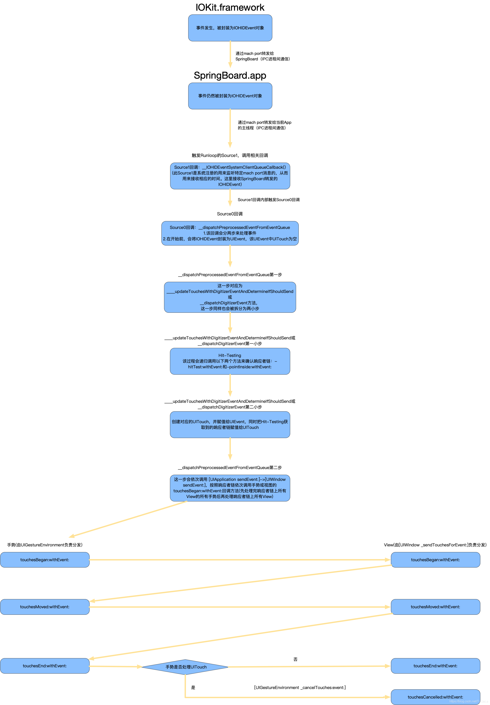

## 事件分发和响应者链条

-----------

整体的流程如下：

首先看一下`事件的产生和传递`、`事件的相应`以及`RunLoop`的关系:

基本上，分为三个过程：

- 事件的产生和封装
- 事件从下往上传递
- 事件的响应(响应者链条)
  - UIGestureRecognizer
  - UIResponder

#### 事件的产生和封装

-------

- 手指触摸屏幕，硬件产生一个事件，传递给`IOKit.framework`
- `IOKit.framework`将事件封装为`IOHIDEvent`对象，通过`IPC`发送给`SpringBoard`
- `SrpingBoard`将事件通过`IPC`发送给当前App的主线程
- `主RunLoop`触发`srouce1`类型的事件回调
- `source1`内部会触发`source0`事件回调
- `source0`内部，将`IOHIDEvent`对象转换为`UIEvent`，并发送给当前的`KeyWindow`

#### 事件从上往下传递

--------

这个过程是通过`hitTest: withEvent:`和`pointInside: withEvent:`方法，从下往上层层递归，去查找最适合相应事件的`View`

这个过程中的`Event`事件，真实的类型是`UITouchesEvent`，并且它里面只有一个时间戳，`touches`字段是是个空

#### 事件的响应

--------

找到最合适的`View`之后，系统会发送一个`UIWindow sendEvent:`事件，这个事件中的`event`，是包含了从第二个阶段找到的`UITouches`信息的`event`

这个过程主要是通过一系列的`touches`方法完成的。如果当前视图，不响应事件，需要向下传递，也就是在`touches`相关的方法里，执行`super touches`相关的方法。

这里会分为两个分支：一个是基于`UIGestureRecognizer`的手势识别，另一个是基于`UIResponder`的手势识别

一个响应者链上有多个View，多个View可能有多个手势，从上到下先执行`gesture`的`touches`相关方法，这些含有手势的View的`gesture`的`touches`方法执行完执行，再去执行`UIView`的`touches`相对应的方法。整个流程如下

- 执行ViewTopGesture(如果有Gesture的话)的`touch begin`
- 执行ViewMidGesture的(如果有Gesture的话)`touch begin`
- 执行ViewBottomGesture(如果有Gesture的话)的`touch begin`
- 执行ViewTop的`touch begin`
- 执行ViewMid的`touch begin`
- 执行ViewBottom的`touch begin`

其他`touch`相关方法也是一样的流程，比如`touch moved`。如果最后执行事件的是`gesture`，那么其他没有`gesture`的view会受到`cancelled`消息，表示取消事件响应。

不同于`Views`中，`touch`方法的自上而下的传递，`gesture`的`touch`方法是根据手势添加到`UIGestureEnvironment`的先后顺序执行的，也就是`addGesture`这段代码执行的先后顺序。并且这个`View`必须在当前点击事件的响应链上

#### `UIControl`和`UIGestureRecognizer`对于正常`响应者链条`的打断

--------

