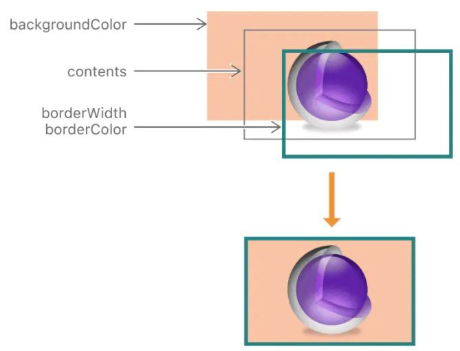
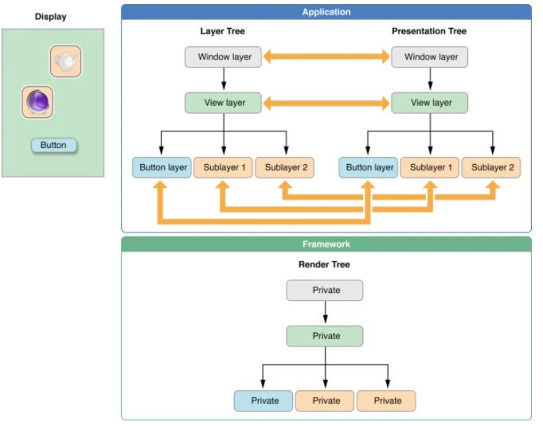

## Core Animation基础

#### CALayer的组成

------

`CALayer`是由下图所示的几部分组成的：

- backgroundColor
- contents
- border

图层在渲染的时候，`backgroudColor`在最底层，中间是`contents`，最上层是`border`。如果存在`sublayers`,`sublayers`存在于`contents`和`border`之间

#### Layer属性之maskLayer

-------

`maskLayer`作为`CALayer`的一个属性，其本身也是一个`CALayer`。`maskLayer`可以理解为一个`遮罩`。这个遮罩有以下点：

- `遮罩`之外的的部分，不会被渲染
- `遮罩`的透明度为`0`时，`遮罩区域`不会显示
- `遮罩`的透明度为`1`时，`遮罩区域`显示
- `遮罩`的透明度值在`0~1`之间的时候，`则mask图层会和被遮罩层内容混合`。影响遮罩透明的的因素有以下几点：
  - `maskLayer`的`backgroudColor`的透明度
  - `maskLayer`的`contents`的透明度
  - `maskLayer`本身的透明度

#### CALayer方法之ModelLayer、PresentationLayer

------

`modelLayer`对应的是`模型树`。`PresentationLayer`对应的是`呈现树`

- CALayer下的`modelLayer`到底是什么?

  非`presentaionLayer`调用该方法，返回自己。`presentationLayer`调用该方法，返回`modelLayer`，即模型层，也就是CALyer本身

- `modelLayer`的`modelLayer`和`presentationLayer`是什么

  `modelLayer`的`modelLayer`是他自己，也就是`宿主Layer`，`modelLayer`的`presentLayer`就是`宿主Layer的presentationLayer`

- `presetationLayer`的`modelLayer`和`presentationLayer`是什么

  `presetationLayer`的`modelLayer`,也就是`宿主Layer`的`modelLayer`，也就是`宿主本身`。`presentationLayer`的`presentationLayer`是他自己

#### 视图树、模型树(图层树)、呈现树、渲染树

------

和`View Layer ModelLayer PresentationLayer`相对应的，会有这样几颗树`视图树、模型树(图层树)、呈现树、渲染树`：

- 视图树：View组成的树
- 模型树(图层树)：由View组成的树生成
- 呈现树：如果在没有`CAAnimation`动画下，呈现树由模型树而来，是对模型树的`copy`。但是如果存在`CAAnimation`动画的情况下，`渲染服务`会结合`CAAnimation`，生成动画过程中的呈现图层
- 渲染树

#### 相关文章

------

https://www.jianshu.com/p/8792ae7dd209

https://www.jianshu.com/p/7bf1e06c6a98

https://zsisme.gitbooks.io/ios-/content/chapter12/cpu-versus-gpu.html

https://www.jianshu.com/p/abf9bde5bd6a