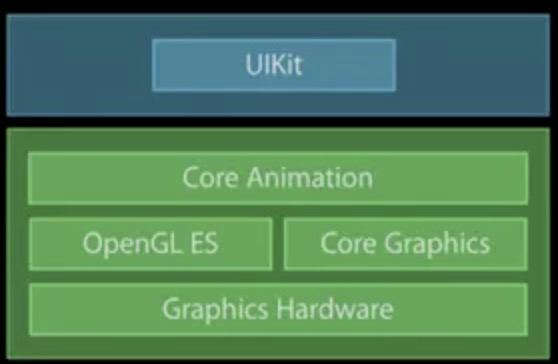
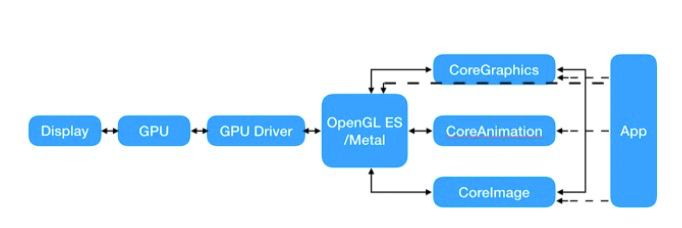
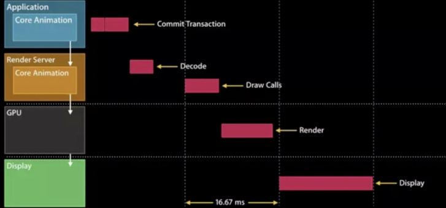
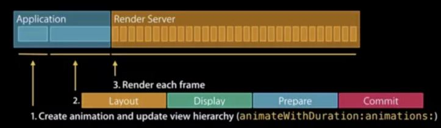

## iOS渲染基本流程分析

------

整个流程中，涉及到的主要框架如下：

基本流程分为四个阶段：

- `CPU`工作阶段
- `OpenGL ES`工作阶段
- `GPU`工作
- 硬件显示器渲染

下面简单介绍每个阶段的工作内容

#### CPU工作阶段(也就是CoreAnimation提交到`Render Server`之前)

-------

该阶段主要分为五个阶段：

- 视图的创建和层级更新
  - `CreateAnimation`和更新视图层级
- 布局
  - LayoutSubViews
- 显示
  - drawRect
- 准备提交
  - 解码图片
- 提交(CoreAnimation监听RunLoop状态，在当前RunLoop结束时提交。结束不只是指RunLoopExit，包括即将进入睡眠状态)
  - 打包`Layers`并发送到`Render Server`

所以`CPU`在UI绘制方面的消耗主要体现在5个方面：

- 布局计算
- 视图懒加载，加载`xib`等消耗CPU比较多的文件
- `Core Graphics`渲染
- 图片解码
- 图层打包

#### OpenGL ES工作阶段

---------------------

#### 相关文章

------

https://cloud.tencent.com/developer/article/1353112

