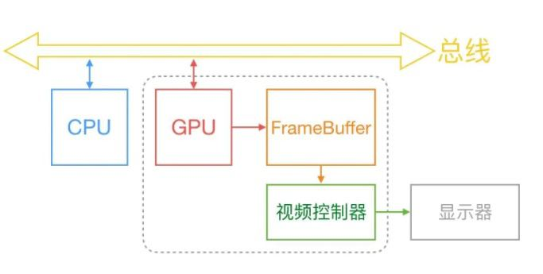

## 屏幕成像原理

--------

- CPU、GPU(显卡)、显示器工作流程
- 显卡单缓冲及问题
- 显卡双缓冲及问题
- 垂直同步技术及问题
- 显卡三缓冲


#### CPU、GPU、显示器的工作流程

--------



画面展示的基本流程：

- CPU和显卡把所要绘制的内容计算出来，放到显卡缓存中
- 显示器把数据显示到屏幕

上面是一个经典的`生产和消费者模式`。`CPU`和`GPU`生产数据需要实现，而`显示器`消费数据也需要时间。而这两个时间往往也是不同的。一般情况下，屏幕的刷新频率是固定的，比如60帧，而CPU/GPU每秒可以计算出的帧数则是不固定的，受硬件和软件两方面的影响。所以就会出现三种情况:

- CPU和GPU的渲染频率 == 屏幕的刷新频率
- CPU和GPU的渲染频率 > 屏幕的刷新频率
- CPU和GPU的渲染频率 < 屏幕的刷新频率

下面我们针对上面三种情况做阐述，

###### CPU和GPU的渲染频率 == 屏幕的刷新频率:

```markdown
这种情况是我们期望的，这样就不会存在任何问题。但是这只是一种理想的情况
```

###### CPU和GPU的渲染频率 > 屏幕的刷新频率

```markdown
需要缓冲机制
```

###### CPU和GPU的渲染频率 < 屏幕的刷新频率

```markdown
需要缓冲机制
```

解决`生产者和消费者`问题的经典答案就是引入缓冲区，就是接下来我们要说的单缓冲


#### 单缓冲显卡及问题

------

最初的显卡，都是单缓冲的。单缓冲下，会出现下面几个问题：

- CPU和GPU的渲染频率 > 屏幕的刷新频率
  - 画面撕裂
  - 跳帧
- CPU和GPU的渲染频率 < 屏幕的刷新频率
  - 卡顿、掉帧
- 单缓冲，需要每次清理当前缓存，这个时候，就会造成闪烁

下面我们挨个介绍：

###### 画面撕裂：

```markdown
如果CPU和显卡的性能很强劲，显示器在显示第一帧的时候，假设显示了一半屏幕，这个时候显卡已经计算完了下一帧，这个时候就会覆盖掉当前缓存，所以剩下的一半，显示的是第二帧的数据。这就造成了屏幕撕裂
```

###### 跳帧:

```markdown
显卡再快一点，那么下一帧的图像还没来得及显示，下下一帧的数据就覆盖上来了，中间这帧就跳过了-----这种情况被称为跳帧
```

###### 卡顿:

```markdown
如果CPU和显卡阶段的整体性能比较低,屏幕可能已经刷新了5次,而cpu和显卡，却连第二帧的数据都没有渲染完，这个时候，就会造成卡顿的现象
```

为了解决`画面撕裂`和`跳帧`的问题，引入了`垂直同步技术`

而为了解决`卡帧、掉帧`和`闪烁的问题`，引入了`双缓冲机制`


#### 垂直同步技术

------

开启垂直同步技术后，GPU会等待显示器的`V-Sync`信号发出后，在进行新的一帧的渲染和缓冲区更新，即把显卡的帧率锁定为显示器的刷新率


#### 双缓冲机制 

----

显卡有两个缓冲区，存放渲染好的`frame-buffer`,分别叫做`前帧缓存`和`后帧缓存`。GPU会预先渲染好一帧放入一个缓冲区内，让视频控制器读取，当下一帧渲染好后，GPU会直接把视频控制器的指针指向第二个缓冲区。也就是说，在一帧被渲染完以后才会交给屏幕显示，不会看到“半成品画面”。并且有两个缓冲区互换，不需要在显示前台清理画布，所以不会闪烁。

然而，即使使用了双缓冲机制，也会造成掉帧的问题


#### 双缓冲机制下的掉帧研究

--------

