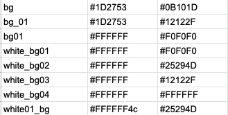
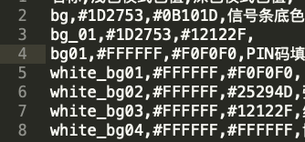
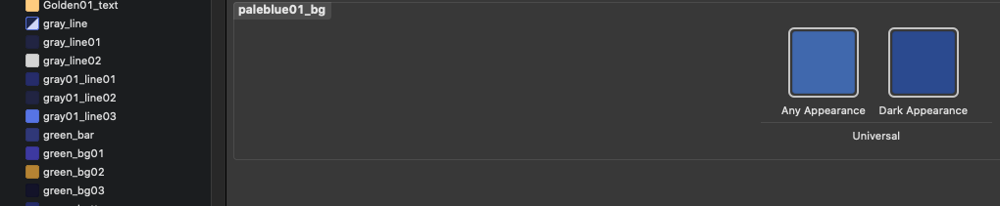
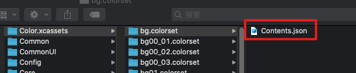

## Python自动替换暗黑模式颜色资源

根据Apple的建议，暗黑模式下，我们写颜色应该写成下面的样子：

```````
let backgroundColor = UIColor { (trainCollection) -> UIColor in
    if trainCollection.userInterfaceStyle == .dark {
        return UIColor.black
    } else {
        return UIColor.white
    }
}
view.backgroundColor = backgroundColor
```````

但是，这个写法很坑爹，代码平白无故多了很多。不用担心，看下面这个方法

```
+ (nullable UIColor *)colorNamed:(NSString *)name inBundle:(nullable NSBundle *)bundle compatibleWithTraitCollection:(nullable UITraitCollection *)traitCollection API_AVAILABLE(ios(11.0));
```

上面这个方法是iOS11上新加的，我们的颜色都会主动导入到mainBundle里，这个方法会根据当前模式自动加载不同的颜色。我们只需要新建一个color,xcassets，然后将颜色放入其中就好了。其实这里颜色和图片的性质都是一样的，都是资源。幸亏，我们用的R.Swift，R.swift已经更形成了上面的方法，所以，我们只需要用脚本将原来使用16进制写法(例如UIColor(0xFFFFFF))，全部替换成R.color.name的样式就好了。

那么color的name是哪里来的呢？是设计师提供的，设计师会随时更新项目的颜色到一个excel上，格式如下:



我们在导出的时候使用.CSV格式，CSV格式如下:




OK，源有了，我们要生成什么样的呢？我们看到的color是下面这样的



但是，Show In Finder一下，是下面这样的



那么Contents.json里面是什么样的呢？

```
{
    "info": {
        "version": 1,
        "author": "xcode"
    },
    "colors": [
        {
            "idiom": "universal",
            "color": {
                "color-space": "srgb",
                "components": {
                    "red": "0x1D",
                    "alpha": "0xFF",
                    "blue": "0x53",
                    "green": "0x27"
                }
            }
        },
        {
            "idiom": "universal",
            "appearances": [
                {
                    "appearance": "luminosity",
                    "value": "dark"
                }],
            "color": {
                "color-space": "srgb",
                "components": {
                    "red": "0x0B",
                    "alpha": "0xFF",
                    "blue": "0x1D",
                    "green": "0x10"
                }
            }
        }]
}
```

OK，这个东西就是我们脚本工作之后生成的目标了


下面是具体脚本如下

<a src='../DarkModeColor.py'>脚本</a>

