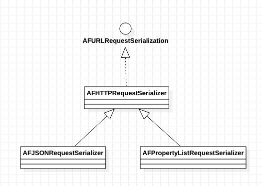
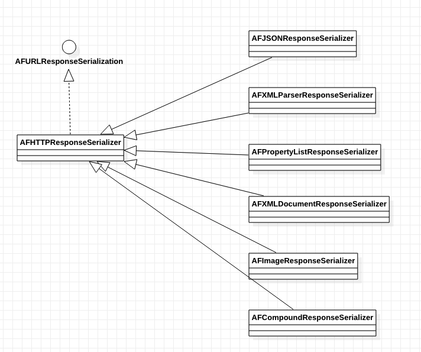

## AFNetworking序列化和反序列化

Request序列化UML：

Response序列化UML：

#### 类功能说明

#### AFHTTPRequestSerializer

----

**相关类:**

- AFStreamingMultipartFormData：用于构建mutipartFromData请求体
- AFMultipartBodyStream:

**所做的事情:**

- 补充请求头
- 参数编码(百分号编码)
- URL参数拼接
  - 如果是GET、HEAD、DELETE方法，参数直接跟在URL后面
  - 如果是其他的Method，需要设置内容类型content-Type。如果不指定，那么是'text/html'。但是表单上传content-type是'application/x-www-form-urlencoded'。将query进行UTF8编码，放入HTTPBody

###### Response序列化类

