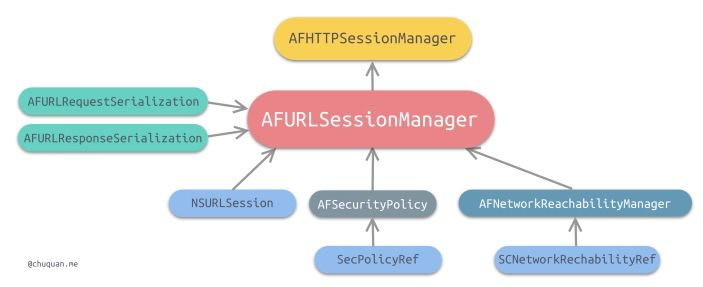

## AFNetworking概览

架构总览：

AFNetworking一共分为5个模块，3个核心模块和2个辅助模块

- 核心模块
  - NSUrlSession：网络通信模块
    - AFURLSessionManager（封装 NSURLSession）
    - AFHTTPSessionManager（继承自 AFURLSessionManager，实现了 HTTP 请求相关的配置）
  - Serialization：序列化和反序列化
    - AFURLRequestSerialization：请求参数序列化
      - AFHTTPRequestSerializer
      - AFJSONRequestSerializer
      - AFPropertyListRequestSerializer
    - AFURLResponseSerialization（验证返回数据和反序列化）
      - AFHTTPResponseSerializer
      - AFJSONResponseSerializer
      - AFXMLParserResponseSerializer
      - AFXMLDocumentResponseSerializer (Mac OS X)
      - AFPropertyListResponseSerializer
      - AFImageResponseSerializer
      - AFCompoundResponseSerializer
  - 网络通信安全模块
    - AFSecurityPolicy
- 辅助模块
  - Reachability（网络状态监听模块）
  - UIKit（对 iOS 系统 UI 控件的扩展）

