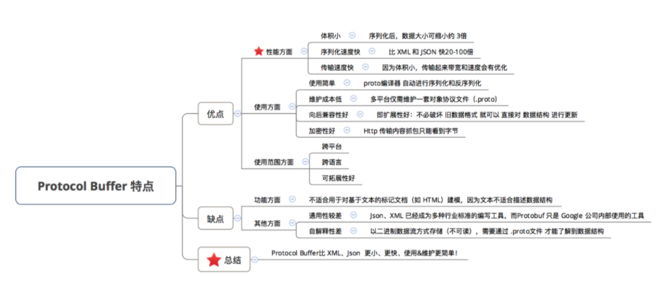

## Protocol buffer序列化原理

定义：是一种 结构化数据 的数据存储格式，类似于XML、JSON

对比XML和JSON的优劣

相关概念

- 序列化

  将数据结构或者对象转换成二进制的过程

- 反序列化

  将序列化过程中生成的二进制串转换成数据结构或者对象

#### Protocol buffer的工作层面

---

#### TLV数据存储格式

----

定义：

Tag-Length-Value，标识-长度-值存储方式

