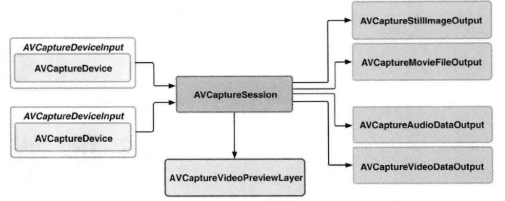

## 媒体捕捉

-----

捕捉媒体涉及到的几个类：

主要涉及到一下几个类：

- AVCaptureSession
- AVCaptureOutput
  - AVCaptureStillImageOutput
  - AVCaptureMovieFileOutput
  - AVCaptureAudioDataOutput
  - AVCaptureVideoDataOutput
- AVCaptureVideoPreviewLayer
- AVCaptureDeviceInput
- AVCaptureConnection

#### AVCaptureSession

------

捕捉会话，用于连接输入和输出的资源。捕捉设备从物理输入设备获取数字流，可以有多个设备，比如摄像头和麦克风，输出到一个或者多个目的地。

输入和输出线路是可以动态配置的，可以使得开发者能能够在会话进行中的时候，动态重新配置捕捉环境

`AVCaptureSession`可以设置一个`session preset`，称作`会话预设值`，用来控制捕捉数据的格式和质量。会话预设值的默认值为`AVCaptureSessionPresetHigh`

#### 基本使用步骤

-----

- 初始化输入设备
- 

