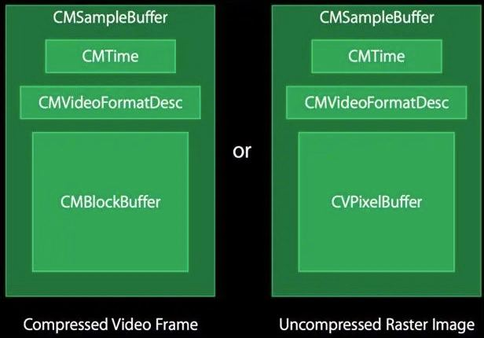

## CMSampleBuffer详解

-----

源自`Core Media`框架，用于在媒体管道中传递数字样本。角色是将基础的样本数据封装，然后加上时间和格式信息以及元数据封装在一起

`CMSampleBuffer`主要包含以下内容：

上面涉及到的结构体：

- CMTime - `Core Media`框架。代表媒体的时间格式。64位的value、32位的scale
- CMVideoFormatDesc - `Core Media`框架。代表 video的格式，包括宽高、颜色空间、编码格式
- CVPixelBuffer - `Core Video`框架。包含未压缩的像素格式、宽高
- CMBlockBuffer - `Core Media`框架。包含压缩的图像数据
- CMSampleBuffer - 存放一个或者多个压缩或者未压缩的媒体文件(有可能是音频，有可能是视频)

#### 相关文章

-----------

https://stackoverflow.com/questions/29525000/how-to-use-videotoolbox-to-decompress-h-264-video-stream/29525001#29525001