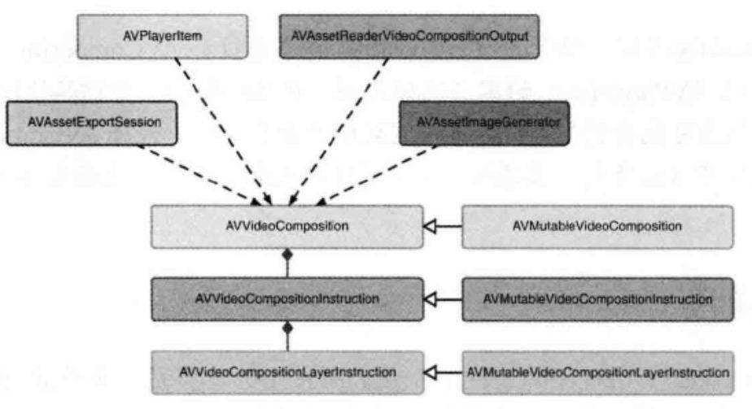

## 创建视频过渡效果

------

相关类：

#### AVVideoComposition关键类

------

这个类对两个或多个视频轨道组合在一起的方法给出了一个总体的描述。他由一组`时间范围`和`描述组合行为介绍内容`组成，这些信息出现在组合资源内的任意时间点。

#### AVVideoCompositionInstruction - 组合指令

------

`AVVideoComposition`是由一组`AVVideoCompositionInstruction`对象格式定义的指令组成的。这个对象所提供的最关键的一段数据是组合对象时间轴内的时间范围信息，这一时间范围是在某一组合形式出现时的时间方位。要执行的组合特质，是通过其`layerInstructions`集合定义的

#### AVVideoCompositionLayerInstruction - 层指令

-------

用于定义对指定的视频轨道，应用模糊、变形和裁剪效果。他提供了一些方法，用于在特定的时间点或在一个时间范围对这些值进行修改。在一段时间内对这些值应用渐变操作可以让开发者创建出动态的过渡效果，比如溶解和渐淡效果

