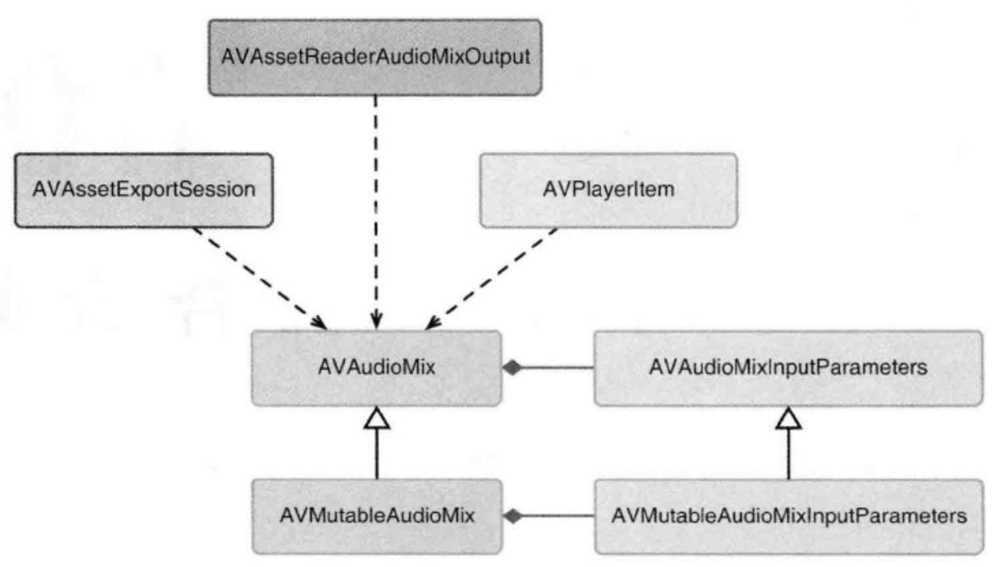

## 混合音频

-------

组合媒体时，遇到的音频相关的问题：

- 声音的处理不够平滑，应该是`开始的时候，音量逐渐变大，结束的时候，音量逐渐变小`
- 背景音乐和画外音的处理 - ducking技术(闪避技术)

解决上面两个问题的关键类就是`AVAudioMix`，相关类示意图如下：




#### AVMutableAudioMixInputParameters

--------

```objective-c
// 调节音量,平滑的过渡
- (void)setVolumeRampFromStartVolume:(float)startVolume toEndVolume:(float)endVolume timeRange:(CMTimeRange)timeRange;
// 调节音量立即生效
- (void)setVolume:(float)volume atTime:(CMTime)time;
```

