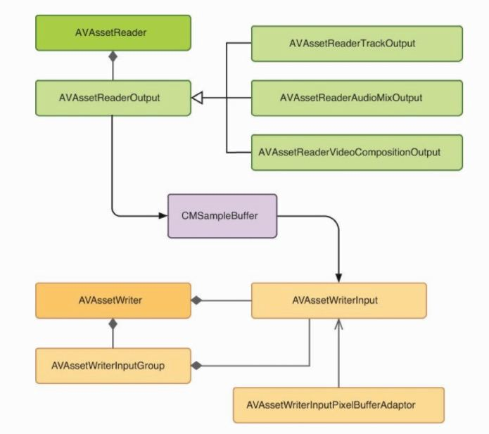

## 综述

-----

#### AVAssetReader

----------

`AVAssetReader`用于从`AVAsset`实例中读取媒体样本

一个`AVAssetReader`通常会配置多个`AVAssetReaderOutput实例`，并通过`copyNextSampleBuffer`的方法，可以访问`音频样本`和`视频帧`

`AVAssetReaderOutput`是一个抽象类，有三个子类：

- AVAssetReaderTrackOutput
- AVAssetReaderAudiooMixOutput
- AVAssetReaderVideoCompostionOuput

#### AVAssetWriter

-----

用于对媒体文件进行编码，并将其写入到容器文件(比如.mp4文件)中

一个`AVAssetWriter`包含一个或者多个`AVAssetWriterInput`对象配置，用于附加`CMSampleBuffer`对象。

#### AVAssetWriter相对于AVAssetExportSession的优势

------

`AVAssetWriter`对输出进行编码时，能够进行更加细致的压缩设置控制。可以让开发者指定一些关键设置：

	-	关键帧间隔
	-	视频比特率
	-	H.264配置文件
	-	像素宽高比
	-	纯净光圈
	-	等

