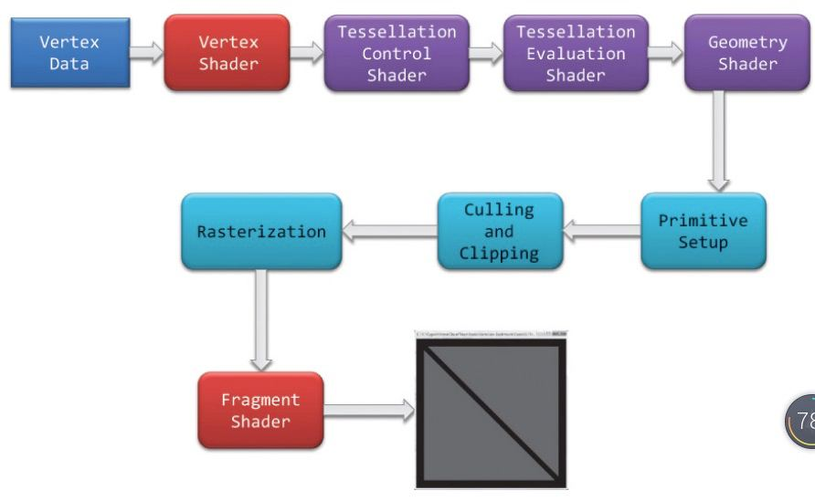

## OpenGL渲染管线

-----

渲染管线的整个流程如上：

- 客户端提供顶点数据
- 顶点着色器处理
- 细分控制着色器和细分计算着色器
- 几何着色器
- 图元设置
- 剪切
- 光栅化
- 片元着色器处理
- frame buffer

上面的几个着色器，并不是所有的都要用到，处理`顶点着色器`和`片元着色器`是必须的之外，其他着色器都是可选的

现在我们介绍一下每个阶段的作用

#### 客户端提供顶点数据

-------

这个过程，主要做以下几件事情：

- 为OpenGL绑定内存标识

- 为OpenGL分配内存

- 开启OpenGL内存

- 为OpenGL设置数据，从CPU内存copy到GPU内存

  

#### 顶点着色器处理

------

首先，复杂的应用程序，顶点着色器可能有一个，也可能有多个，单同时只能有一个在工作。简单的着色器什么都不做处理，只是简单的将数据复制到下一个着色器阶段。而复杂的着色器，可能需要大量的计算，来获得顶点在屏幕上的位置。

#### 细分着色器处理

-------

在顶点着色器处理完顶点的数据后，如果同时激活了细分着色器，那么细分着色器将继续处理这些数据。

细分着色器用产生更多的图元，更加细致的描述物体的形状。他有两个着色器：细分控制着色器和细分计算着色器

#### 几何着色器处理

--------

在光栅化之前，允许对每个几何图元做更细致的处理。这些几何图片来自上一个着色器，上一个着色器可能是顶点着色器也可能是细分着色器

#### 图元装配

----------

上面的几个着色器，处理的都是顶点数据，图片装配会将顶点和图元组织起来，准备下一步的剪切和光栅化操作

#### 剪切

------

裁减掉屏幕之外的图片，将剩下的图元传递到逛沾化阶段

#### 光栅化

-------

光栅化拿到了剪切之后的图元，生成对应的片元，一个片元可以看做是一个候选的像素

#### 片元着色器

------

控制真正显示的颜色。这个阶段，会计算片元的最终颜色。所以：顶点着色器控制了图元的位置，而片元着色器控制了顶点的颜色

