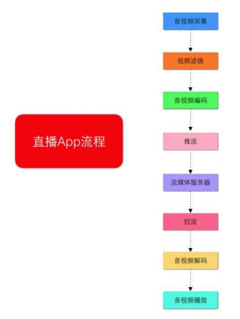
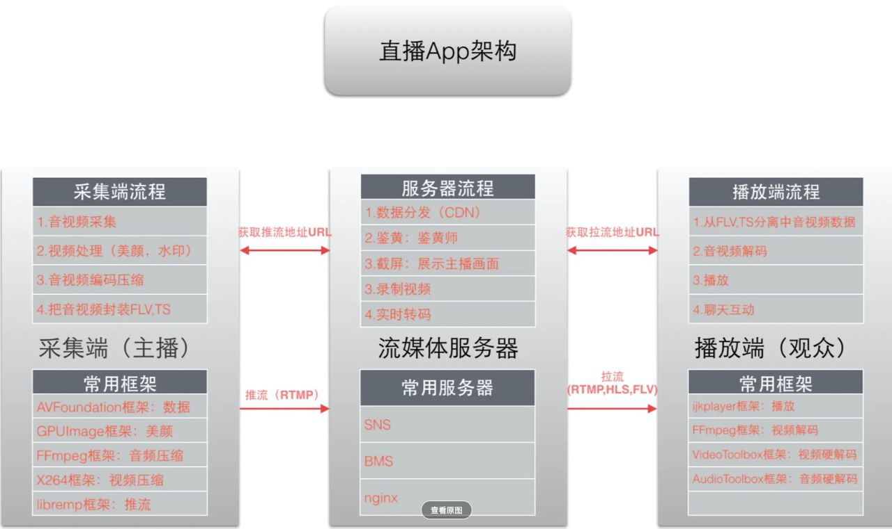
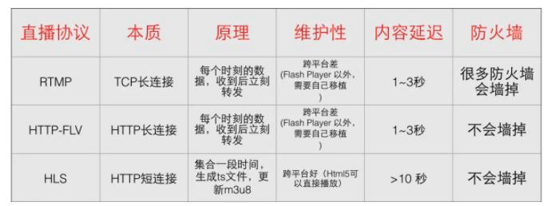

## 直播的主要流程和相关技术

------



对于主播端而言，主要分为以下几个阶段：

- 音视频采集
- 音视频处理
- 音视频编码
- 音视频封装
- 推流(将数据发送到流媒体服务器)

对于观众端而言，主要分为以下几个阶段：

- 拉流(将数据从流媒体服务器拉到本地)
- 音视频解协议
- 音视频解封装
- 音视频解码
- 音视频播放

对于server端而言，包括以下主要内容：

- 流媒体服务器(转码、录制、截图、鉴黄)

整体框架如下：



下面介绍，每个流程涉及到的相关技术


#### 主播端 - 音视频采集

---------------------

音视频采集：

- 软件框架
  - AVFoundation
- 硬件：
  - CCD：图像传感器，将图像转换为电信号
  - 拾音器：将声音转换为电信号
  - 音频采样数据：PCM格式
  - 视频采样数据：分为YUV和RGB格式

采集到的原始音视频数据都是很大的，需要进行压缩后，才能传输

#### 主播端 - 音视频处理

-------------------

视频处理原理：

```markdown
因为视频最终也是通过GPU，一帧一帧渲染到屏幕上的，所以我们可以利用OpenGL ES，对视频帧进行各种加工，从而视频各种不同的效果
```

视频处理相关的框架：

- CPUImage
- CoreImage
- OpenGL ES


#### 主播端 - 音视频编码

--------------

###### 音视频编码框架：

- FFmpeg
- x264
- videoToolbox
- AudioToolbox

###### 视频编码技术：

- 


#### 主播端 - 音视频封装

-----------------

流媒体主要有两种封装格式：

- TS
- FLV：主要的格式


#### 主播端 - 推流

--------------

###### 常见的流媒体传输协议：

- RTMP
- HTTP-FLV
- HLS
- RTSP
- RTP/RTCP




#### 流媒体服务器

------------


#### 播放端 - 拉流

-------------


#### 播放端 - 解协议

------------


#### 播放端 - 解封装

------------


#### 播放端 - 解码

----------------------


##### 播放端 - 播放

-----------


