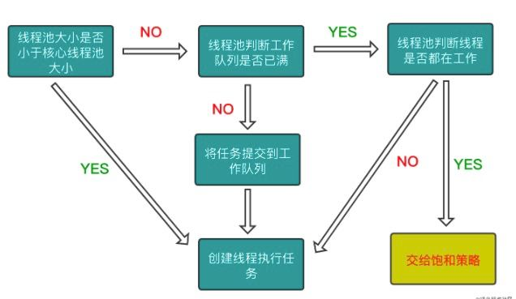

## 线程池的工作原理

-------------

线程池的作用：

- 限制系统创建线程的数量
- 每个线程可以被重复利用，可执行多个任务，减少了创建和销毁线程的次数


关于线程池的几个概念：

- corePoolSize：线程池的基本大小(核心线程数量)
- maximumPoolSize：线程池允许的最大线程数
- keepAliveTime：当线程池的线程数量大于corePoolSize时，空闲线程的最大存活时间。如果超过这个时间后，这个线程就会回收
- workQueue：存放任务的工作队列，也称为`阻塞队列`
- handler：超出线程范围和队列容量的任务的处理程序

<font color='red'>需要注意线程池中的阻塞队列和GCD中的队列或者NSOperationQueue等，是不同的概念，线程池的阻塞队列，是专门用来缓存线程池当前无法处理的任务的</font>


#### 线程池、线程、队列和任务的关系

----------------------

这里有几个概念需要注意一下：

- 线程池
- 队列
- 任务
- 线程

其中：

- `队列`负责任务的执行顺序，而`线程`负责任务的具体执行
- 线程池负责多个线程的管理


#### 线程池的工作流程

------------




###### 关于饱和策略：

当任务提交线程池失败时，即当前提交的任务数超过`maxmumPoolSize`与`workQueue中的任务`之和时，任务就会交给饱和策略处理

饱和策略分为四种：

- AbortPolicy

  ```markdown
  中止策略，属于默认的饱和策略，该策略将抛出未检查的RejectedExecutionException。调用者可以捕获这个异常，然后根据需要编写自己的处理代码。
  ```

- CallerRunsPolicy

  ```markdown
  调用者策略，策略实现了一种调度机制，该策略既不会抛弃任务，也不会抛出异常，而是将某些任务回退到调用者，从而降低新任务的流量。它不会在线程池的某个线程中执行新提交的任务，而是在一个调用了execute的线程中执行该任务。如果采用有界队列和“调用者运行”饱和策略，当线程池中的所有线程都被占用，并且工作队列被填满后，下一个任务会在调用execute时在主线程中执行。由于执行任务需要一定的时间，因此主线程至少在一段时间内不能提交任何任务，从而使得工作者线程有时间来处理完正在执行的任务。在此期间，主线程不会调用accept，因此到达的请求将被保存在TCP层的队列中而不是在应用程序的队列中。如果持续过载，那么TCP层将最终发现它的请求队列被填满，因此同样会开始抛弃请求。当服务器过载时，这种过载情况会逐渐向外蔓延开来——从线程池到工作队列到应用程序再到TCP层，最终达到客户端，导致服务器在高负载下实现一种平缓的性能降低。
  ```

- DiscardPolicy

  ```markdown
  抛弃策略，当新提交的任务无法保存到队列中等待执行时，“抛弃（Discard）”策略会悄悄抛弃该任务。
  ```

- DiscardOldestPolicy

  ```markdown
  抛弃下一个将被执行的任务，然后尝试重新提交新的任务。（如果工作队列是一个优先队列，那么“抛弃最旧的”策略将导致抛弃优先级最高的任务，因此最好不要将“抛弃最旧的”饱和策略和优先队列放在一起使用。）
  ```

  


#### 线程池和生产消费问题

--------

###### 生产者和消费者问题：

```markdown
`Producer-consumer problem`，也称为`有限缓冲问题`，英文称作`Bouned-buffer problem`，是一个多进程同步问题的经典案例。该问题描述了共享固定大小缓冲区的两个进程——即所谓的“生产者”和“消费者”——在实际运行时会发生的问题。生产者的主要作用是生成一定量的数据放到缓冲区中，然后重复此过程。与此同时，消费者也在缓冲区消耗这些数据。该问题的关键就是要保证生产者不会在缓冲区满时加入数据，消费者也不会在缓冲区中空时消耗数据。
所以说，生产者消费者问题主要涉及到以下两个问题：
-	生产者不会在缓冲区满的时候，再次添加数据
-	消费者不会在缓冲区没有数据的时候，请求数据
为了解决上面两个问题，可以使用以下两个方案：
-	就必须让生产者在缓冲区满时休眠（要么干脆就放弃数据），等到下次消费者消耗缓冲区中的数据的时候，生产者才能被唤醒，开始往缓冲区添加数据
-	让消费者在缓冲区空时进入休眠，等到生产者往缓冲区添加数据之后，再唤醒消费者
```


