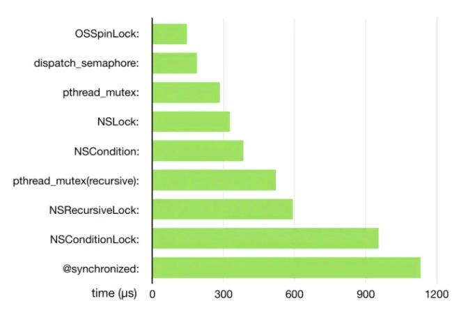

## 锁的介绍

------


#### 锁的分类 - 从实现上来分

-----------

- 遵循NSLocking协议的锁：NSLock、NSCondition、NSconditionLock、NSRecursiveLock。这几个锁底层都是通过pthread_mutex实现的
- GCD：dispatchSemaphore、DispatchWorkItemFlags.barrier
- @synchronized，objc_sync_enter
- pthread：包括POSIX


#### 锁的分类 - 功能划分

--------------

- 互斥锁(mutexlock)

  ```markdown
  同一个时刻，只有一个线程可以访问该资源。
  比如，正在访问资源的是线程A，而线程B此时也想要访问资源，那么线程B是不能够访问的。此时会将线程B会休眠，直到锁资源被释放之后，线程再次激活，获取锁。这样可以释放CPU资源，CPU可以去执行其他线程的任务，不必处于忙等的状态
  ```

- 自旋锁(spinlock)

  ```markdown
  同一个时刻，只有一个线程可以访问该资源。
  比如，正在访问资源的是线程A，而线程B此时也想要访问资源，那么线程B是不能够访问的。那么线程B就会一直反复请求锁，线程B所在的CPU内核就会一直处于忙等的状态
  ```

  

- 递归锁(recursivelock)

  ```
  递归锁，又叫`重入锁`。他与互斥锁的区别是，同一个线程，可以多次获取同一个递归锁，而不会产生`死锁`
  ```

  

- 读写锁(rwlock)

  ```markdown
  高级别锁，区分读和写，符合条件时允许多个线程访问对象。处于读锁操作时可以允许其他线程和本线程的读锁， 但不允许写锁， 处于写锁时则任何锁操作都会睡眠等待
  ```

- 条件锁(conditionlock)

  ```markdown
  
  ```

- 信号量(dispatch_semphore)

  ```markdown
  
  ```

  


#### 各种锁的优先级对比

---------




#### POSIX介绍

----

- https://blog.csdn.net/weixin_30512785/article/details/99518352

