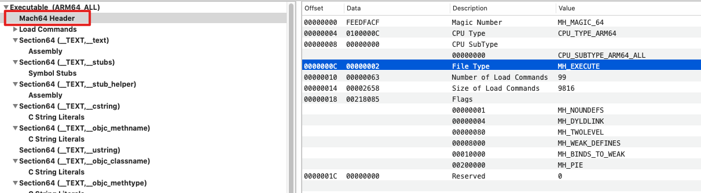

## Mach-O Header详解

Mach-O头文件链接：https://opensource.apple.com/source/xnu/xnu-4903.221.2/EXTERNAL_HEADERS/mach-o/

Mach-O Header所在文件链接：https://opensource.apple.com/source/xnu/xnu-4903.221.2/EXTERNAL_HEADERS/mach-o/loader.h


Header的主要作用：


`struct mach_header`结构体如下：

```c++
/*
 * The 32-bit mach header appears at the very beginning of the object file for
 * 32-bit architectures.
 */
struct mach_header {
	uint32_t	magic;		/* mach magic number identifier */
	cpu_type_t	cputype;	/* cpu specifier */
	cpu_subtype_t	cpusubtype;	/* machine specifier */
	uint32_t	filetype;	/* type of file */
	uint32_t	ncmds;		/* number of load commands */
	uint32_t	sizeofcmds;	/* the size of all the load commands */
	uint32_t	flags;		/* flags */
};

/* Constant for the magic field of the mach_header (32-bit architectures) */
#define	MH_MAGIC	0xfeedface	/* the mach magic number */
#define MH_CIGAM	0xcefaedfe	/* NXSwapInt(MH_MAGIC) */

/*
 * The 64-bit mach header appears at the very beginning of object files for
 * 64-bit architectures.
 */
struct mach_header_64 {
	uint32_t	magic;		/* mach magic number identifier */
	cpu_type_t	cputype;	/* cpu specifier */
	cpu_subtype_t	cpusubtype;	/* machine specifier */
	uint32_t	filetype;	/* type of file */
	uint32_t	ncmds;		/* number of load commands */
	uint32_t	sizeofcmds;	/* the size of all the load commands */
	uint32_t	flags;		/* flags */
	uint32_t	reserved;	/* reserved */
};

/* Constant for the magic field of the mach_header_64 (64-bit architectures) */
#define MH_MAGIC_64 0xfeedfacf /* the 64-bit mach magic number */
#define MH_CIGAM_64 0xcffaedfe /* NXSwapInt(MH_MAGIC_64) */
```

看一下Mach-O文件中的header



- magic：摩数，`0xFEEDFACE`指的是32位，`0xFEEDFACF`指的是64位
- cputype：CPU平台，和cpusubtype共同使用
- cpusubtype：CPU版本，和cputype共同使用
- filetype：文件类型(执行文件、库文件、Core、内核扩展...)
- ncmds：配合sizeofcmds，描述`Load Commands`的个数和长度
- sizeofcmds：配合ncmds，描述`Load Commands`的个数和长度
- flags：dyld加载时所需要的标记位 
- reserved：保留位，64位才有

下面具体套路每一个参数：


#### magic

----


#### cputype & cpusubtype

-----


#### filetype

-----

文件类型，一共有30多种，这里只介绍几种

| File Type      | 用处                                         | 例子                       | 16进制 |
| -------------- | -------------------------------------------- | -------------------------- | ------ |
| MH_OBJECT      | 编译过程中产生的*.obj文件                    | gcc -c xxx.c 生成xxx.o文件 | 0x1    |
| MH_EXECUT      | 可执行二进制文件                             | /usr/bin/git               | 0x2    |
| MH_CORE        | CoreDump                                     | 崩溃时的Dump文件           | 0x4    |
| MH_PRELOAD     | preloaded executable file                    |                            | 0x5    |
| MH_DYLIB       | 动态库                                       | /usr/lib/里面的那些库文件  | 0x6    |
| MH_DYLINKER    | 动态连接器 /usr/lib/dyld                     | /usr/lib/dyld文件          | 0x7    |
| MH_BUNDLE      | 非独立的二进制文件，往往通过 gcc-bundle 生成 |                            | 0x8    |
| MH_DYLIB_STUB  | 静态链接文件（还不清楚是什么东西）           |                            | 0x9    |
| MH_DSYM        | 符号文件以及调试信息，在解析堆栈符号中常用   |                            | 0xA    |
| MH_KEXT_BUNDLE | 内核扩展                                     |                            | 0xB    |


#### ncmds & sizeofcmds

------

作用：描述`Load Commands`的个数和长度


#### flags

------

`dyld`标志位，这里只介绍几个，感兴趣的去`load.h`文件中查看

| 定义                     | 16进制    | 描述                                                         |
| ------------------------ | --------- | ------------------------------------------------------------ |
| MH_NOUNDEFS              | 0x1       | Target 文件中没有带未定义的符号，常为静态二进制文件          |
| MH_SPLIT_SEGS            | 0x20      | Target 文件中的只读 Segment 和可读写 Segment 分开            |
| MH_TWOLEVEL              | 0x80      | 该 Image 使用二级命名空间(two name space binding)绑定方案    |
| MH_FORCE_FLAT            | 0x100     | 使用扁平命名空间(flat name space binding)绑定（与 MH_TWOLEVEL 互斥） |
| MH_WEAK_DEFINES          | 0x8000    | 二进制文件使用了弱符号                                       |
| MH_BINDS_TO_WEAK         | 0x10000   | 二进制文件链接了弱符号                                       |
| MH_ALLOW_STACK_EXECUTION | 0x20000   | 允许 Stack 可执行                                            |
| MH_PIE                   | 0x200000  | 对可执行的文件类型启用地址空间 layout 随机化                 |
| MH_NO_HEAP_EXECUTION     | 0x1000000 | 将 Heap 标记为不可执行，可防止 heap spray 攻击               |


#### reserved

-----

