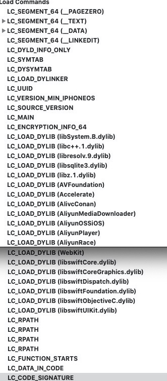
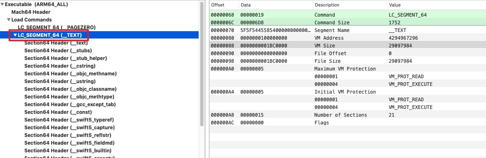
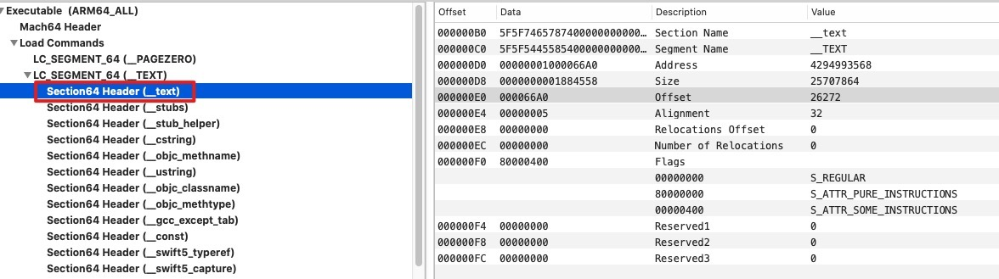
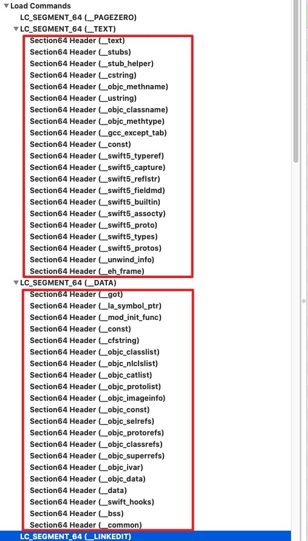

- ## loadcommand详解

  ----

  Mach-O文件的主要功能在于加载命令(load command)，他用于描述文件在虚拟内存中的逻辑与布局。加载命令仅跟在文件头之后，文件头中的两个字段`ncmds`和`sizeofncmds`用于解析加载命令

  有一些部分是由内核负责加载的，还有一部分是由动态链接器负责加载的

  - 内核加载器指令

    加载过程中，内核加载器主要负责`新进程`的基本设置：

    - 分配虚拟内存

    - 创建主线程

    - 处理任何可能的代码签名/加密工作

      然而，对于动态链接的可执行文件(大部分可执行文件都是动态链接的)来说，真正的`库加载`和`符号解析`的工作都是通过`LC_LOAD_DYLINKER`命令指定的动态链接器完成的。加载的控制权会移交给动态连接器，动态连接器进而接着处理头文件中的其他加载命令

  - 动态链接器指令

  

  #### LoadCommand

  -----

  

  段的详细介绍如下表所示：

  | Segment                   | 作用                                                         | 预留 |
  | ------------------------- | ------------------------------------------------------------ | ---- |
  | LC_SEGMENT_64(__PAGEZERO) | 空指针陷阱段，映射到虚拟内存空间的第一页，用于捕捉对NULL指针的引用。 |      |
  | LC_SEGMENT_64(__TEXT)     | 包含了 `执行代码` 以及 `其他只读数据` 。该段数据的保护级别为：VM_PROT_READ(读)、VM_PROT_EXECUTE(执行)，防止内存中被修改。 |      |
  | LC_SEGMENT_64(__DATA)     | 包含了程序数据，可读/可写数据存放段。                        |      |
  | LC_SEGMENT_64(__LINKEDIT) | 链接器使用的符号以及其他表，链接的部分，支持dyld，包含了一些符号表等数据。 |      |
  | LC_SYMTAB                 | 符号表信息                                                   |      |
  | LC_DYSYMTAB               | 动态符号表信息                                               |      |
  | LC_LOAD_DYLINKER          | 加载动态链接器（/usr/lib/dyld），使用Mach-O文件的时候链接器，可以看到name为 /usr/lib/dyld 的链接器来加载Mach-O文件。 |      |
  | LC_UUID                   | 对每个Mach-O文件都是唯一标识，crash解析中也会有，去匹配dysm文件和crash文件。 |      |
  | LC_VERSION_MIN_IPHONEOS   | 二进制文件要求的最低操作系统版本（iOS Deployment Target） ，打开xcode ，输入iOS Development Target 可以查看版本 |      |
  | LC_MAIN                   | 设置程序主线程的入口地址和栈大小                             |      |
  | LC_ENCRYPTION_INFO        | 加密信息，查看文件是否加密（在终端输入`otool -l 文件名       | grep cryptid`） |      |
  | LC_LOAD_DYLIB             | 加载的动态库，包括动态库地址和名称，当前版本号，兼容版本号（终端输入`otool -l 文件名） |      |
  | LC_RPATH                  | 环境变量路径                                                 |      |
  | LC_FUNCTION_STARTS        | 函数起始地址表                                               |      |
  | LC_CODE_SIGNATURE         | 记录可执行文件的代码是否签名                                 |      |
  |                           |                                                              |      |

  

  #### Segment_command介绍

  --------

  ```c++
  struct segment_command { /* for 32-bit architectures */
  	uint32_t	cmd;		/* LC_SEGMENT */
  	uint32_t	cmdsize;	/* includes sizeof section structs */
  	char		segname[16];	/* segment name */
  	uint32_t	vmaddr;		/* memory address of this segment */
  	uint32_t	vmsize;		/* memory size of this segment */
  	uint32_t	fileoff;	/* file offset of this segment */
  	uint32_t	filesize;	/* amount to map from the file */
  	vm_prot_t	maxprot;	/* maximum VM protection */
  	vm_prot_t	initprot;	/* initial VM protection */
  	uint32_t	nsects;		/* number of sections in segment */
  	uint32_t	flags;		/* flags */
  };
  
  struct segment_command_64 { /* for 64-bit architectures */
  	uint32_t	cmd;		/* LC_SEGMENT_64 */
  	uint32_t	cmdsize;	/* includes sizeof section_64 structs */
  	char		segname[16];	/* segment name */
  	uint64_t	vmaddr;		/* memory address of this segment */
  	uint64_t	vmsize;		/* memory size of this segment */
  	uint64_t	fileoff;	/* file offset of this segment */
  	uint64_t	filesize;	/* amount to map from the file */
  	vm_prot_t	maxprot;	/* maximum VM protection */
  	vm_prot_t	initprot;	/* initial VM protection */
  	uint32_t	nsects;		/* number of sections in segment */
  	uint32_t	flags;		/* flags */
  };
  ```

  `segment_command`在Mach-O中的展示，如下：(我们以`LC_SEGMENT_64(__TEXT)`为例)，
  

  

  

  

  

  

  我们看一下`segmen_command`每个字段的含义

  - cmd：即 Load commands 的类型，比如`LC_SEGMENT_64`代表将文件中64位的段映射到进程的地址空间。还有LC_SEGMENT、LC_DYLD_INFO_ONLY等等类型。
  - cmdsize：代表当前 `load command` 的大小
  - segname：段的名称。例如__PAGEZERO、__TEXT等等。
  - vmaddr：段的虚拟内存地址
  - vmsize： 段的虚拟内存大小
  - fileoff：段在Mach-O文件中的偏移量
  - filesize：段在文件中的大小
  - maxprot
  - initprot
  - nsects：标识了Segment中有多少section
  - Flags

  

  #### segment section介绍

  -------

  可以看出，这里大部分的数据是用来帮助内核将Segment映射到虚拟内存的。主要要关注的是`nsects`

  字段，标示了`segment`中有多少`secetion`,`section`是具体有用的数据存放的地方，`section`的结构体如下

  ```c++
  struct section { /* for 32-bit architectures */
  	char		sectname[16];	/* name of this section */
  	char		segname[16];	/* segment this section goes in */
  	uint32_t	addr;		/* memory address of this section */
  	uint32_t	size;		/* size in bytes of this section */
  	uint32_t	offset;		/* file offset of this section */
  	uint32_t	align;		/* section alignment (power of 2) */
  	uint32_t	reloff;		/* file offset of relocation entries */
  	uint32_t	nreloc;		/* number of relocation entries */
  	uint32_t	flags;		/* flags (section type and attributes)*/
  	uint32_t	reserved1;	/* reserved (for offset or index) */
  	uint32_t	reserved2;	/* reserved (for count or sizeof) */
  };
  
  struct section_64 { /* for 64-bit architectures */
  	char		sectname[16];	/* name of this section */
  	char		segname[16];	/* segment this section goes in */
  	uint64_t	addr;		/* memory address of this section */
  	uint64_t	size;		/* size in bytes of this section */
  	uint32_t	offset;		/* file offset of this section */
  	uint32_t	align;		/* section alignment (power of 2) */
  	uint32_t	reloff;		/* file offset of relocation entries */
  	uint32_t	nreloc;		/* number of relocation entries */
  	uint32_t	flags;		/* flags (section type and attributes)*/
  	uint32_t	reserved1;	/* reserved (for offset or index) */
  	uint32_t	reserved2;	/* reserved (for count or sizeof) */
  	uint32_t	reserved3;	/* reserved */
  };
  ```

  `segment section`在Mach-O中的展示如下：

  

  我们看一下每个字段的含义：

  - sectname：比如`__text`、`__stubs`
  - segname：该`section`所属的`segment`，比如`__TEXT`
  - addr：该`section`在内存中的起始位置
  - size：该`section`的大小
  - offset：该`section`的文件偏移
  - align：字节大小对齐
  - reloff：重定位的入口的文件偏移
  - nreloc：重定位入口的文件偏移
  - flags：包含`section`的`type`和`attributes`
  - reserved1：保留值
  - reserved2：保留值
  - reserved3：保留值

  主要的`section`类型内容介绍：

  

  | Segment_command 类型                  | section sectname   |                                                             |
  | ------------------------------------- | ------------------ | ----------------------------------------------------------- |
  | __TEXT                                | __text             | 主程序代码段                                                |
  | __TEXT                                | __stubs            | 用于`stub`的占位代码/桩代码                                 |
  | __TEXT                                | __stub_helper      | 当 `stub` 无法找到真正的符号地址后的最终指向                |
  | __TEXT                                | __cstring          | C语言字符串                                                 |
  | __TEXT                                | __objc_methodname  | Objective-C方法名称                                         |
  | __TEXT                                | __usstring         |                                                             |
  | __TEXT                                | __objc_classname   | Objective-C类名称                                           |
  | __TEXT                                | __objc_methtype    | Objective-C方法类型                                         |
  | __TEXT                                | __gcc_except_type  |                                                             |
  | __TEXT                                | __const            |                                                             |
  | ---------Swift相关后面完善----------- |                    |                                                             |
  | __DATA                                | __got              |                                                             |
  | __DATA                                | __la_symbol_ptr    | lazy binding 的指针表，表中的指针一开始都指向 __stub_helper |
  | __DATA                                | __mod_init_func    |                                                             |
  | __DATA                                | __const            | 没有初始化过的常量                                          |
  | __DATA                                | __cfstring         | 程序中使用的 Core Foundation 字符串（CFStringRefs）         |
  | __DATA                                | __objc_classlist   | objc类列表                                                  |
  | __DATA                                | __objc_nlclslist   |                                                             |
  | __DATA                                | __objc_catlist     |                                                             |
  | __DATA                                | __objc_protolist   | objc协议列表                                                |
  | __DATA                                | __objc_imageinfo   | objc 镜像信息                                               |
  | __DATA                                | __objc_const       |                                                             |
  | __DATA                                | __objc_selrefs     | 引用到的objc方法                                            |
  | __DATA                                | __objc_protorefs   | 引用到的objc协议                                            |
  | __DATA                                | __objc_classesrefs |                                                             |
  | __DATA                                | __objc_superrefs   | objc超类引用                                                |
  | __DATA                                | __objc_ivar        |                                                             |
  | __DATA                                | __objc_data        |                                                             |
  | __DATA                                | __data             | 初始化过的可变数据                                          |
  | __DATA                                | __swift_hooks      |                                                             |
  | __DATA                                | __bss              | BSS，存放为初始化的全局变量，即常说的静态内存分配           |
  | __DATA                                | __common           | 没有初始化过的符号声明                                      |

  

  

  #### 相关文章

  ------

  - https://www.jianshu.com/p/4b360aad229f?utm_campaign=maleskine&utm_content=note&utm_medium=seo_notes&utm_source=recommendation
  - https://zhangbuhuai.com/post/macho-dynamic-link.html