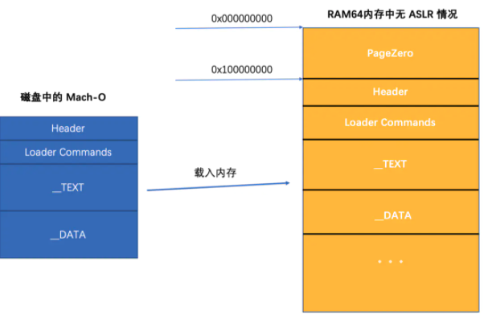
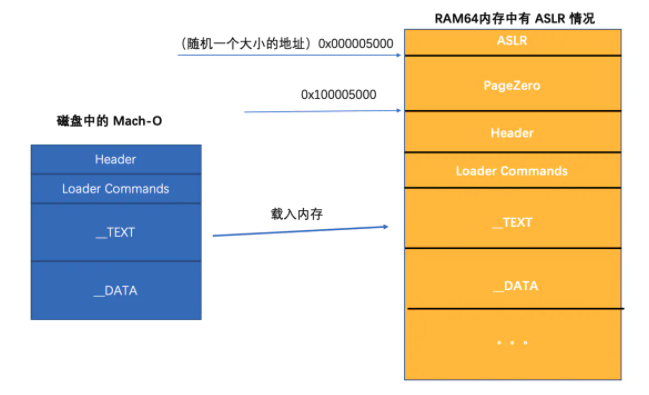

## Mach-O内存地址计算

#### 一些基础概念

-----

- vm address：段的虚拟地址
- vm size：段需要分配的虚拟内存大小
- file offset：段在文件中的偏移量
- file size：段在文件中的大小
- 程序的基址
- 虚拟地址
- `偏移前地址`和`偏移后地址`以及`ASLR`的关系

#### 如何根据运行中的程序打印的地址，定位Mach-O中的地址

-----------

首先有三个地址是非常重要的：

- `Mach-O文`件加载进入内存时候的地址。我们称为`基地址`
- `ASLR`地址
- `Mach-O`中的地址

#### Mach-O文件被加载到内存后的情况

-----

**没有引入`ASLR`的情况**

**引入`ASLR`的情况**

