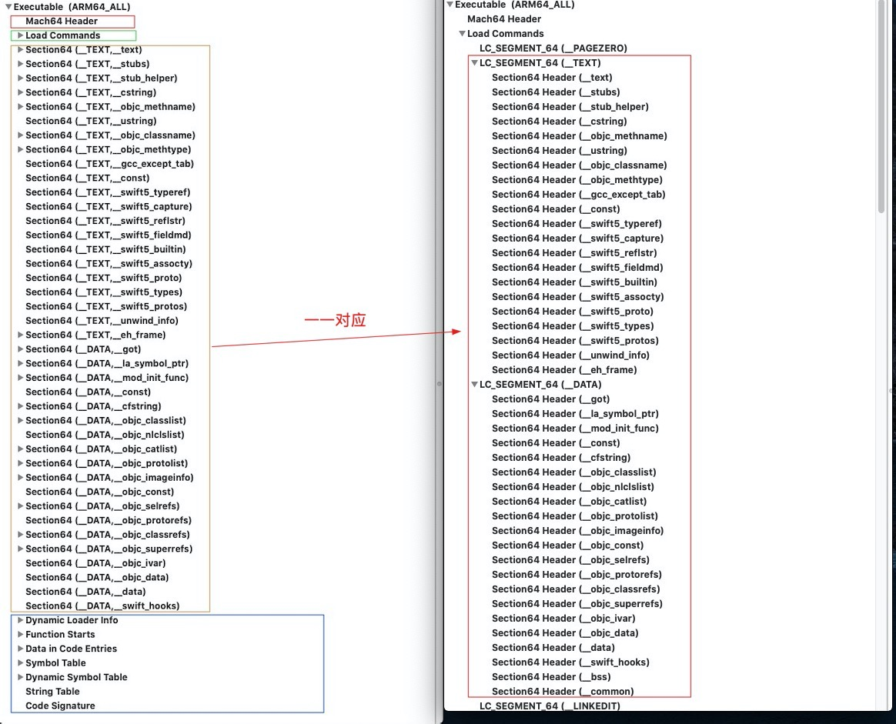
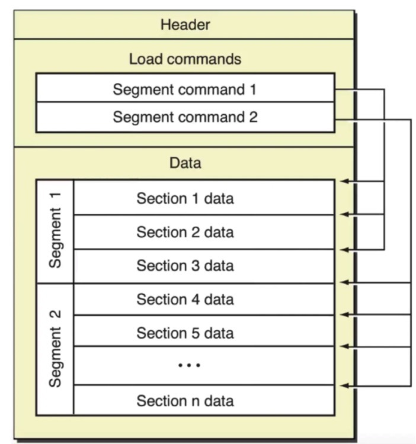

## Mach-o文件简介

-----

Mach-O通常有三部分组成：

- Header
  - Mach-O的文件架构，比如x86-64、ARM
- Load comands：紧跟在头部之后，这些加载指令清晰的高速加载器如何处理二进制数据。有些命令由内核处理，有些是由动态链接器处理
- Raw segment data：有多个段(segment)，每个段可以拥有零个或多个区域(section)。每一个段(segment)都拥有一段虚拟地址映射到进程的地址空间

进程是特殊格式的文件，在内存中加载得到的结果

涉及到的两个加载器：内核加载器和动态加载器(dyld)

mach-O支持的三种可执行格式：

- 解释器脚本格式
- 通用二进制格式
- Mach-O格式

常见的Mach-O文件

- 目标文件：.o
- 库文件：.a、.dylib、.framework
- 可执行文件：.dyld、.dsym

那些文件是Mach-O

- Executable 可执行文件
- Dylib 动态库
- Bundle，无法被连接的动态库，只能通过dlopen()加载
- Image 指的是Executable，Dylib或者Bundle的一种，文中会多次使用Image这个名词
- Framework 动态库(可以是静态库)和对应的头文件和资源文件的集合

#### Mach-O文件格式

-----

通过MachOView查看二进制文件，如下：

 

看左边的图，Mach-O文件整体分为四个部分：

- Header

- LoadCommand

- 文本段，`__Text`

- 数据段，`__DATA`

- 动态库载入信息`Dynamic Loader Info`

- 入口函数`Function Starts`

- 符号表`Sysbol Table`

- 动态库符号表`Dynamic sysbol Table`

- 字符串表：`String Table`

- 代码签名：`Code Signature`

  

其中loadCommand和Data区的关系如下：

下面我们逐个解析

#### Header

----

#### Load Command

-----

#### 文本段(__TEXT)

-----

#### 数据段(__DATA)

-----

#### 动态库载入信息`Dynamic Loader Info`

-----

#### 入口函数`Function Starts`

-----

#### 符号表`Sysbol Table`

-----

#### 动态库符号表`Dynamic sysbol Table`

-----

#### 字符串表：`String Table`

-----

#### 代码签名：`Code Signature`

-----

#### 相关文章

----

- https://www.jianshu.com/p/2e9b7f61d369
- https://www.jianshu.com/p/54d842db3f69
- https://blog.csdn.net/bjtufang/article/details/50628310
- https://www.youtube.com/watch?v=LNU6uw8RXyI
- https://lowlevelbits.org/parsing-mach-o-files/
- 源码：
  - xnu内核源码：https://opensource.apple.com/source/xnu/xnu-1456.1.26/EXTERNAL_HEADERS/mach-o/
  - dyld源码：

