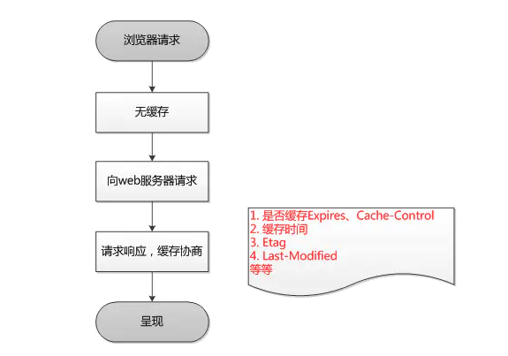
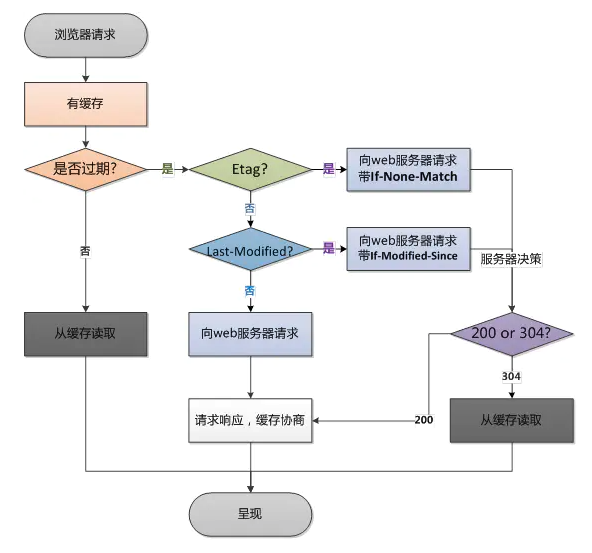

## NSURLCache详解

官方描述：https://developer.apple.com/documentation/foundation/nsurlcache?language=occ

简介：

- 默认开启的，提供了磁盘缓存和内存缓存。默认内存缓存512K，以及10M磁盘空间。如果要修改，在程序启动的是后续，使用下面方法：

  ```
  NSURLCache *URLCache = [[NSURLCache alloc] initWithMemoryCapacity:4 * 1024 * 1024
                                                       diskCapacity:20 * 1024 * 1024
                                                           diskPath:nil];
  [NSURLCache setSharedURLCache:URLCache];
  ```


#### NSURLCache只对你的GET请求进行缓存

-----

NSURLRequest中有个属性：

```
public var cachePolicy: NSURLRequestCachePolicy { get }
```

```
public enum NSURLRequestCachePolicy : UInt {
    case UseProtocolCachePolicy // 默认值，即使用HTTPS头部指定的策略
    case ReloadIgnoringLocalCacheData // 不使用缓存数据，每次请求都会从源端重新下载
    case ReloadIgnoringLocalAndRemoteCacheData // Unimplemented
    case ReturnCacheDataElseLoad // 无论缓存是否过期都是用缓存，没有缓存就进行网络请求
    case ReturnCacheDataDontLoad // 无论缓存是否过期都是用缓存，没有缓存也不会进行网络请求
    case ReloadRevalidatingCacheData // Unimplemented
}
```


###### 讨论一下HTTP协议默认的策略UseProtocolCachePolicy

----

HTTP协议的请求和相应共同头部中，有一个Cache-control的选项，关键的几个字段是max-age，Last-modified以及etag字段。具体见《图解HTTP》或者https://juejin.im/post/5d76162bf265da03b120738d

- 第一次请求

  

- 后面的请求

  

#### NSURLCache缓存查看

-----

默认在Library/Caches下面


#### SDWebImage和NSURLCache

-----

SDWebImageDownloader.m

```
- (nullable SDWebImageDownloadToken *)downloadImageWithURL:(nullable NSURL *)url
                                                   options:(SDWebImageDownloaderOptions)options
                                                  progress:(nullable SDWebImageDownloaderProgressBlock)progressBlock
                                                 completed:(nullable SDWebImageDownloaderCompletedBlock)completedBlock {
    __weak SDWebImageDownloader *wself = self;

    return [self addProgressCallback:progressBlock completedBlock:completedBlock forURL:url createCallback:^SDWebImageDownloaderOperation *{
        __strong __typeof (wself) sself = wself;
        NSTimeInterval timeoutInterval = sself.downloadTimeout;
        if (timeoutInterval == 0.0) {
            timeoutInterval = 15.0;
        }

        // In order to prevent from potential duplicate caching (NSURLCache + SDImageCache) we disable the cache for image requests if told otherwise
        NSURLRequestCachePolicy cachePolicy = options & SDWebImageDownloaderUseNSURLCache ? NSURLRequestUseProtocolCachePolicy : NSURLRequestReloadIgnoringLocalCacheData;
        NSMutableURLRequest *request = [[NSMutableURLRequest alloc] initWithURL:url
                                                                    cachePolicy:cachePolicy
                                                                timeoutInterval:timeoutInterval];
    /*以下省略...*/
}
```

里面有这么一段值得注意的 :

```
NSURLRequestCachePolicy cachePolicy = options & SDWebImageDownloaderUseNSURLCache ? NSURLRequestUseProtocolCachePolicy : NSURLRequestReloadIgnoringLocalCacheData;
```

也就是说 , **除非用户指定了 `options` 是 `UseNSURLCache`, 否则 `SD` 会默认忽略掉 `NSURLCache`** .

这么做的目的 上面也写了注释 , 防止多次缓存 , 避免 `SD` 自己实现的缓存和 `NSURLCache` 多次缓存造成资源浪费 .

同样的 , 在 `SDWebImageDownloaderOperation.m` 里, `NSURLSessionDataDelegate` 的代理方法 `willCacheResponse` 中 也可以看出来:

```
- (void)URLSession:(NSURLSession *)session
          dataTask:(NSURLSessionDataTask *)dataTask
 willCacheResponse:(NSCachedURLResponse *)proposedResponse
 completionHandler:(void (^)(NSCachedURLResponse *cachedResponse))completionHandler {
    
    NSCachedURLResponse *cachedResponse = proposedResponse;

    if (self.request.cachePolicy == NSURLRequestReloadIgnoringLocalCacheData) {
        // Prevents caching of responses
        cachedResponse = nil;
    }
    if (completionHandler) {
        completionHandler(cachedResponse);
    }
}
```

当设置 `NSURLRequestReloadIgnoringLocalCacheData` 策略 , 会忽略 `NSURLCache` 的缓存 .


#### 相关类

---

- NSURLRequestCachePolicy
- NSURLCacheStoragePolicy
- NSURLRequest

#### 相关文章

-----

- https://www.jianshu.com/p/aa49bb3555f4
- https://nshipster.com/nsurlcache/
- https://blog.csdn.net/jingcheng345413/article/details/54967679
- https://juejin.im/post/5d76162bf265da03b120738d

