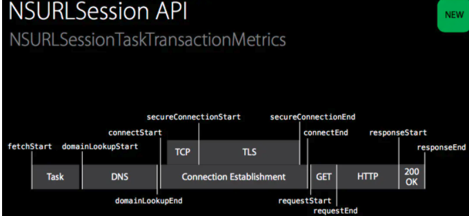

## NSURLSessionTaskMetrics

对发送请求/DNS查询/TLS握手/请求响应等各种环节时间上的统计. 更易于我们检测, 分析我们App的请求缓慢到底是发生在哪个环节, 并对此进行优化提升我们APP的性能.

NSURLSessionTaskMetrics对象与NSURLSessionTask对象一一对应. 每个NSURLSessionTaskMetrics对象内有3个属性 :

- taskInterval : task从开始到结束总共用的时间

- redirectCount : task重定向的次数

- transactionMetrics : 一个task从发出请求到收到数据过程中派生出的每个子请求, 它是一个装着许多NSURLSessionTaskTransactionMetrics对象的数组. 每个对象都代表下图的一个子过程

  