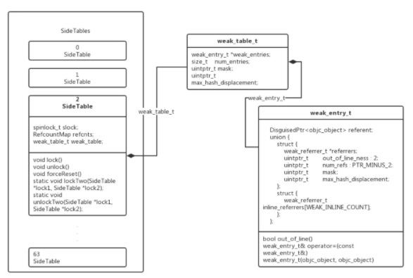

## weak的底层原理

------


#### weak的Runtime基础(weak原理所涉及到的数据结构)

----------

`Runtime`中有四个重要的数据结构：`SideTables`、`SideTable`、`weak_table_t`、`weak_entry_t`

这四个数据结构的关系是这样的：



在`Runtime`内存空间中，`SideTables`是一个8个元素的哈希数组，他的定义应该是这样的`<obj address, SideTable>`。也就是一个的`address`，对应一个`SideTable`，但是一个`SideTable`对应多个`obj`

一个`SideTable`中，有两个成员：

```objective-c
RefcountMap refcnts;        // 对象引用计数相关 map
weak_table_t weak_table;    // 对象弱引用相关 table
```

其中`refcnts`是一个hash map，其key是obj的地址，而value是obj的引用计数

`weak_table`则存储了`弱引用`了obj指针的地址，其本质是一个以obj地址为key，`弱引用`obj的对象的地址为value的hash表

而`weak_table`中的节点的类型就是`weak_entry_t`


###### SideTables:

```objective-c

```


#### SideTables

------

```objective-c
// 可以通过静态函数获取`SideTables`
static StripedMap<SideTable>& SideTables() {
    return *reinterpret_cast<StripedMap<SideTable>*>(SideTableBuf);
}
```

可以看到，`SideTabls` 实质类型为`StripedMap`

```objective-c
// StripedMap<T> is a map of void* -> T, sized appropriately 
// for cache-friendly lock striping. 
// For example, this may be used as StripedMap<spinlock_t>
// or as StripedMap<SomeStruct> where SomeStruct stores a spin lock.
template<typename T>
class StripedMap {

    enum { CacheLineSize = 64 };

#if TARGET_OS_EMBEDDED
    enum { StripeCount = 8 };
#else
    enum { StripeCount = 64 };  // iOS 设备的StripeCount = 64
#endif

    struct PaddedT {
        T value alignas(CacheLineSize); // T value 64字节对齐
        
    };

    PaddedT array[StripeCount]; // 所有PaddedT struct 类型数据被存储在array数组中。iOS 设备 StripeCount == 64

    static unsigned int indexForPointer(const void *p) { // 该方法以void *作为key 来获取void *对应在StripedMap 中的位置
        uintptr_t addr = reinterpret_cast<uintptr_t>(p);
        return ((addr >> 4) ^ (addr >> 9)) % StripeCount; // % StripeCount 防止index越界
    }

 public:
    // 取值方法 [p],
    T& operator[] (const void *p) { 
        return array[indexForPointer(p)].value; 
    }
    const T& operator[] (const void *p) const { 
        return const_cast<StripedMap<T>>(this)[p]; 
    }

    
    // Shortcuts for StripedMaps of locks.
    void lockAll() {
        for (unsigned int i = 0; i < StripeCount; i++) {
            array[i].value.lock();
        }
    }

    void unlockAll() {
        for (unsigned int i = 0; i < StripeCount; i++) {
            array[i].value.unlock();
        }
    }

    void forceResetAll() {
        for (unsigned int i = 0; i < StripeCount; i++) {
            array[i].value.forceReset();
        }
    }

    void defineLockOrder() {
        for (unsigned int i = 1; i < StripeCount; i++) {
            lockdebug_lock_precedes_lock(&array[i-1].value, &array[i].value);
        }
    }

    void precedeLock(const void *newlock) {
        // assumes defineLockOrder is also called
        lockdebug_lock_precedes_lock(&array[StripeCount-1].value, newlock);
    }

    void succeedLock(const void *oldlock) {
        // assumes defineLockOrder is also called
        lockdebug_lock_precedes_lock(oldlock, &array[0].value);
    }

    const void *getLock(int i) {
        if (i < StripeCount) return &array[i].value;
        else return nil;
    }
};
```

可以看到`StripedMap`是一个以`void *`为hash key，`T`为value的hash表

可以看到里面是一堆锁，因为`SideTables`是一个全局的`hash`表


#### SideTable

--------

```objective-c
struct SideTable {
    spinlock_t slock;           // 自旋锁，防止多线程访问冲突
    RefcountMap refcnts;        // 对象引用计数map
    weak_table_t weak_table;    // 对象弱引用map

    SideTable() {
        memset(&weak_table, 0, sizeof(weak_table));
    }

    ~SideTable() {
        _objc_fatal("Do not delete SideTable.");
    }

    // 锁操作 符合StripedMap对T的定义
    void lock() { slock.lock(); }
    void unlock() { slock.unlock(); }
    void forceReset() { slock.forceReset(); }

    // Address-ordered lock discipline for a pair of side tables.

    template<HaveOld, HaveNew>
    static void lockTwo(SideTable *lock1, SideTable *lock2);
    template<HaveOld, HaveNew>
    static void unlockTwo(SideTable *lock1, SideTable *lock2);
};
```


###### weak_table_t

```objective-c
/**
 * The global weak references table. Stores object ids as keys,
 * and weak_entry_t structs as their values.
 */
struct weak_table_t {
    weak_entry_t *weak_entries;        // hash数组，用来存储弱引用对象的相关信息weak_entry_t
    size_t    num_entries;             // hash数组中的元素个数
    uintptr_t mask;                    // hash数组长度-1，会参与hash计算。（注意，这里是hash数组的长度，而不是元素个数。比如，数组长度可能是64，而元素个数仅存了2个）
    uintptr_t max_hash_displacement;   // 可能会发生的hash冲突的最大次数，用于判断是否出现了逻辑错误（hash表中的冲突次数绝不会超过改值）
};
```

###### weak_entry_t

```objective-c
/**
 * The internal structure stored in the weak references table. 
 * It maintains and stores
 * a hash set of weak references pointing to an object.
 * If out_of_line_ness != REFERRERS_OUT_OF_LINE then the set
 * is instead a small inline array.
 */
#define WEAK_INLINE_COUNT 4

// out_of_line_ness field overlaps with the low two bits of inline_referrers[1].
// inline_referrers[1] is a DisguisedPtr of a pointer-aligned address.
// The low two bits of a pointer-aligned DisguisedPtr will always be 0b00
// (disguised nil or 0x80..00) or 0b11 (any other address).
// Therefore out_of_line_ness == 0b10 is used to mark the out-of-line state.
#define REFERRERS_OUT_OF_LINE 2

struct weak_entry_t {
    DisguisedPtr<objc_object> referent; // 被弱引用的对象
    
    // 引用该对象的对象列表，联合。 引用个数小于4，用inline_referrers数组。 用个数大于4，用动态数组weak_referrer_t *referrers
    union {
        struct {
            weak_referrer_t *referrers;                      // 弱引用该对象的对象指针地址的hash数组
            uintptr_t        out_of_line_ness : 2;           // 是否使用动态hash数组标记位
            uintptr_t        num_refs : PTR_MINUS_2;         // hash数组中的元素个数
            uintptr_t        mask;                           // hash数组长度-1，会参与hash计算。（注意，这里是hash数组的长度，而不是元素个数。比如，数组长度可能是64，而元素个数仅存了2个）素个数）。
            uintptr_t        max_hash_displacement;          // 可能会发生的hash冲突的最大次数，用于判断是否出现了逻辑错误（hash表中的冲突次数绝不会超过改值）
        };
        struct {
            // out_of_line_ness field is low bits of inline_referrers[1]
            weak_referrer_t  inline_referrers[WEAK_INLINE_COUNT];
        };
    };

    bool out_of_line() {
        return (out_of_line_ness == REFERRERS_OUT_OF_LINE);
    }

    weak_entry_t& operator=(const weak_entry_t& other) {
        memcpy(this, &other, sizeof(other));
        return *this;
    }

    weak_entry_t(objc_object *newReferent, objc_object **newReferrer)
        : referent(newReferent) // 构造方法，里面初始化了静态数组
    {
        inline_referrers[0] = newReferrer;
        for (int i = 1; i < WEAK_INLINE_COUNT; i++) {
            inline_referrers[i] = nil;
        }
    }
};
```


#### 从弱引用到释放的整个流程(弱引用开始，到弱引用释放过程中的几个方法)

-------

主要分为两个阶段：

- 弱引用阶段锁涉及的方法
  - `objc_initWeak`
  - `objc_storeWeak`
  - `weak_unregister_no_lock`
  - `weak_register_no_lock`
- 释放阶段所涉及的方法
  - `_objc_rootDealloc`
  - `rootDealloc`
  - `clearDellocating`


#### 相关文章

----

- https://blog.csdn.net/u013378438/article/details/82790332
- https://juejin.cn/post/6844904101839372295