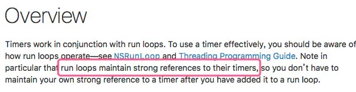

## NSTimer详解

NSTimer存在的问题：

- NSTimer延迟
- 切换runloop失效
- 内存泄漏
- 进入后台会停止
- timer的创建和撤销，必须在同一个线程


#### NSTimer延迟

----

先来看一段官方描述：

```
A timer is not a real-time mechanism; it fires only when one of the run loop modes to which the timer has been added is running and able to check if the timer’s firing time has passed. If a timer’s firing time occurs during a long callout or while the run loop is in a mode that is not monitoring the timer, the timer does not fire until the next time the run loop checks the timer.
```

```
Because of the various input sources a typical run loop manages, the effective resolution of the time interval for a timer is limited to on the order of 50-100 milliseconds.
```

什么意思呢？

其实当我们注册一个timer到Runloop的时候，Runloop已经在每个应该回调的时间点上，注册了回调事件。但是，如果遇到当前Runloop任务繁重的时候，来不及在该时间点触发事件，RunLoop 的下一个消息处理就只能顺延，导致 NSTimer 的时间已经到达，但 Runloop 却无法及时触发 NSTimer，导致该时间点的回调被错过。

理论上最小精度为 0.1 毫秒。不过由于受 Runloop 的影响，会有 50 ~ 100 毫秒的误差，所以，实际精度可以认为是 0.1 秒。不过由于受 Runloop 的影响，会有 50 ~ 100 毫秒的误差，所以，实际精度可以认为是 0.1 秒。

怎么优化呢？


#### NSTimer切换runloop失效

---

先说一下，为什么NSTimer在UIScrollView滚动的时候，会失效掉。

每个线程(我们这里拿主线程作为例子)，都有一个Runloop，每个Runloop在同一个时刻，只能处于某一个mode下面。我们最常见的是NSDefaultRunloopMode和UITrackingRunloopMode。当我执行下面的代码

```
self.timer = [NSTimer timerWithTimeInterval:1.0 target:self selector:@selector(timerAction:) userInfo:nil repeats:YES];
[[NSRunLoop mainRunLoop] addTimer:self.timer forMode:NSDefaultRunLoopMode];
```

timer仅仅是被加入NSDefaultRunLoopMode，当主线程的NSRunloopMode = UITrackingRunloopMode(也就是UIScrollView滚动的时候)，timer就失效了，如何解决呢？使用`NSRunLoopCommonModes`

```
[[NSRunLoop mainRunLoop] addTimer:self.timer forMode:NSRunLoopCommonModes];
```

为什么`NSRunloopCommonModes`就能解决问题呢？原因是，当我们把一个source/timer等mode item，标记为common的时候，当前Runloop会把该item加入到`_commonModeItems`。这个`_commonModeItems`有什么作用呢？处于`_commonModeItems`中的items，会在每次Runloop内容发生变化的时候，将`_commonModeItems`中的items同步到所有具有`common`属性的mode中，那么那些`mode`具有`common`属性呢？没错`NSDefaultRunloopMode`和`UITrackingRunloopMode`都具有`common`属性

下面是Runloop的结构

```
struct __CFRunLoop {
    CFRuntimeBase _base;
    pthread_mutex_t _lock;  /* locked for accessing mode list */
    __CFPort _wakeUpPort;   // used for CFRunLoopWakeUp 内核向该端口发送消息可以唤醒runloop
    Boolean _unused;
    volatile _per_run_data *_perRunData; // reset for runs of the run loop
    pthread_t _pthread;             //RunLoop对应的线程
    uint32_t _winthread;
    CFMutableSetRef _commonModes;    //存储的是字符串，记录所有标记为common的mode
    CFMutableSetRef _commonModeItems;//存储所有commonMode的item(source、timer、observer)
    CFRunLoopModeRef _currentMode;   //当前运行的mode
    CFMutableSetRef _modes;          //存储的是CFRunLoopModeRef
    struct _block_item *_blocks_head;//doblocks的时候用到
    struct _block_item *_blocks_tail;
    CFTypeRef _counterpart;
};
```


#### NSTimer内存泄漏

-----

```
- (void)viewDidLoad {
    [super viewDidLoad];

    self.timer = [NSTimer timerWithTimeInterval:1.0 target:self selector:@selector(timerAction:) userInfo:nil repeats:YES];
    [[NSRunLoop mainRunLoop] addTimer:self.timer forMode:NSRunLoopCommonModes];

}

- (void)timerAction:(NSTimer *)timer
{
    NSLog(@"%@", timer);
}
```

**导致内存泄漏的原因：**

网上有很多人说是target和timer两者互相强引用导致释放不掉，其实不是的，看下面两个例子：

```
- (void)addTimer1 {
    // 将timer设置成局部变量，timer和target没有释放
    NSTimer *timer = [NSTimer timerWithTimeInterval:1.0 target:self selector:@selector(action) userInfo:nil repeats:YES];
    [[NSRunLoop mainRunLoop] addTimer:timer forMode:NSRunLoopCommonModes];
}

- (void)addTimer2 {
   // 将target设置成局部变量，target和timer也没有释放
    __weak typeof(self) weakSelf = self;
    NSTimer *timer = [NSTimer timerWithTimeInterval:1.0 target:weakSelf selector:@selector(action) userInfo:nil repeats:YES];
    [[NSRunLoop mainRunLoop] addTimer:timer forMode:NSRunLoopCommonModes];
}
```

如果是target和timer相互强引用，形成循环引用，导致内存泄漏的话，那么上面两种方式target应该会被释放掉，但是target依旧没有被释放掉，显然`target和timer相互强引用，形成循环引用，导致内存泄漏`这个结论是错的，那么到底是什么原因导致了NSTimer的内存泄漏呢？

其实是Runloop在持有NSTimer，NSTimer持有target，导致target释放不掉，官方描述如下：



那怎么解决？

**解决办法：**

- 使得timer的target指向NSTimer的类对象本身，action写成类方法
- 利用NSProxy进行消息转发，消除强引用的timer
- 定义中介继承NSObject进行消息转发，消除强引用timer

**使得timer的target指向NSTimer的类对象本身，action写成类方法：**

```objective-c
#import <Foundation/Foundation.h>
typedef void(^TimerHandler)(NSTimer *timer);

@implementation NSTimer (Category)

+ (NSTimer *)generateTimerWithTimeInterval:(NSTimeInterval)timeInterval handler:(TimerHandler)block repeats:(BOOL)repeats {

		NSTimer *timer = [self scheduledTimerWithTimeInterval:timeInterval target:self selector:@selector(countdown:) userInfo:[block copy] repeats:repeats];

		return timer;
}

+ (void)countdown:(NSTimer *)timer {
     TimerHandler block = timer.userInfo;
     if (block) {
		     block(timer);
     }
 }
 @end
```

**利用NSProxy进行消息转发，消除强引用的timer:**

具体，参考YYWeakProxy

**定义中介继承NSObject进行消息转发，消除强引用timer:**

这里不写代码了，思想和上面是一样的


<font color=red>我们上面仅仅讨论的是将NSTimer的target该如何释放，但是我们知道了NSTimer是被runloop强引用的，那么Runloop不消失，timer是永远都不会释放的，那怎么释放timer本身呢？使用`invalidate`方法来将计时器从runloop中移除掉，</font>所以，上面第二种和第三种解决方法其实思想都是一样的：

- 找一个对象delegateTarget，弱持有target
- 初始化timer的时候，让timer持有的是delegateTarget，这样的话，target就会正常释放
- target释放的时候，调用timer`invalidate`方法，将timer从runloop移除，这个时候timer就会被释放掉了


#### App进入后台后会停止

-----


#### NSTimer的创建和撤销，必须在同一个线程

-----


#### 相关文章

-----

https://medium.com/@danielemargutti/the-secret-world-of-nstimer-708f508c9eb