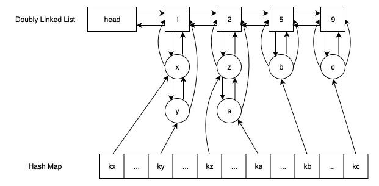

## hashmap + 二级双向链表实现 LFU

----------------

通过这种方式实现的`LFU`，复杂度可以做到O(1)

上面的图中，还少了一个东西，就是访问次数几点需要有一个尾指针，专门指向当前纵向链表的最后一个元素，方便自动清理

首先横向的双线链表存储的是访问次数，从小到大

纵向的双向链表，存储的是节点访问次数相同的节点。每个节点有一个指向访问次数节点的指针

hashmap存储了所有的节点

下面我们分析一下每个操作的复杂度：

#### 存

-----

1. 存入hashmap，查看当前节点是否存在
2. 如果存在，找到当前的访问次数节点，找到访问次数节点的下一个节点，如果该次数对应的节点不存在，创建一个该访问次数的节点，更新横向的双向链表
3. 如果不存在，直接放入访问次数为1的节点的首部，更新访问次数为1的链表的首部

#### 取

-------

#### 移除

-----

#### 自动清理

----------

