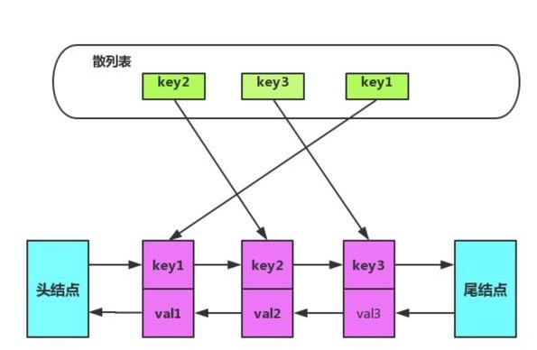

## hashmap + 双向链表 实现LRU

----------

首先`LRU`指的是`Least recently used`，即`最近最少使用`，是一种缓存淘汰算法。其核心思想是`如果数据最近被访问过，那么将来被访问的几率也会很高`

这种算法，可以将`存`、`取`、`移除`操作的复杂度做到O(1)

接下来我们看每种操作的复杂度：

首先，我们下面几个变量：

- hash表
- 双向链表
- 双向链表的头节点
- 双向链表的尾节点

#### 存(访问)

------

1. 存入hasmap中，查看当前节点是否存在
2. 更新头节点

#### 取(访问)

--------

1. 通过hasmap获取节点
2. 更新头节点

#### 移除

----------

1. 通过hashmap找到该节点
2. 更新该节点的前后节点的指向

#### 自动清理

---------

1. 更新尾部节点
2. 移除尾部节点

